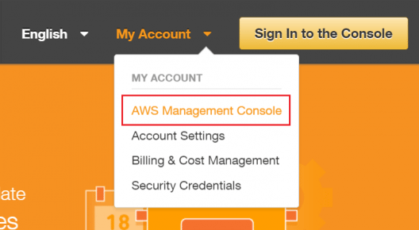
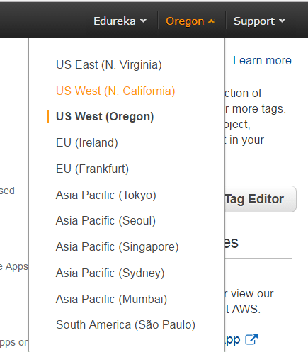
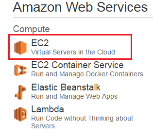
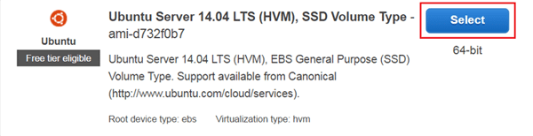
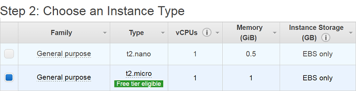
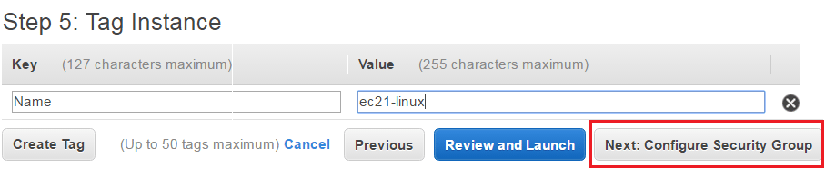
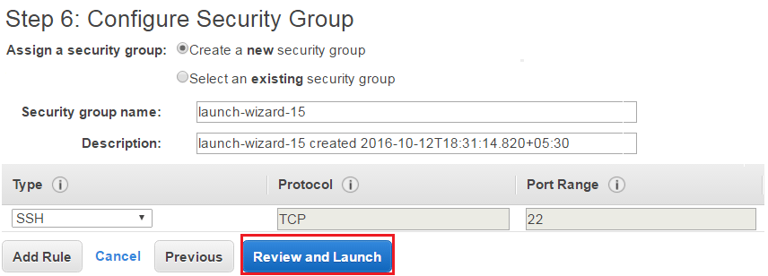
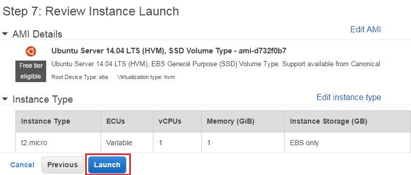
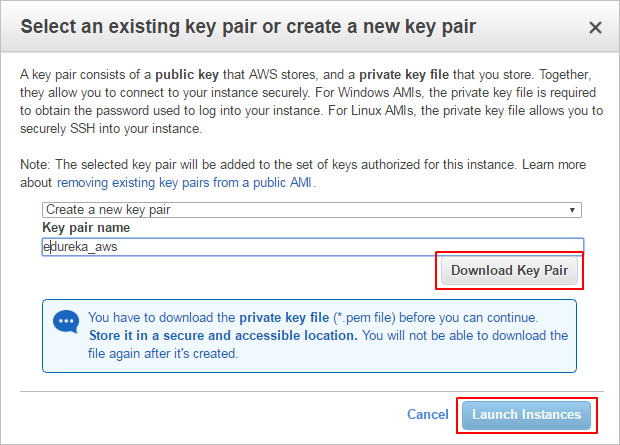
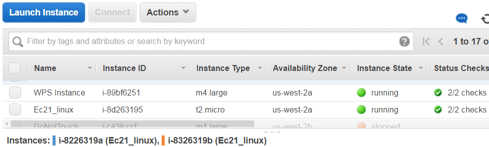

# amazon ec2 basics

It is very difficult to predict how much computing power one might require for an application which you might have just launched. There can be two scenarios: you may over-estimate the requirement and buy stacks of servers which will not be of any use, or you may under-estimate the usage, which will lead to the crashing of your application. In this AWS EC2 Tutorial, we will understand all the key concepts using examples and also perform hands-on to launch an Ubuntu instance.

### What is AWS EC2?

Amazon Elastic Compute Cloud (EC2) is a web service from Amazon that provides re-sizable compute services in the cloud.

### How are they re-sizable?

They are re-sizable because you can quickly scale up or scale down the number of server instances you are using if your computing requirements change.

### What is an Instance?

An instance is a virtual server for running applications on Amazon’s EC2. It can also be understood like a tiny part of a larger computer: a tiny part which has its own hard drive, network connection, OS, etc. But it is actually all virtual. You can have multiple “tiny” computers on a single physical machine, and all these tiny machines are called instances.

### Difference between a service and an Instance?

* EC2 is a service along with other Amazon Web Services like S3 etc.
* When we use EC2 or any other service, we use it through an instance, e.g. t2.micro instance in EC2.

### Why AWS EC2?

Why not buy your own stack of servers and work independently? If you buy your own servers you must handle security updates, troubleshooting, redundancy, depreciation, and scaling. With EC2 most of these operational burdens are managed by Amazon, letting you focus on your application, often at lower cost.

Cost and operational benefits include:

* No need to hire a full IT team for server maintenance.
* Reduced costs for redundancy and fault handling vs self-managed hardware.
* Cloud providers continually improve hardware and drop prices over time.
* Faster, managed scaling when traffic surges.

Let’s understand the types of EC2 computing instances.



### General Instances

For applications that require a balance of performance and cost.

E.g. email responding systems, where you need a prompt response and cost-effectiveness.

Common families:

* t2
* m4
* m3



### Compute Instances

For applications that require a lot of CPU processing.

E.g. analysis of streaming data like a Twitter stream.

Common families:

* c4
* c3



### Memory Instances

For memory-heavy applications that require a lot of RAM.

E.g. systems needing many background applications or heavy multitasking.

Common families:

* r3
* x1



### Storage Instances

For applications with very large data sets or heavy storage needs.

E.g. applications with huge on-disk datasets.

Common families:

* i2
* d2



### GPU Instances

For applications that require heavy graphics rendering.

E.g. 3D modeling or GPU-accelerated workloads.

Common families:

* g2



### Burstable Performance Instances

T2 instances are burstable instances: the CPU performs at a baseline (e.g., 20% of its capability). When your application needs more than the baseline, the CPU can burst to higher performance for a limited time.

* You earn CPU credits when your CPU is idle.
* Each CPU credit gives a burst of 1 minute to the CPU.
* Unused CPU credits are retained for up to 24 hours.
* CPU credit balance helps decide scaling up or down.
* Bursts consume CPU credits.

### EBS-Optimized Instances

C4, M4, and D2 instances are EBS-optimized by default. EBS (Elastic Block Storage) is a storage option with high IOPS. When an EBS volume is attached to an optimized instance, single-digit millisecond latencies can be achieved.

_IOPS (Input/Output Operations Per Second) is a performance measurement used to characterize computer storage devices._

### Cluster Networking Instances

X1, M4, C4, C3, I2, G2 and D2 instances support cluster networking. Instances launched into a common placement group are placed in a logical cluster that provides high-bandwidth, low-latency connectivity between all instances in the group.

* A placement group is a logical cluster where instances can utilize up to 10 Gbps for single-flow and 20 Gbps for multi-flow traffic in each direction.
* Instances outside the placement group are limited to \~5 Gbps in multi-flow traffic.
* Cluster networking is ideal for high-performance analytics systems.

### Dedicated Instances

* Run on single-tenant hardware dedicated to a single customer.
* Suitable for workloads that require hardware-level isolation due to corporate policy or regulatory requirements.

Example use cases and recommended instance choices:

* Analysis of customer data with fluctuating traffic: t2 (burstable).
* Auto-response emailing system needing low latency: EBS-optimized instances.
* Search engine needing fast inter-server communication: Cluster Networking Instances in a placement group.
* Highly confidential processes: Dedicated Instances.

### How to run systems in EC2?



### Launching an Instance — initial steps

* Login to your AWS account and open EC2.
* Under "Create an instance", click "Launch instance".
* Select an Amazon Machine Image (AMI). AMIs are OS templates (e.g., Ubuntu, Windows Server).

AMIs can be:

* Pre-configured from the AWS Marketplace.
* Custom: choose Quick Start to select and configure your own.



### Configure Instance & Storage

* Choose instance type (e.g., t2.micro for free tier).
* Configure instance details (networking, IAM role, etc.) and then "Add Storage".

Elastic Block Storage (EBS) options:

1. Provisioned IOPS — for mission-critical workloads with high IOPS.
2. General Purpose — balance of performance and cost.
3. Magnetic — for infrequently accessed data; higher retrieval time.



### Security groups, tags, and launch

* Give the instance a Name tag to identify it in the console.
* Create a security group: acts as a firewall to control inbound/outbound traffic.
  * Each security group has rules controlling traffic.
  * Each instance can be assigned up to 5 security groups.
* Review all settings and click "Launch".

When launching, you must provide authentication: create or select a key pair (public/private key) to securely access the instance.



### Security in AWS EC2

To authenticate users to their instances, AWS uses a key pair method.

* EC2 uses public–key cryptography to encrypt/decrypt login information.
* The public key encrypts (stored by AWS) and the private key decrypts (kept by you).
* Public/private keys together are called a key pair.

Additional EC2 features:

### Auto Scaling

Auto Scaling automatically launches or terminates EC2 instances based on user-defined policies, schedules, and health checks.

Elastic Load Balancing (ELB) automatically distributes incoming application traffic across multiple EC2 instances in multiple Availability Zones.

* Availability Zones are geographically separate locations that reduce latency and provide fault tolerance.
* Elastic IP Addresses are static IPs associated with your AWS account; they can be remapped to another instance to mask instance failure.

### AWS EC2 Pricing

AWS EC2 free tier allows 750 hours of t2.micro instance usage per month for 1 year from account sign-up.

Three main pricing options:

* Spot Instances
* On-Demand Instances
* Reserved Instances

Spot Instances:

* Bid on unused EC2 capacity; hourly price fluctuates by availability in an AZ.
* You set a maximum price you’re willing to pay per hour; when the spot price exceeds your max, the instance is terminated.

On-Demand Instances:

* Pay by the hour with no long-term commitments. Good for unpredictable workloads or initial testing.

Reserved Instances:

* Significant discounts compared to On-Demand in exchange for committing to a period.
* Payment options: No Upfront, Partial Upfront, Full Upfront.
* Term lengths: One Year or Three Year. Higher upfront payment yields greater savings.

### AWS EC2 Use Case — Create an Ubuntu instance (walkthrough)



### Login to AWS Management Console

Sign in to the AWS Management Console and open the EC2 service.




### Select Region

Choose your preferred region from the region selector. Region selection can affect latency and pricing.




### Open EC2 Dashboard

Select EC2 under the Compute section to open the EC2 dashboard.




### Launch Instance

Click "Launch Instance".



### Select an AMI

For a Linux instance, choose the basic 64-bit Ubuntu AMI and click "Select".




### Choose Instance Type

Select t2.micro (free tier eligible).




### Configure Instance Details

Configure desired details (networking, IAM role, etc.) and then click "Add Storage".




### Add Storage

Configure EBS volume settings as needed.




### Tag the Instance

Add a Name tag (or other tags) to identify your instance in the console.




### Create a Security Group

Create or select a security group to control inbound and outbound traffic.




### Review and Launch

Verify the configured settings and click "Launch".




### Create a Key Pair & Launch

Select "Create a new key pair", name it, download the private key (.pem), and save it securely for future use.




### Check Launched Instance

Inspect the instance details in the EC2 console after launch.




### Convert Private Key Using PuTTYgen (Windows + PuTTY)

PuTTY requires a .ppk private key. Convert the .pem you downloaded to .ppk using PuTTYgen:

* Click "Load". By default PuTTYgen shows only .ppk files; set to show all files to find your .pem.
* Select the .pem file you saved and click "Open". Dismiss confirmation dialogs.
* Click "Save private key" to save in .ppk format. PuTTYgen may warn about saving without a passphrase — click "Yes" if you choose no passphrase.
* Use the same base name for the .ppk (e.g., my-key-pair.ppk).



### Connect to EC2 Instance using SSH and PuTTY

* Open PuTTY.exe.
* In "Host Name", enter the public IP of your instance.
* In the Category list, expand "SSH".
* Click "Auth" (do not expand it).
* In "Private key file for authentication", browse to the .ppk file and load it.
* Click "Open".
* When prompted for the login ID, enter: ubuntu



***

This document covered EC2 concepts, instance types, storage options, security, pricing categories, and a step-by-step walkthrough to launch and connect to an Ubuntu EC2 instance.
