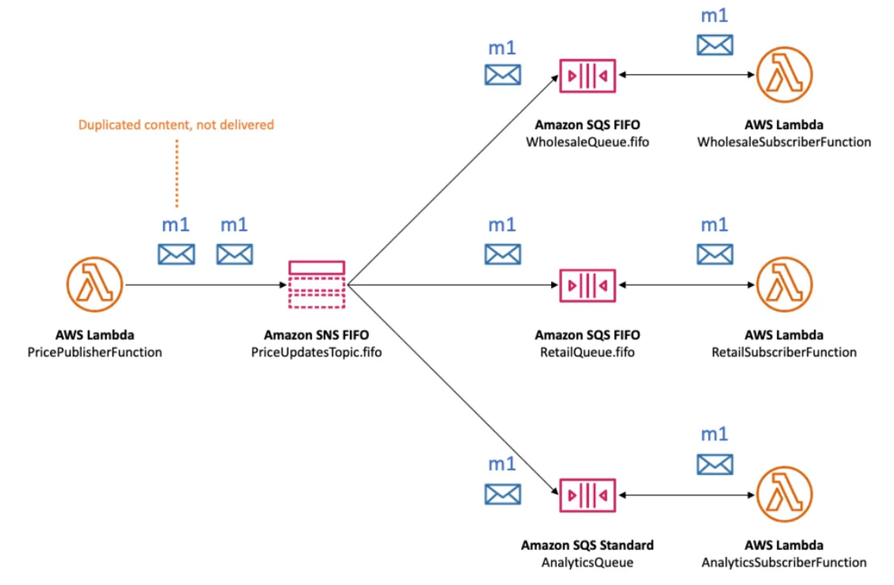
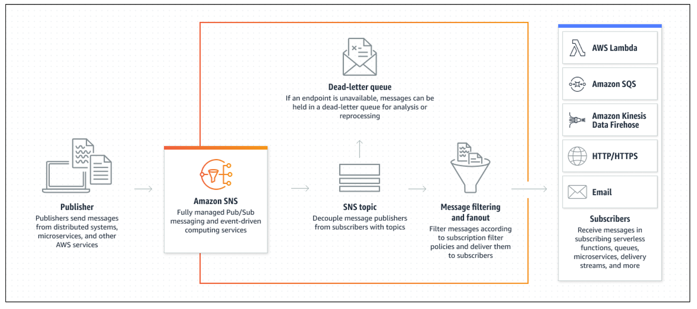

# amazon sns sqs and ses

> Amazon Web Services (AWS) offers a range of communication services that help businesses streamline notifications, messaging, and email management across various applications. Among these, **Amazon Simple Notification Service (SNS)**, **Simple Queue Service (SQS)** and **Simple Email Service (SES)** stand out as highly useful tools for industries needing robust communication solutions. Each service is optimized for different use cases, but they’re often used together to create seamless workflows. Here’s a closer look at how these services work individually and how they can be combined in real-world applications.

## Understanding SNS, SQS, and SES



### Amazon SNS (Simple Notification Service)

**Overview:** SNS is a messaging service primarily used for sending notifications from applications to various endpoints, including SMS, email, and HTTP/S.

**How it Works:** SNS operates through _topics_, where a publisher sends messages to a topic, and subscribers to that topic automatically receive those messages in real time. This enables quick notifications across multiple channels.

#### Example in Industry

**E-commerce:** When a customer makes a purchase, SNS notifies different systems (like inventory, billing, and shipping) almost instantly, triggering the necessary follow-up actions. This keeps the transaction process streamlined without requiring manual notifications across different departments.




### Amazon SQS (Simple Queue Service)

**Overview:** SQS is a distributed message queuing service designed for decoupling application components, allowing for reliable communication even during high traffic.

**How it Works:** SQS uses a queue where producers add messages, and consumers pick them up for processing asynchronously. This setup is especially useful for managing traffic spikes or distributing workloads across various components without overloading the system.

#### Example in Industry

**Banking and Financial Services:** Banks often use SQS to handle transaction queues, which helps manage peak times, such as month-end or tax season, when transaction volumes are highest. By queuing these tasks, financial institutions ensure all transactions are processed smoothly and in order.



### Amazon SES (Simple Email Service)

**Overview:** SES is a scalable and cost-effective email-sending service designed for both transactional emails (like order confirmations) and marketing emails.

**How it Works:** SES allows applications to send emails programmatically, including critical messages like welcome emails, password resets, and purchase confirmations, all in compliance with email standards and security.

#### Example in Industry

**Healthcare:** Healthcare organizations rely on SES to send appointment reminders, prescription updates, and secure messages to patients. SES offers reliability and customization options, making it easier to ensure sensitive information is communicated effectively and compliantly.



## Combining SNS, SQS, and SES in Industry Applications

While each service has a specific purpose, they are often combined to create comprehensive communication workflows. Here are two real-world scenarios showing how they can work together.

### Customer Order Processing in E-commerce



### Order placement and distribution

When a customer places an order, the application publishes a message to an **SNS topic**. This topic notifies other systems (such as inventory management, billing, and shipping) of the new order, ensuring each system is updated in real time and ready to act.



### Asynchronous processing

The SNS message is sent to an **SQS queue**, where workers pick up the message to process it asynchronously. This enables the backend to handle tasks like deducting inventory, processing the payment, and preparing the order for shipping without delaying other ongoing tasks.



### Customer and internal notifications

After the order has been successfully processed, **SES** sends an email to the customer confirming their purchase, along with details like estimated delivery time. SES can also send an internal notification to the vendor or warehouse team to confirm the order has been successfully logged and fulfilled.



### Incident Management in IT Services



### Incident notification

When a service issue or incident is detected, a monitoring system sends an alert via **SNS** to notify the on-call team through SMS, email, or another subscribed application. This helps reduce response time, ensuring the right team members are immediately informed.



### Queueing for response

The alert message is sent to an **SQS queue**, where either a system or a team member can retrieve it for resolution. Queueing incidents ensures they are managed in a first-come-first-served order and no incident is overlooked, even during busy times.



### Incident reporting

Once the incident is resolved, **SES** sends a detailed incident report to stakeholders, summarizing actions taken and resolution details. This automated process streamlines communication while providing essential documentation for follow-up or future reference.



## Why These AWS Services Work Well Together

* Decoupling of Tasks: SQS allows different parts of an application to operate independently, without waiting on each other, enhancing overall system efficiency.
* Real-Time Updates: SNS provides instant notifications, ensuring critical information reaches recipients without delay — essential in industries like healthcare and finance.
* Scalability and Reliability: SES ensures that high volumes of emails (such as order confirmations or alerts) are sent reliably, without risking server overload or delivery issues.

By combining **SNS** (notifications), **SQS** (queuing), and **SES** (email), businesses can build flexible, robust workflows that enhance customer experience, streamline operations, and improve incident management across industries.
