# automate start stop ec2 instances using lambda

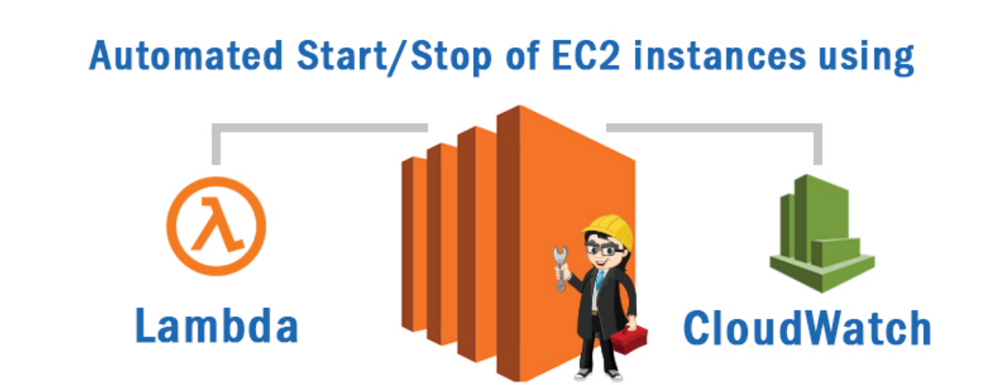

In today’s fast-paced world of cloud computing, optimizing resources and minimizing costs are essential tasks. Amazon Web Services (AWS) offers tools like AWS Lambda to automate actions such as starting and stopping EC2 instances. This guide walks through automating the start-stop cycle of EC2 instances using Lambda and CloudWatch/EventBridge to reduce costs by running instances only when needed.

## Introduction to EC2 Instance Automation

Amazon Elastic Compute Cloud (EC2) provides scalable computing capacity in the AWS cloud. It’s common to have instances running 24/7 even when not in use. Automating start/stop with Lambda ensures instances run only when needed, optimizing expenses.

## Prerequisites

Make sure you have:

* An AWS account with appropriate permissions.
* EC2 instances you want to automate.
* Basic knowledge of AWS services like EC2, IAM, Lambda, and CloudWatch.


## Setting up IAM Role and Policy

The Lambda function needs an IAM role that allows reading/listing EC2 instances and describing EC2 tags. Create the required policy and role in the IAM console.



### Create the IAM policy

* Go to the AWS Management Console → IAM dashboard → Policies → Create policy.
* Configure the policy to allow at least the following EC2 actions: DescribeInstances, StartInstances, StopInstances (or attach a managed policy such as `AmazonEC2FullAccess` if appropriate for your needs).
* Save the policy.

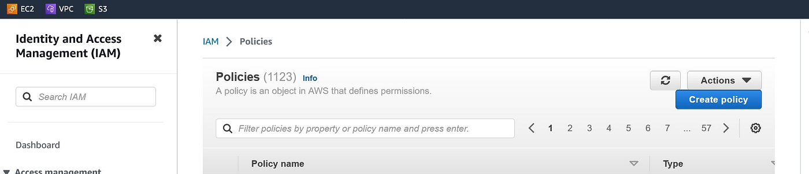



### Create the IAM role for Lambda

* In the IAM dashboard, click Roles → Create role.
* Choose "Lambda" as the trusted entity type.
* Attach policies such as `AmazonEC2FullAccess` and `CloudWatchEventsFullAccess` (or the custom policy you created).
* Name the role and create it.

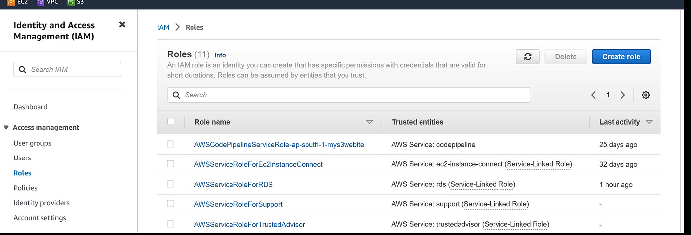 



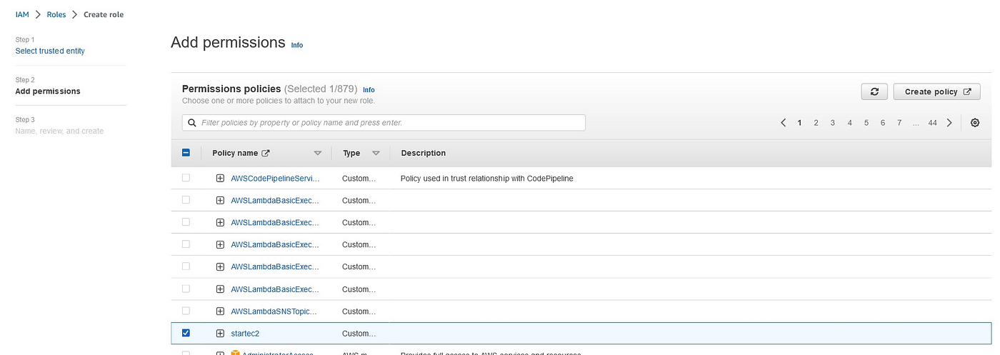 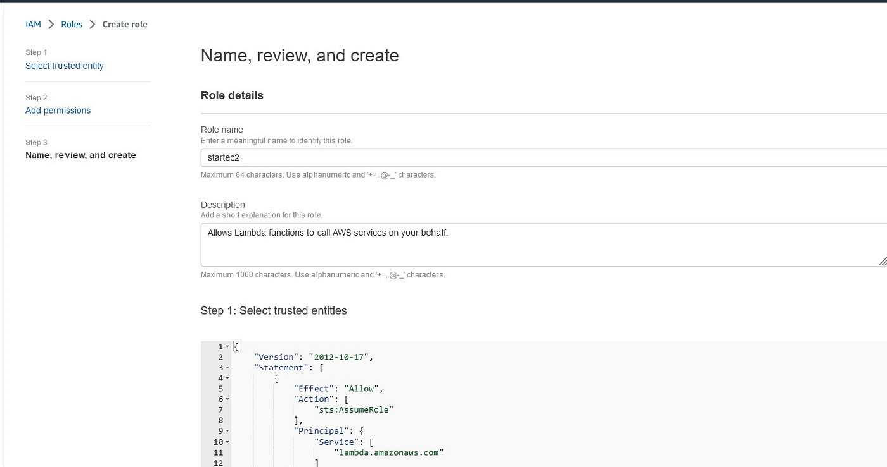 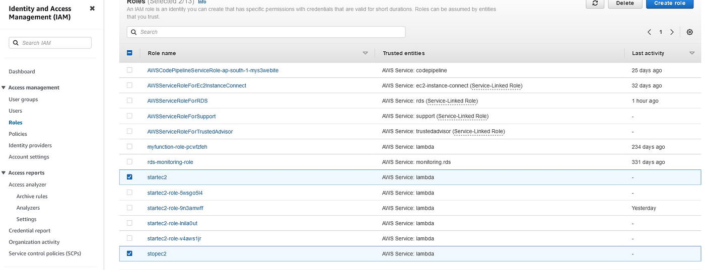

## Creating a Lambda Function

Create two Lambda functions (one to stop instances and one to start instances). Use Python 3.9 runtime and the IAM role you created.



### Create the "Stop EC2 Instances" Lambda

1. Go to AWS Services → Lambda → Create function.
2. Choose "Author from scratch".
3. For Function name, use something like `StopEC2Instances`.
4. For Runtime, choose Python 3.9.
5. Under Permissions → Change default execution role → Use an existing role.
6. Choose the IAM role you created.
7. Create function.
8. In the Code section, paste the stop function code (see below).
9. Choose Deploy.





### Create the "Start EC2 Instances" Lambda

Repeat the steps above to create a second function (for example, `StartEC2Instances`) and paste the start function code (see below). Deploy the function.

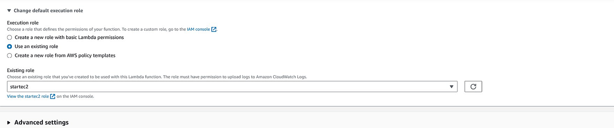



### Lambda code examples

Stop instances:


```python
# Lambda code reference to stop EC2

import boto3
region = 'us-west-1'
instances = ['i-12345cb6de4f78g9h', 'i-08ce9b2d7eccf6d26']
ec2 = boto3.client('ec2', region_name=region)

def lambda_handler(event, context):
    ec2.stop_instances(InstanceIds=instances)
    print('stopped your instances: ' + str(instances))
```


Start instances:


```python
# Lambda code reference to start EC2

import boto3
region = 'us-west-1'
instances = ['i-12345cb6de4f78g9h', 'i-08ce9b2d7eccf6d26']
ec2 = boto3.client('ec2', region_name=region)

def lambda_handler(event, context):
    ec2.start_instances(InstanceIds=instances)
    print('started your instances: ' + str(instances))
```


Replace the instance IDs in the `instances` list with your actual instance IDs.


## Setting Up CloudWatch Events (EventBridge Scheduler)

Use CloudWatch Events (EventBridge) to schedule the Lambda functions.



### Create a rule to stop instances on schedule

1. Go to the AWS Management Console → CloudWatch (or EventBridge).
2. In the dashboard, go to Rules (under Events) → Create rule.
3. Enter a Name, e.g., `StopEC2Instances`, and optionally a Description.
4. For Rule type, choose Schedule → Continue in EventBridge Scheduler.
5. For Schedule pattern, choose Recurring schedule.
6. Choose Schedule type:
   * For a rate-based schedule, enter a rate expression (e.g., every X hours).
   * For a cron-based schedule, enter a Cron expression.
7. In Select targets, choose Lambda function as the Target and select your stop function.
8. Review and Create.

Note: Cron expressions are evaluated in UTC. Adjust for your timezone.



### Create a rule to start instances on schedule

Repeat the steps to create another rule named, for example, `StartEC2Instances`, and select your start Lambda as the target. Configure the schedule (rate or cron) to match when you want the instances started.



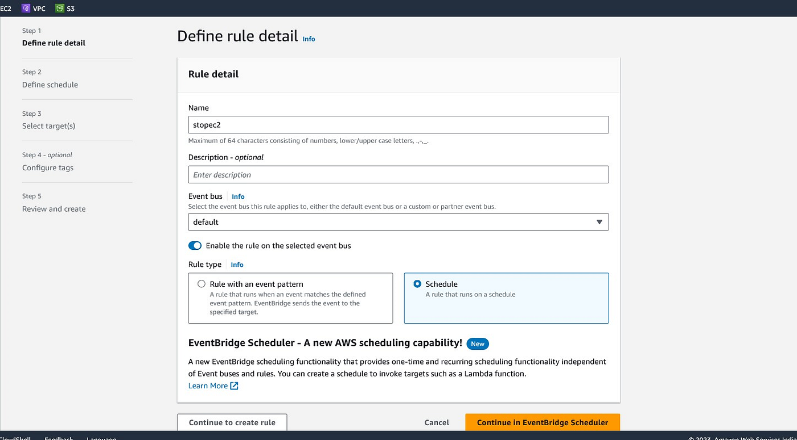 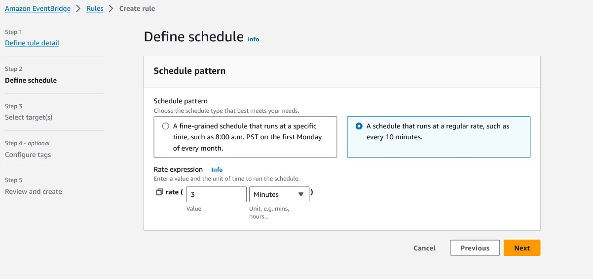 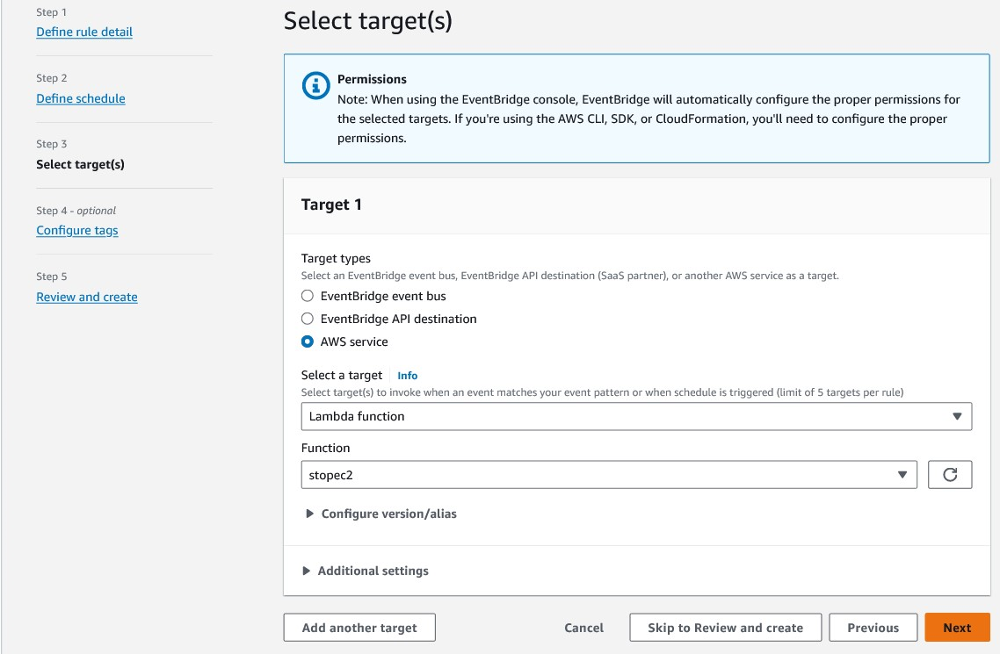 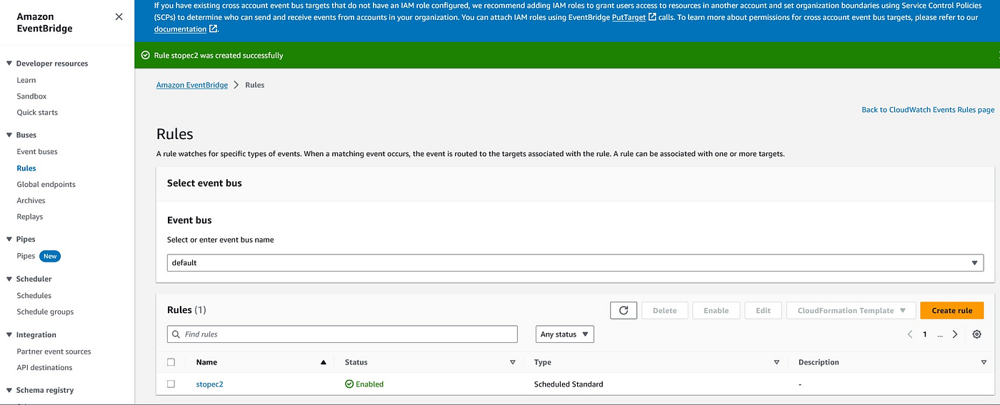


For details on cron expression syntax for EventBridge/CloudWatch schedule expressions, see: https://docs.aws.amazon.com/AmazonCloudWatch/latest/events/ScheduledEvents.html Also remember: Cron expressions are evaluated in UTC.


## Testing the Automation

After creating rules, the Lambda functions will be triggered according to the schedules and will start/stop the specified instances. Monitor CloudWatch Logs and the EC2 console to verify behavior.

* Check CloudWatch Logs for Lambda execution logs.
* Verify instance states in the EC2 console.

This completes the setup for automating EC2 start/stop cycles using AWS Lambda and scheduled CloudWatch/EventBridge rules.
