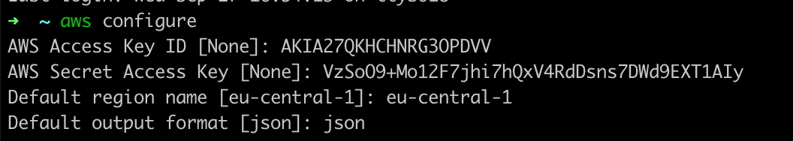
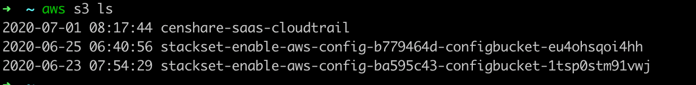
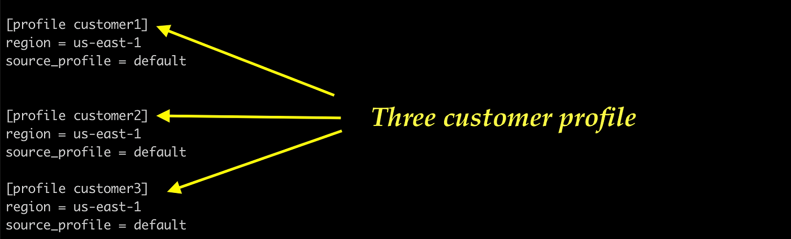

# aws cli

In the fast-paced world of cloud computing, managing and interacting with your resources efficiently is key to success. Amazon Web Services (AWS) provides a powerful tool for this purpose — the AWS Command Line Interface (CLI). The AWS CLI empowers users to interact with AWS services directly from the command line, offering flexibility, speed, and automation capabilities.

Unlock the power of AWS CLI with this step-by-step guide on configuration and command execution. The guide walks you through installation, credential setup, and practical examples for running essential AWS CLI commands.



### Install AWS CLI

Ensure that you have the AWS CLI installed on your local machine. You can download and install it from the official AWS CLI download page:

https://aws.amazon.com/cli/



### Open a Terminal or Command Prompt

Open your terminal or command prompt on your local machine.



### Run aws configure

In the terminal, run:


```bash
aws configure
```




### Enter AWS Access Key ID

When prompted, enter the AWS Access Key ID associated with your IAM user.



### Enter AWS Secret Access Key

When prompted, enter the AWS Secret Access Key associated with your IAM user.



### Set Default Region

When prompted, enter the default region you want to use.



### Set Output Format

When prompted, choose the default output format (for example, json, text, or table).

Example interaction:


```
AWS Access Key ID [None]: YOUR_ACCESS_KEY_ID
AWS Secret Access Key [None]: YOUR_SECRET_ACCESS_KEY
Default region name [None]: us-central-1
Default output format [None]: json
```


<figure><figcaption></figcaption></figure>



### Run AWS CLI Commands

Examples:

* List S3 buckets:


```bash
aws s3 ls
```


<figure><figcaption></figcaption></figure>

* Describe EC2 instances:


```bash
aws ec2 describe-instances
```


* Create an S3 bucket:


```bash
aws s3 mb s3://your-new-bucket-name
```


* Upload a file to S3:


```bash
aws s3 cp local-file.txt s3://your-new-bucket-name/
```


Replace placeholder values (bucket name, file path) with your actual values.



### Verification

You can verify the results of your commands by checking the AWS Management Console or by running additional AWS CLI commands as needed.




Remember to replace placeholder values like `YOUR_ACCESS_KEY_ID`, `YOUR_SECRET_ACCESS_KEY`, `your-new-bucket-name`, and `local-file.txt` with your actual AWS credentials, bucket names, and file paths.


## Multiple AWS CLI profiles

You can store multiple AWS CLI profiles by configuring named profiles in your AWS CLI configuration file (`~/.aws/config`). This allows you to switch between different AWS accounts or IAM roles easily.



### Open or create the AWS CLI configuration file

Open your terminal or command prompt and edit the AWS CLI configuration file. If the file doesn’t exist, it will be created:


```bash
nano ~/.aws/config
```




### Define AWS CLI profiles

In the configuration file, define multiple profiles using the following syntax:


```ini
[profile customer1]
region = us-east-1
output = json

[profile customer2]
region = us-west-2
output = json

[profile customer3]
region = us-east-1
output = json
```


Save the changes to the configuration file and exit the text editor.

<figure><figcaption></figcaption></figure>



### Use a specific profile for a command

Specify the profile you want to use for a particular AWS CLI command with the `--profile` option:


```bash
aws s3 ls s3://name-of-the-s3bucket --profile customer1
```


This command lists S3 buckets using the `customer1` profile.

<figure><figcaption></figcaption></figure>



### Switching profiles

To switch between profiles, use the `--profile` option with different profile names:


```bash
aws ec2 describe-instances --profile work
```


This command describes EC2 instances using the `work` profile.


