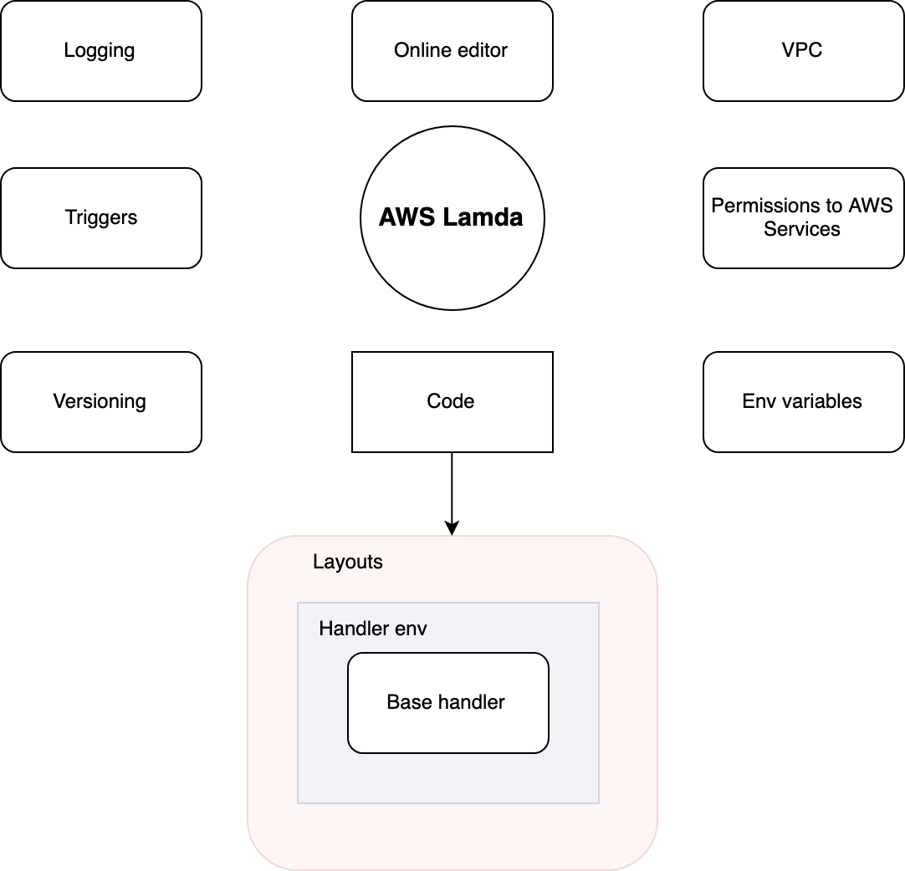
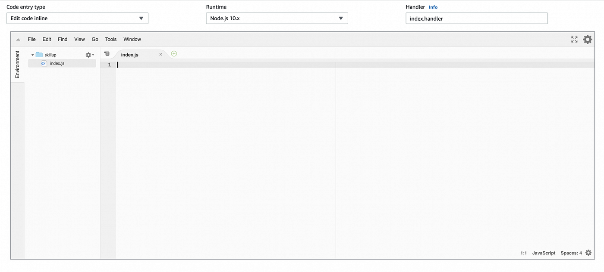

# aws lamda overview

AWS Lambda is a compute service that allows you to run code for virtually any type of application or serverless service without the need for server administration. AWS Lambda handles administrative tasks for you, including server and operating system maintenance, resource allocation, automatic scaling, code monitoring, and logging. All you need to do is provide your code in one of the languages supported by AWS Lambda.

AWS Lambda is used for several key reasons:

* Cost-Efficiency: You only pay for the compute time your service consumes. Since AWS Lambda functions are event-driven and stateless, you are not charged for idle resources, making it a cost-effective choice.
* Speed: AWS Lambda functions start and execute quickly, which is ideal for applications requiring low latency and rapid response times.
* Convenience: Lambda integrates seamlessly with various AWS services, allowing you to build complex workflows and applications easily. It also supports a wide range of event sources, including API Gateway, S3, DynamoDB, and more.
* Scalability: Lambda can automatically scale to handle a large number of concurrent requests. Depending on the AWS region, you can run anywhere from 1000 to 3000 concurrent executions of your functions, and you can request an increase in this limit through AWS support if needed.

In summary, AWS Lambda offers a cost-effective, fast, and convenient way to build serverless applications that can scale to meet your performance requirements.

There are some limitations to the AWS Lambda approach:

* Lack of OS Control: AWS Lambda abstracts away the underlying operating system, which means you cannot manage or customize the operating system itself. You are restricted to the runtime environment provided by AWS.
* Limited Control Over Resources: AWS Lambda automatically manages CPU, memory, and other resources for you based on your function’s configuration. While this simplifies scaling, it also means you have limited control over resource allocation.
* Language Constraints: You can only choose from the programming languages supported by AWS Lambda. This limits your language choices compared to traditional server environments.

Below is a brief list of the main functions of AWS Lambda. We will then discuss each of them in order.

<figure><figcaption></figcaption></figure>

## Triggers

Triggers are Lambda’s “activators.” Lambda executes and then terminates in response to triggers. A Lambda function is invoked by one or more triggers; whether it executes synchronously or asynchronously depends on the trigger type.

### Possible triggers

* API Gateway
* AWS IoT
* AWS Step Functions
* CloudFront
* CloudWatch Events
* CloudWatch Logs
* CodeCommit
* Cognito Sync Trigger
* DynamoDB
* Kinesis
* S3
* SNS
* SQS
* Alexa Skills Kit
* Lex
* SES
* Alexa Smart Home
* CloudFormation
* Custom Application
* Direct Invocation
* Mobile Application (e.g., Android, iOS)
* AWS CloudTrail
* AWS Config
* AWS Glue
* AWS Key Management Service (KMS)
* AWS Secrets Manager
* AWS Step Functions (Sync)
* Aurora (RDS)
* Elastic File System (EFS)
* EventBridge
* EventBridge Archive
* EventBridge Default Bus
* IoT Events
* IoT Events — API Calls
* IoT Events — API Calls (V2)
* IoT Events — Events
* IoT Events — Events (V2)
* S3 Batch Operations
* SageMaker
* SQS FIFO
* Web Application Firewall (WAF)

Please note that Lambda supports a wide range of triggers, enabling it to respond to various events and integrate with [many AWS services](https://gartsolutions.com/services/devops/aws-devops-services/) and external systems.

You can configure unique parameters for each trigger, and a single Lambda function can have multiple triggers. Whether the execution is synchronous or asynchronous depends on the trigger type. You can also invoke Lambda manually using the AWS CLI or AWS SDK by passing the necessary parameters, including whether it should run synchronously.

Examples:

* API Gateway: Invokes a Lambda function via an HTTP request and requires a response to be returned to the client. This is typically synchronous.
* SQS (Simple Queue Service): Lambda can process messages from SQS asynchronously. When executed asynchronously, you can configure retries, dead-letter queues, and other error-handling mechanisms.

## Permissions to AWS Services

Lambda functions operate under an IAM Role that specifies the permissions and privileges they have. In your Lambda function code you can include the AWS SDK and use permitted AWS services without embedding explicit keys or authentication parameters; the permissions are defined by the function’s IAM Role.

For each programming language used, there is a corresponding SDK that can communicate with core AWS services.

## VPC (Virtual Private Cloud)

You can configure a virtual network for your Lambda function to establish secure connections to resources such as Amazon RDS. This allows you to isolate Lambda functions within your own network, enhancing security and control over network traffic and access to resources.

## Online Editor

AWS Lambda provides an option to edit your function code directly from a web-based interface in the AWS console. This allows quick code changes without downloading, editing, and re-uploading files.

<figure><figcaption></figcaption></figure>

## Logging

All Lambda invocations are logged to CloudWatch, which records execution time and memory usage. These logs help you set resource limits effectively. Within your code you can also log custom data (for example, `console.log` in Node.js). Usage statistics are available in the Monitoring tab for insights into performance and utilization.

## Environment Variables

You can pass environment variables to your code and encrypt them using keys. This allows configuration without code changes. There is also a predefined [list of environment variables](https://docs.aws.amazon.com/lambda/latest/dg/lambda-environment-variables.html) you can use.

For encrypting environment variables see: https://docs.aws.amazon.com/lambda/latest/dg/env\_variables.html

## Code

A Lambda function consists of several components:

* Layers — Optional. Use layers to include libraries separate from the main code. This reduces the size of the main deployment package and can improve performance. Layers are reusable across functions and managed independently.
* Function Environment — The environment contains initialization and resources that are preserved between invocations for some time. Initialize configuration and connections outside the handler when possible to avoid repeated initialization overhead.
* Handler — The function entry point. The exact form depends on the runtime. For Node.js, the default is an `index.js` file with an exported function named `handler`.

Example (Node.js):


```javascript
// index.js

// Export a function named "handler"
exports.handler = async (event) => {
  try {
    // Your code logic here
    const result = await someAsyncOperation();
    
    // Return a response if needed
    return {
      statusCode: 200,
      body: JSON.stringify(result),
    };
  } catch (error) {
    // Handle errors and return an error response
    return {
      statusCode: 500,
      body: JSON.stringify({ error: 'An error occurred' }),
    };
  }
};
```


## Versioning

AWS Lambda supports versioning and aliases. You can publish versions of your function and create aliases that point to specific versions or to `$LATEST`. The flow below shows a typical way to use versions and aliases.



### Initial State

* Create the first version of your Lambda function.
* An automatic pointer `$LATEST` is created and points to the latest uploaded code.
* Create an alias `Dev` and attach it to `$LATEST` so `Dev` always points to the latest version for development testing.
* Create an alias `Stage` and attach it to version `1` (the first version) for the staging environment.
* Create an alias `Prod` and attach it to version `1` for production.



### Second State

* Create a second version of your Lambda function (for example, with new features).
* `$LATEST` now points to the second version; because `Dev` is attached to `$LATEST`, `Dev` points to the second version automatically.
* Update the `Stage` alias to point to the second version (it was previously pointing to version `1`) when you are ready to stage the new version.
* At this point: `Prod` → version `1`, `Stage` → version `2`, `Dev` → `$LATEST` (version `2`).



### Third State

* Create a third version by adding more changes.
* `Dev` (attached to `$LATEST`) will start pointing to version `3`.
* Manually update `Stage` and `Prod` aliases when you decide to promote versions to staging or production.


