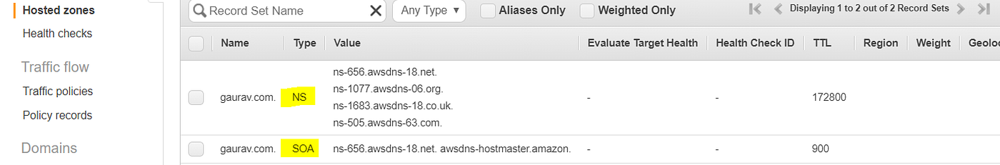
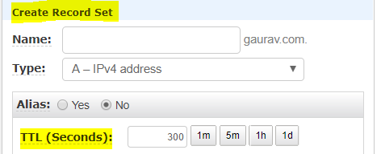
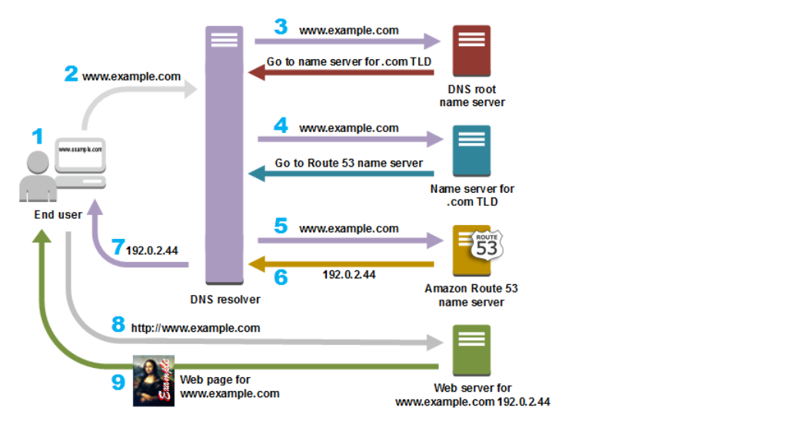
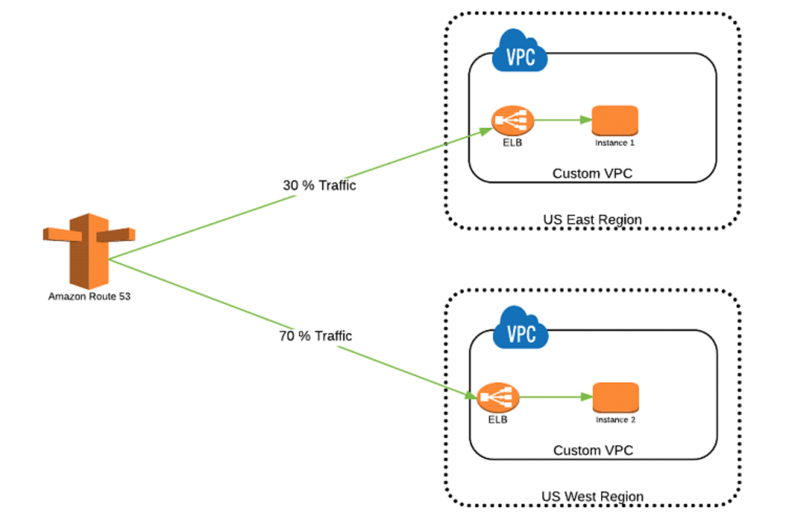
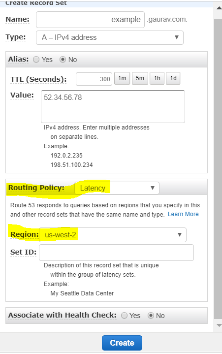
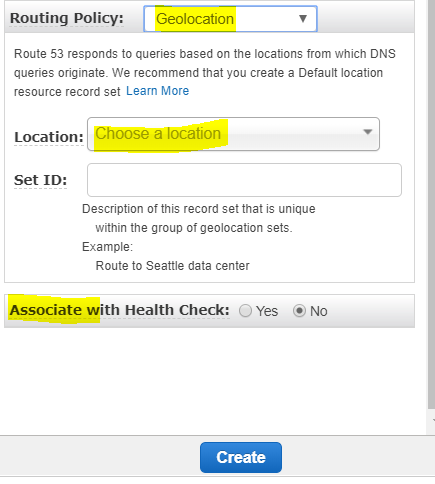

# aws route53.

So what is Route53, what is the use of it, and why do we use it?

<figure><figcaption></figcaption></figure>

Before we start with Route53, let’s understand what DNS (Domain Name System) is.

We have two types of IP addresses: IPv4 (32 bit field, approx 4 billion different addresses) & IPv6 (128 bits).

If you want to know how DNS name resolution works, see this blog: https://levelup.gitconnected.com/how-does-dns-domain-name-system-query-gets-resolved-137a9e445ad8?source=post\_page-----f3657b01ffa2---------------------------------------

Let’s head over to our main topic: Route53.

> In AWS, Route53 is a global managed DNS (Domain Name System). DNS is a collection of rules and records which helps clients understand how to reach a server through URLs.
>
> DNS operates on port 53. Amazon decided to call it Route 53—that’s where the name comes from.

Route53 is a global service. You need a domain to work with Route53: go to the Route53 service → Register domain → enter the domain → check availability → add to cart → continue.

Route53 can work with:

* Public domain names you own (or buy) or private domain names that can be resolved by your instances in your VPCs.
* Many features such as load balancing, health checks, and routing policies like Simple, Failover, Geolocation, Latency, Weighted, and Multi value.
* Cost: $0.50 per month per hosted zone.

When you create a hosted zone in Route53, two records are automatically created: SOA and NS.

<figure><figcaption>
Hosted Zone (SOA &#x26; NS Records)
</figcaption></figure>

TTL (Time to Live)

* TTL is mandatory for each DNS record. It is the length that a DNS record is cached on either the resolving server or the user's device.
* Lower TTL means changes to DNS records propagate faster.
* You must define TTL when you create a record set.

<figure><figcaption>
TTL (Time to Live)
</figcaption></figure>

<figure><figcaption>
How Amazon Route 53 Routes Traffic for Your Domain (Source AWS Official)
</figcaption></figure>

When you create basic records, you specify the following values:

* Name
* Type
* Alias
* TTL (Time to Live)
* Value
* Routing Policy

Records (common types)



### SOA (Start of Authority)

SOA stores information about:

* Name of server that supplied the data for the zone.
* The administrator of that zone & current version of the data file.

Example: ns-2048.awsdns-64.net. hostmaster.example.com. 1 7200 900 1209600 86400

Route53 name server that creates the SOA record: ns-2048.awsdns-64.net.\
Email address of administrator: hostmaster.example.com



### NS Record (Name Server Record)

NS records are your name server records used by top-level domain servers to direct traffic to the authoritative DNS server that contains the records.

* When you create a hosted zone in Route53, an NS record is automatically created.



### A Record (Address — URL to IPv4)

* The “A” record maps a domain name to an IPv4 address.
* Example: http://medium.com might point to http://126.78.98.90



### CNAME (Canonical Name — URL to URL)

* CNAME points a subdomain (non-root domain) to another domain name.
* Use: something.mydomain.com → otherdomain.example.com
* Note: CNAMEs are used only for non-root domains.



### Alias Record

* Alias records point a URL to an AWS resource (e.g., Elastic Load Balancer, CloudFront distribution, or S3 bucket configured as a website).
* Alias records are Route53-specific and can be used at the zone apex (root domain).



### AAAA (URL to IPv6)

* AAAA maps a domain name to an IPv6 address (IP version 6).



### MX Record (Mail Exchanger)

* MX records specify the mail server(s) responsible for accepting email messages on behalf of a domain.
* You can configure multiple MX records for redundancy and load balancing.



Routing policies

> When you create a record, you choose a routing policy, which determines how Amazon Route 53 responds to queries.

<figure><figcaption>
Routing Policy
</figcaption></figure>

There are six routing policies in Route53. Below they are presented as steps.



### Simple routing

* Maps a domain to a single resource.
* You can have one record with multiple IP addresses; Route53 returns all values in random order.
* Use when you need to redirect to a single resource.
* You can’t attach health checks to simple routing policy. If multiple values are returned, the client chooses one.



### Weighted routing

* Controls the percentage of requests sent to specific endpoints.
* Useful for testing (e.g., 1% of traffic to a new app version) or splitting traffic across regions.
* You can associate health checks with weighted records.

<figure><figcaption>
Weighted Policy
</figcaption></figure>



### Latency routing

* Routes traffic based on the lowest network latency for the end user.
* Redirects to the region with the least latency from the user’s location.
* Latency is evaluated in terms of user-to-designated-AWS-region.

<figure><figcaption>
Latency Routing Policy
</figcaption></figure>



### Failover routing

* Routes traffic to a primary resource when healthy, and to a secondary resource when the primary is unhealthy.
* Can be used to route to S3 website endpoints, ELBs, or complex record trees.
* You can associate health checks with failover routing.

<figure><figcaption></figcaption></figure>



### Geolocation routing

* Routes traffic based on the geographic location of DNS queries' origin.
* Example: route all queries from Europe to an ELB in the Frankfurt region.
* You can associate health checks with geolocation routing.

<figure><figcaption>
Geolocation Policy
</figcaption></figure>



### Multi Value routing

* Returns multiple values for a DNS query and routes traffic to multiple IP addresses.
* Use when you want to return multiple answers and associate records with Route53 health checks.
* Up to 8 healthy records are returned for each multi-value query.
* Note: Multi Value routing is not a substitute for an ELB.

<figure><figcaption></figcaption></figure>



This covers the essential Route53 records and routing policies.
