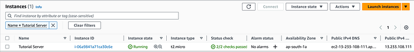
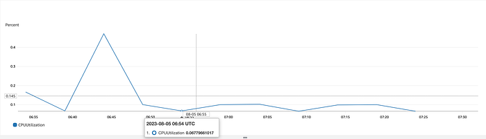
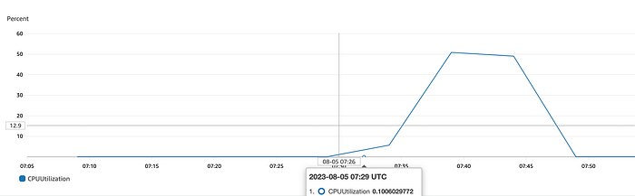
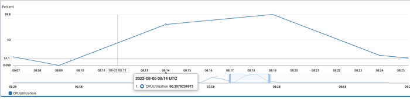
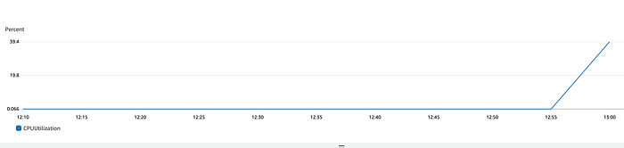
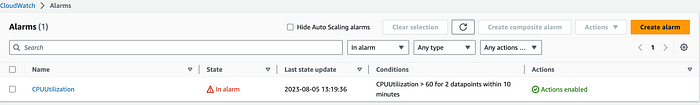
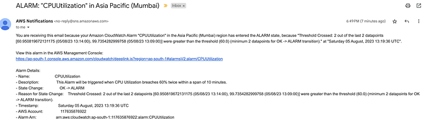

# cloudwatch

 _CloudWatch Monitoring and Alerting_

## Agenda

Monitoring and Alerting of AWS resources is performed using AWS’ CloudWatch.

Monitoring involves a related concept called Metrics. Alerting involves a related concept called Alarms.\
Thus we would get familiar with:

* Metrics
* Monitoring
* Alarms
* Alerts

Alerts need to be configured using AWS SNS service. Hence we would also touch upon the following SNS concepts:

* Topic
* Subscription

We will monitor an EC2 instance in this post. Monitoring can also be configured on other AWS resources like API Gateway, Lambda, S3 etc.

## Prerequisites

We will use three AWS services, namely CloudWatch, EC2 and SNS. Hence having a user authorised for these three services would help.

## EC2 setup

We are interested in monitoring the CPU Utilisation of an EC2 instance. Hence, we need an EC2 instance.

Let’s launch an EC2 t2.micro instance, we can use Ubuntu 22.04 LTS AMI or any other AMI.

We have named our instance _Tutorial Server_.



## Metrics

Monitoring is always performed on a **Metric**. Some examples of metrics are:

* CPU Utilisation
* Memory used
* Memory available
* Bytes read
* Bytes written

A useful metric for compute resources is **CPU utilisation**. As EC2 is a compute service, so let’s focus on CPU utilisation.

CloudWatch provides ability to view metrics for different resources. It can be used to see CPU utilisation of an EC2 instance.

Navigate to CloudWatch > Metrics > All metrics

Metrics are grouped under namespaces.

You would find _EC2_ under _AWS namespaces_. As we are interested in an instance metric, thus need to select _Per-Instance Metrics_.

If you have multiple EC2 instances, metrics for all the instances would show up. Filter by the instance id to view only an instance’s metrics.

You would find a column **Metric name**. It lists several metrics like **CPUUtilization**, **DiskReadBytes**, **DiskReadOps** etc.

We can select and graph CPUUtilization.

Every data point of this graph shows average cpu utilisation over a 5 minute period.\
You would notice a difference of 5 minutes between each successive data point.

Let’s check average cpu utilisation every 1 minute rather than 5 minutes. Also, let’s see only last 1 hour data instead of 3 hours. We will have to switch to _Graphed Metrics_ tab.

The graph should start looking like:



We are working on a brand new EC2 instance which isn’t doing any real work. Hence the CPU utilisation is less than 1 percent.

## Stress test

Let’s stress the instance with some real load and see how the CPU utilisation spikes.

`stress` is a useful tool to subject any machine to real CPU load.

ssh to the instance.

```bash
ssh -v -i identity-file.pem ubuntu@13.233.108.111
```

Install stress on the instance.

```bash
sudo apt update
sudo apt install -y stress
```

Let’s perform a stress on the CPU.

```bash
sudo stress --cpu 1 --timeout 300
```

This would put load on the CPU for 300 seconds, i.e 5 minutes.

We will check the metric after 5 minutes once stress has completed. Go and grab a coffee in the meanwhile!

Recheck the metric and graph it after 5 minutes. The graph would look similar to the following:



This suggests that during the 5 minute interval that the stress was running, CPU utilisation was 50 percent.

Let’s increase the number of concurrent processes to 4 and run the processes for 10 minutes.

```bash
sudo stress --cpu 4 --timeout 600
```

Recheck and graph the metric after 10 minutes. The graph would look similar to the following:



This suggests that during the 10 minutes interval, CPU utilisation reached 80 percent and then went up till more than 99 percent and slowly came down towards 20 percent.

## Alarm and Alert

We want to be alerted whenever there is a spike in CPU utilisation. This will allow us to take corrective action like scaling the compute capacity before there is an outage.

The foundation for Alerting is **Alarms**. Hence, Alarms need to be configured.

The alarm would indicate us that current server resources aren’t sufficient to sustain the load.

We can create an **Alarm** from **Graphed metrics** tab.

Alarm creation has three major parts:

* Metric
* Condition
* Action

A CloudWatch Alarm has different states. The two states of interest are _OK_ and _In Alarm_.

We took the following steps:



### Create alarm — select actions

Under **Actions**, choose **Create alarm**.



### Create alarm — metric fields

As we have reached the Create alarm page from Metric detail page, fields **Metric name**, **InstanceId**, **Statistic** and **Period** are auto-populated.



### Create alarm — set condition

We want Alarm to transition to **In Alarm** state when CPU utilisation breaches 60 percent. Hence the **condition** specified is **Greater than 60**.



### Create alarm — action destination

When Alarm changes state, CloudWatch sends a notification to an SNS Topic.



### Create alarm — SNS topic & subscription

Create an **SNS Topic**. Add an **EMAIL Subscription** to this topic with your email address.



### Confirm subscription

Subscriptions need to be confirmed. After creating the email subscription, the subscription will be in **Pending Confirmation** state.



### Confirm via email

Open the email from AWS Notifications and confirm the subscription. Refresh the subscriptions list page — the subscription _Status_ should change to _Confirmed_.



We consider our application stable when cpu utilisation stays below 60%. That’s why our alarm has been configured to trigger when the utilisation goes above 60%.

Let’s again run stress for 10 minutes.

```bash
sudo stress --cpu 1 --timeout 600
```

Navigate to Metrics and graph the CPUUtilization after few minutes.



CloudWatch also provides an Alarm list page. Let’s navigate there and see the created Alarm.

We can see the created Alarm named CPUUtilization. Also, the current state of Alarm is shown here which is _OK_.

Let’s increase the CPU concurrency with stress. This will put additional load on the server CPU.

```bash
sudo stress --cpu 2 --timeout 600
```

After 10 minutes, once the relevant data points are published to CloudWatch, check the Alarm page again.

It’s highly likely that the Alarm has transitioned to _In alarm_ state.



Since our Alarm’s action specified a SNS Topic and an Email subscription, you should have received an Email from AWS.



This confirms that our alarm and alerting is working as intended.

## Recap

CloudWatch allows users to monitor different resource metrics. Alarms can be configured on the monitored metrics.

When the configured metrics thresholds are breached, the alarm transitions from **OK** to **In Alarm** state.

Alerts can be configured to be triggered on alarm transition. A basic alerting mechanism could be sending an email. In AWS, alerts are configured using SNS.
