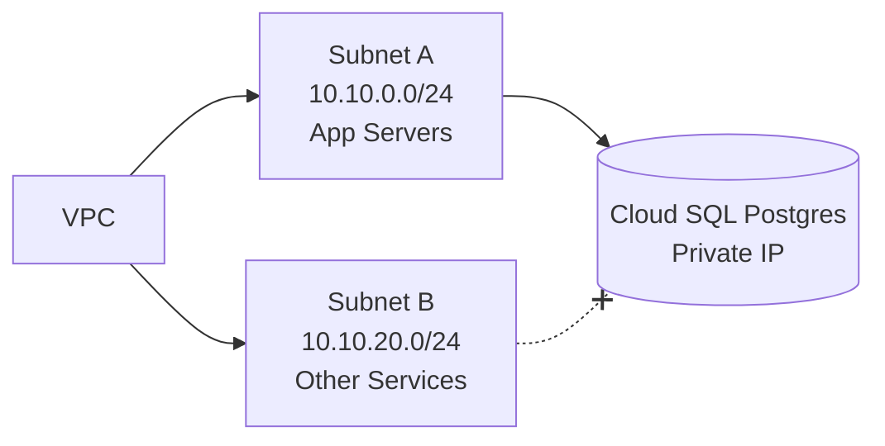

# Data Base Basics

## Four types of databases

Typically, as a cloud engineer, you will be dealing with four main types of databases.

Number one is relational databases.\
Number two is non-relational databases.\
Number three is in-memory databases.\
Number four is time series databases.

Now, what are these databases? Let’s go through each one of them and understand their real-life implications with practical examples.

## Relational databases with banking example

First, let’s talk about relational databases, which are very popular and quite widely used. In relational databases, data is stored in terms of tables and organized into rows and columns.

Let’s take an example to make it very concrete. Suppose you are working in a banking company. You will most likely be asked by your developers to create a relational database. Why?

Imagine your development team wants to deal with employee data. They want to understand which employee belongs to which department in the bank, and they want to save these records in a structured way.

How will they do this? First, they will create a table. So this is the first table they will create in the database.

This table has the ID of the employee, the name of the employee, and the age of the employee. For example:\
ID 1, name is Abby, age is 25.\
ID 2, name is XYZ, age is 30.

So, in this first table—let’s call this the employee table—these records are saved.

Now in the second table, again within the same database, the developer creates another table. In this second table, the developer stores department ID and the name of the department.

For example:\
Department ID 101, name: “Safe Department.”\
Department ID 102, name: “Credit Cards Department.”\
Department ID 103, name: “Debit Cards Department.”

So this second table is for departments.

Finally, the developer creates a third table which establishes the relationship between these two tables—employees and departments. This third table holds the output that the organization is actually looking for.

What does this third table have? It has the employee ID and the department ID mapping. For example:\
Employee ID 1 belongs to department 101.\
Employee ID 2 belongs to department 102.\
Employee ID 3 again belongs to department 101.

So this mapping table is created by establishing a relation between the employee table and the department table. Because the data across these tables—these entities—has a relationship, this is called a relational database.

In a relational database, as I told you, data is usually stored in tables and organized into rows and columns. Also, the data that is stored in relational database tables is usually consistent in nature.

What do I mean by consistent? This data looks predictable in structure. Even when there is a new employee, you know how the data would look. Typically:\
Employee ID will be some incrementing integer.\
Name will be a string of certain characters.\
Age will be between 0 and 100.

So you know the shape of the data because it is consistent in nature when it comes to relational databases.

### Block diagram: relational database example

At this point, on the whiteboard, I would draw a simple block diagram to visualize the three tables and their relationship.

```mermaid
flowchart LR
    A[Employee Table\n(emp_id, name, age)] --> C[Employee-Dept Mapping\n(emp_id, dept_id)]
    B[Department Table\n(dept_id, dept_name)] --> C
```

You can point to each block and say: this is the employee table, this is the department table, and this is the mapping table that creates the relation between them.

## Non-relational databases

Now, let’s move on to non-relational databases.

Non-relational databases are used when you don’t have such consistent, strictly structured data. Maybe you want to store documents, or you want to store key-value pairs, or even graphs. In such cases, you go for a non-relational database for your organization.

A key-value pair can be anything, as long as there is a key and there is a value. If your data looks like semi-structured documents, or flexible key-value pairs, or graph structures, a relational model becomes too rigid, and that is where non-relational databases shine.

Now, what are some examples of relational databases? We already discussed the concept. Popular relational databases are PostgreSQL, MySQL, and Oracle—these are all very popular relational database systems.

When it comes to non-relational databases—again, this is when you don’t have consistent tabular data, and you want to store key-value pairs, documents, or graphs—then you go for databases like MongoDB, Cassandra DB, or DynamoDB, which is a very popular choice in this space.

As a DevOps or cloud engineer, you will usually ask your developer what sort of database they need. The developer can provide the requirement, and based on that you can decide which kind of database to go with, or sometimes the development team will directly tell you which database they want.

I am explaining the concept here so that you understand the “why” behind the database choice, not just the “how.”

## In-memory databases with e-commerce example

Now, let’s understand in-memory databases. Instead of starting with a strict definition, we’ll understand this through an example.

These days, we all use e-commerce websites. When we use e-commerce sites and we add an item to the cart, you will notice that even when you log in again later, you still see that item in your cart.

Even if, for some reason, the e-commerce site goes down, and you log in after one month, or even after one year, during that entire period the e-commerce application might have had some downtime—because it’s practically impossible for applications to be 100 percent up all the time—but still, when you log in, you see the same items in the cart.

Why does this happen? This happens because, as soon as you log in, the application fetches the state of your session or the state of your last login.

How does this work internally? Applications store this state information in in-memory data stores optimized for fast read and write operations.

Here, the popular in-memory databases are Redis, Memcached, and even Valkey. These are very popular options when it comes to in-memory databases.

As the name suggests, in-memory databases store data primarily in RAM. Relational and non-relational databases typically deal with huge amounts of data and store that data on persistent storage.

So, for example, if you take PostgreSQL, you’ll have a virtual machine running a PostgreSQL instance, but the actual data is stored on a large storage server or a dedicated volume. It can be SSDs, a Google Cloud Storage bucket, EBS volumes in AWS—some kind of persistent storage.

So PostgreSQL stores data on storage that is isolated from the compute or virtual machine.

But when it comes to in-memory databases such as Redis, they typically store data in the RAM of that machine. So if you’re creating a virtual machine running Redis, more or less the compute and the data (in RAM) are tightly coupled, not completely isolated like relational databases with separate storage servers.

Popular in-memory database use cases are: session management, caching information, and leaderboards (for example, in gaming applications). These are classic scenarios where in-memory databases are used.

## Time series databases

Finally, let’s talk about time series databases.

Time series databases are used when the data you deal with corresponds to timestamps. For example, your organization is building or using a monitoring stack where data points are tied to specific points in time.

Think of CPU utilization metrics. At time 10:00:01, the CPU utilization is 70 percent. At time 10:00:02, the CPU utilization is 80 percent.

So if you want to store data with respect to timestamps, and the data is changing very quickly, you go for a time series database.

Examples of time series databases are InfluxDB and TimescaleDB. And if you are a cloud aspirant, you would also know Prometheus. Prometheus has a built-in time series database.

So these are popular time series databases, and their typical use cases are monitoring, observability, IoT sensors, or anything that is metrics-driven and time-based.

## Quick recap of database types

Let’s do a quick recap of the four types of databases you typically deal with as a cloud or DevOps engineer.

Relational databases store data in tables, rows, and columns. Relational databases are the most popular and widely used. Most likely, you will be working with relational databases in your projects, especially for traditional applications like banking applications or e-commerce applications. Storing user details, employee details, and similar structured data usually happens through relational databases.

Non-relational databases are used when you don’t have consistent, strictly structured data, and you want to store different types of data such as documents, key-value pairs, or graphs. In that case, you go for a non-relational database.

In-memory databases are used when your application deals with session management, caching, leaderboards, or even queues in some cases. In these scenarios, your organization would typically request you to create an in-memory database.

Time series databases are used when your organization is dealing with metrics—maybe for a monitoring stack or IoT sensor data—anything where data is linked to time and changes rapidly. In that case, your organization would require a time series database.

## The big question: how to create these databases?

Now, the big question is: how do we actually create these databases in real environments?

You might have a discussion with your developer or development team, and you have agreed to go with a relational database, for example PostgreSQL, and a specific version, say PostgreSQL version 17.

You have come to this agreement, but as a DevOps or cloud engineer, your big question is: how do you install and configure this database? This installation and configuration is one of your major tasks.

There are three main ways of achieving this. This is the part you have to focus on more as a cloud engineer.

Option one: on-premises.\
Option two: self-hosting on the cloud.\
Option three: managed hosting or managed services.

Let’s break down what these options mean.

## On-premises vs self-hosted vs managed

On-premises means you set up your own data center for your organization, or you buy physical servers for your organization. On those servers, you set up a cluster of your database—in this case, a cluster of PostgreSQL—and you install and configure the required version, say v17. That is option one.

Option two is self-hosting on the cloud. Conceptually, it is similar to on-premises, but instead of buying physical servers, you rent virtual machines from a cloud provider.

Again, the concept is more or less the same: on the rented servers, along with attached storage, you install PostgreSQL of a defined version, say v17.

The advantage over pure on-premises is that you don’t have to maintain the physical hardware and, depending on the setup, you often offload some operating system maintenance to the cloud provider. You still manage the database layer, but you enjoy the elasticity of cloud infrastructure.

Finally, option three is managed services. Here, you just go to a cloud provider—let’s say Google Cloud Platform. You go to its managed database offering, like Cloud SQL, and within Cloud SQL you look for PostgreSQL.

You pick the service you need and literally click a few buttons. That’s it—PostgreSQL is installed and configured for you as a managed service.

These are the three options: on-premises, self-hosted on cloud VMs, and managed service.

### Block diagram: hosting options

At this point, I would draw a simple block diagram to compare these three hosting models.

```mermaid
flowchart LR
    A[On-Prem\nYour data center,\nyour servers] --> D[PostgreSQL Cluster]
    B[Self-Hosted in Cloud\nVMs + Storage] --> D
    C[Managed Service\n(e.g., Cloud SQL)] --> E[Managed PostgreSQL\n(click-to-create)]
```

You can use this to visually highlight: here you manage everything; here you manage VMs + DB; and here the cloud provider manages most of it.

## When to choose which option

Now let’s understand when a cloud engineer should go for which option.

When you’re dealing with a highly secure environment—maybe you’re working for a bank—and you are dealing with critical banking data such as employee details, customer details, client information, policies they have taken, and other sensitive information, in many such cases you may be required to go for a data center or an on-premises setup.

You might not be allowed to trust the security of your data entirely to a cloud provider’s configuration. In those scenarios, you often strictly go with an on-premises option.

Now, let’s say your data is important, but you and your regulators are okay trusting the cloud provider for this particular data. Then you can go for the self-hosted option on the cloud, where you set up a bunch of virtual machines, create a database cluster out of them, and because you are renting, you can scale down when you don’t need them and scale up when you do.

So, compared to on-premises, you can save some money by scaling dynamically. However, you still have to take care of patching the database version.

Today your database might be v17; tomorrow, if you need v18, you must plan and perform that upgrade. So the advantage here is cost flexibility, but the disadvantage is that you still have to maintain the database software. You may not have to maintain physical hardware, but the database lifecycle is still your responsibility.

Now, the third option is managed database offerings. With managed services, you have very little operational work to do. You go to the cloud provider, click a few buttons, and you have a complete managed solution.

The advantages are very low maintenance and strong automation. Operating system-level patching is handled by the cloud service. Database-related patching, version upgrades, and security patches are also taken care of by the cloud platform.

Of course, the disadvantage is usually higher cost per unit compared to self-hosting. However, because managed services are efficiently managed by the cloud provider, if you self-host poorly, your self-hosted option can actually end up being more expensive.

I don’t want to confuse you, so let me make this very clear. Autoscaling should be taken care of carefully by the team managing the infrastructure. If the cloud or DevOps team does not handle autoscaling well in a self-hosted setup, they can waste resources and drive up cost.

Managed services typically take care of upscaling and downscaling for you. They try to make sure whenever you don’t need compute or storage, the resources are right-sized automatically.

So even though managed services look costlier on paper than self-hosting, if self-hosting is not efficiently managed, managed hosting can actually be cheaper overall.

Overall, it depends on your organization’s needs. If you want a very, very secure solution, you might go with on-premises.

If you want to do things by yourself instead of relying on a managed service, and you are okay renting servers and manually taking care of upscaling and downscaling because you have a larger cloud team, then you can go with the self-hosted option.

If you have a small team and you don’t want to invest in more cloud engineers to handle scaling and patching, then you can go for a managed cloud offering and rely on the cloud platform for autoscaling as well as data security.

So this is how you think about different types of installations and hosting models.

## What’s popular in 2025?

Now, another question you might have is: ", which one is actually popular today? Out of all of these, what is used most by teams in 2025?”

Today, a lot of companies are moving towards managed services. What cloud platforms typically do is they take open-source solutions—this is true for Kubernetes, Redis, Valkey, Kafka, and many others—wrap them as managed services, and distribute these managed offerings to cloud customers.

Because these are based on open-source offerings, and open source is maintained by an external community, cloud providers can build managed products around them and tune the pricing.

Companies have realized the advantage of managed services: they can manage infrastructure using small teams. In many organizations, DevOps and cloud teams are relatively small. That’s why companies are increasingly moving towards managed services.

So, if you are giving an interview and someone asks what you have used, it is quite safe to say you have experience using managed services for databases in your organization.

## Practical demo: Google Cloud SQL for PostgreSQL

Now that we understand what databases are and the different ways of hosting them—how to install and configure them—let’s see this in practice.

We will go to Google Cloud Platform. I already have a database instance running, but I’ll create a new one so you can follow along. You can do this with me or you can try it later after watching the video.

Step one: we start by creating a project in Google Cloud. If you want to do the same exercise on AWS or Azure, you can absolutely do that. But if you want to follow exactly what I’m doing on Google Cloud Platform, I already have a GitHub repository available.

You can go to the repository—for example, a folder like “day ten” for Cloud SQL—and you can see what is covered as part of this video. If you go to that day’s folder, you will find a README file which has all the steps related to today’s video, including both the theory part and the practical part that we’re doing right now.

So, step one, if you’re using Google Cloud Platform, is to create a project and make sure billing is enabled. Once you’re done with the demo, you should come back to this project, disable billing, and delete the project, because databases do not come for free.

If you’re on a free trial, you may get some usage for free, but databases are costly, and they can eat up your free account credits. So after watching this, and after practicing, please go back, disable billing, and delete the project.

Now, first step after project creation is to look for “Cloud SQL.”

Cloud SQL is the managed database service on GCP for relational databases. I already have a PostgreSQL instance, but I’ll create a new one. It’s very simple: click on “Create instance.”

Cloud SQL is specifically for relational databases. If you want to create other types of databases—like in-memory databases or time series databases—Cloud SQL will not help. In that case, you should search for the specific database you’re looking for.

If Google Cloud Platform has a managed offering for it, you can use that. Otherwise, you have to go with option two we discussed earlier: self-hosting your own services on virtual machines.

Cloud platforms do not offer managed services for everything; they only offer managed services for popular solutions.

For example, if you want to go with Oracle right now, there is no Oracle managed service inside Cloud SQL. In that case, you have to install Oracle yourself on virtual machines that you rent on the cloud platform.

In our case, I’ll go with PostgreSQL.

## Cloud SQL tiers and SLA

When you choose PostgreSQL in Cloud SQL, you’ll see there are usually multiple tiers. In this example, there are two options: Enterprise Plus and Enterprise.

The major difference between these tiers is the SLA—Service Level Agreement. This pattern is similar across most cloud platforms.

SLA plays a critical role. If you are working on a critical application—let’s say an e-commerce application—where you cannot afford even 0.01 percent downtime, then you should go for Enterprise Plus.

If you are working for a startup or mid-scale company where you can afford a slightly higher downtime—for example, 0.05 percent, which is still very low—then you can go for the Enterprise plan.

You can also see the cost shown in the console. For example, with default options it might show something like 1.23 dollars per hour, but I’ll show you how you can bring it down.

For a hobby project or for a development environment, you can go with the lower Enterprise plan and choose a smaller-sized database instance.

For this demo, I’ll go with 2 CPUs, 8 GB RAM, and 10 GB storage. Since this is just for practice, I don’t need high availability.

In a real production environment, you would definitely enable high availability.

This is also something that can be asked in interviews: “What kind of configuration do you take care of when you create a database instance?” You can answer that in production you go with high availability, and in lower environments you choose a single-zone database instance.

The reason is simple: when you go for high availability, a cluster is created, where one copy of the instance is in zone A and another copy is in zone B, so even if one data center goes down in that region, you still have your database instance up and running.

## Version, instance ID, credentials, region

Another advantage of managed services like Cloud SQL is version flexibility. You can choose any PostgreSQL version, and at any point in time you can relatively easily upgrade between versions.

Next, you choose an instance ID. For example, I might call it “demo-db.”

You also need to pick a strong password. These credentials are what you will use later to log into the instance once it is created—either to create databases or to create tables within a database.

Then you choose the region. In this case, you should choose a region that is nearest to your client, not nearest to you or your development team. The reason is that the client is the one making the requests, and the client should receive responses quickly, so you pick a region close to your end users.

So I’ll just pick a suitable region. I’ll also select single-zone again for this demo.

## Instance customization and cost optimization

Now let’s talk about instance customization.

These are exactly the configurations you can talk about in an interview when asked “What did you do with your database infrastructure?” You can say things like: I ensured my production instances are highly available, I made sure production instances are upscaled correctly, and I used smaller instances in non-production environments to save cost.

You can show how the cost changes when you modify configurations. For example, from 1.23 dollars per hour, you might bring it down to 0.17 dollars per hour by choosing smaller machine types and lower storage.

If you extend that over one year, saving (1.23 − 0.17) dollars per hour translates into significant savings. Roughly, you can think of 24 hours per day multiplied by 365 days per year, which comes close to around 10,000 dollars per year on a single instance.

This is where cost optimization comes into the picture, and as a cloud or DevOps engineer, you should be very strong at this.

You can further downsize the machine if it’s just for hobby or development usage and bring the hourly cost even lower, for example to 0.08 dollars per hour.

You’ll also see options like data caching, which you can leave as defaults for now.

## Storage and automatic storage increase

Let’s talk about storage settings. There is one very important option here: “Enable automatic storage increase.”

Why is this important? In databases, you are storing data and, in many cases, you cannot accurately predict how much data you will store over time.

Maybe you are storing logs from an application, or storing documents from an application in MongoDB, as an example. At one point, you might have very little data, but when you suddenly get a lot of concurrent user requests, you might start pushing a large volume of data into the database.

If you set a fixed storage size, say 250 GB, there will be a point where the storage fills up and you need more space, but you may not have time to manually add storage because users are actively accessing the system.

To avoid such situations, you can enable automatic storage increase.

So, if you initially set 250 GB and usage reaches, for example, 200 or 220 GB, the cloud platform will automatically add additional storage to the instance. This helps you play safe.

## Securing the database: private IP and authorized networks

Now, another important setting is securing your database instance.

How do you secure it? One way is to enable private IP. This disables direct public access to your database and lets you place the instance inside a particular VPC.

So, you can select which VPC you want your database to live in. If you check the “Private IP” option and select a specific VPC, the scope of your database’s network access is restricted to that VPC.

Additionally, you can authorize specific networks. Let me explain this further because security is very important.

When you create a PostgreSQL instance and databases inside it, you can place that instance in a subnet. You can disable public access so that only workloads within that VPC—through private IP addresses—can access the database.

If the instance is exposed publicly, then anybody on the internet could theoretically attempt to access that database, which is a bad practice.

Within a VPC, you can also have multiple subnets. Suppose you have one subnet where you want the application to access the database and another subnet where you do not want the application to access the database.

For example, subnet A could have the range 10.10.0.0/24, and subnet B could have the range 10.10.20.0/24. You can authorize only the network of subnet A so that only applications inside subnet A can reach the database.

You can further secure things using firewall rules and other configurations, but for now understand two main ideas: using private IP and authorizing particular networks.

For a hobby project, you can also authorize your personal machine—that is, your laptop’s IP—so that you can connect directly to the database instance.

In that case, you would typically enable public IP access for that instance because your laptop is not part of the cloud VPC. Alternatively, you can connect via VPN, but public IP with proper firewall restrictions is simpler for learning and small experiments.

### Block diagram: VPC, subnets, and database access

To make this clearer, I would draw a small block diagram on the board.



Here you can explain that only Subnet A is authorized to access the DB, while Subnet B is explicitly blocked.

## Creating the instance

Now, after choosing these configurations, we click on “Create instance.”

Within a few minutes, we will have our database instance up and running. More precisely, we will have the PostgreSQL instance up and running; within that instance we can create databases.

So, to be clear: we first create an instance of PostgreSQL. Within that instance, we can create multiple databases. Within each database, we can create tables. And within those tables, we can import or insert data.

We’ll wait for the instance creation to finish, then I’ll show you quickly how to perform these operations through the Cloud SQL user interface.

Once the instance is created, you can go into it.

## Creating databases and users

Inside the instance, you can go to the “Databases” section. You will see a default database, and you can create additional databases as needed.

For example, I can create a database called “app-db” and give it to a particular team that is requesting a database.

Within this instance and its databases, you can grant permissions to different users—for example, to developers, QA team members, and anyone who needs write access to the database.

You can also integrate this with IAM (Identity and Access Management) and define user-level access using IAM groups. You can define read-only access, write access, delete access—anything that IAM policies support.

So, managing users and permissions is another important part of your role as a cloud or DevOps engineer.

## Connecting via SQL Studio or Cloud Shell

You can connect to the database using the integrated SQL Studio UI in the console if you’re comfortable with the web interface.

If you don’t want to use the UI, you can also use Cloud Shell to connect. Cloud Shell comes with PostgreSQL and MySQL clients pre-installed.

For example, if you type `psql` in Cloud Shell, you will see that the PostgreSQL client is already installed. Using the `psql` command, you can connect to your database instance.

All the necessary connection commands will be available in the GitHub documentation I mentioned earlier.

Now, let’s say we open SQL Studio. We select the database instance. For example, user might be “postgres,” we enter the password, and authenticate.

Once connected, we can click on “Tables,” then “Create table,” and start adding tables. We can add a couple of tables and insert data into them—just as we discussed conceptually earlier.

So, this is how you add data, create users, and create databases through the Cloud SQL UI.

## Importing and exporting data: common DevOps tasks

Finally, you can also go to a particular database and use options to import or export data.

You might ask: “Why would cloud engineers import and export data?” It’s a very common task.

One use case is when you are using self-managed databases instead of managed databases, and you want to upgrade the database version. For example, you want to upgrade from PostgreSQL 16 to PostgreSQL 17.

In that case, you might want to take a copy of the data as a backup in case something goes wrong during the upgrade and the database gets corrupted. You can export all the data. After the installation or upgrade is done, if something is wrong, you can import the previously exported data into the new instance.

Another very important use case—one you can also mention in interviews—is related to debugging production issues.

Suppose a customer reports an issue on production, and the developer wants a similar environment in a lower environment (like QA or staging) to replicate the issue and identify the root cause.

In this case, you can export the data from the production database and then, in a lower environment, create a PostgreSQL v17 managed instance, create the database, and import the exported data.

This way, you create a lower environment that closely mirrors production, and the developer can reproduce and analyze the issue.

So, as a cloud engineer, importing and exporting data is a very simple but very important responsibility.

When you click on “Import” in the console, you can import data either from Google Cloud Storage (a GCS bucket) or from your local machine (the laptop you are using). You will see both options in the UI.

## Typical DevOps activities with databases

Let’s summarize the common activities you would perform as a DevOps or cloud engineer around databases.

These activities remain the same even if the underlying cloud platform changes. You might be using RDS on AWS or some managed database on another cloud platform, but your high-level responsibilities remain similar.

First, installation and configuration of the database instance.

Second, managing users and integrating access with IAM.

Third, when required, creating database instances and, less frequently but sometimes, creating tables. Typically, developers handle schema creation, but you should be aware of it.

Fourth, working on import and export of data, especially for upgrades and production-issue replication.

These are the core database-related activities for DevOps and cloud engineers.

## Using Cloud Shell and cleaning up

As I mentioned, you don’t have to use only the UI. Today, Cloud Shell is available on all major cloud platforms.

You can use the Cloud Shell environment, and the big advantage is that it comes with database clients like `psql` or MySQL client already installed.

You can connect to your database instance from Cloud Shell using command-line tools, and all the necessary commands are documented in the GitHub repo I referred to earlier.

Now, as a final step, I will go ahead and disable billing for this project so that we don’t keep paying for the resources.

I’ll search for the “Billing” service in the console, go to “Manage billing accounts,” and click on “Disable billing” for this project. Once billing is disabled, we will no longer be billed for this project.

Then I’ll head to “Manage resources,” find the project—say, “databases-for-devops”—and delete the project. I’ll confirm the project ID and delete it.

That’s it—cleanup is done.
