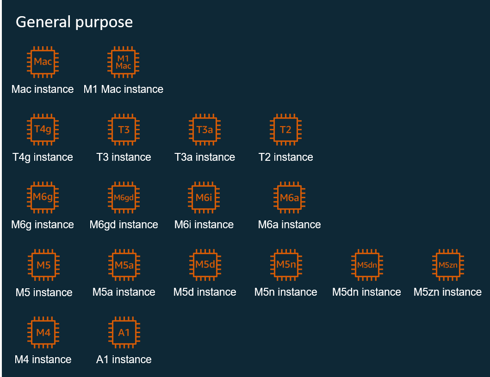
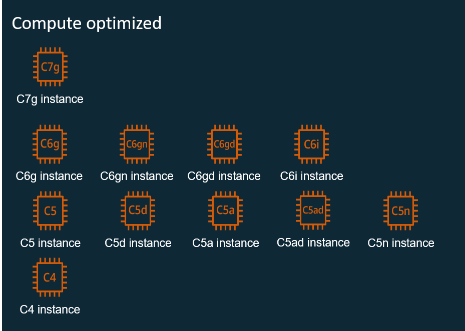
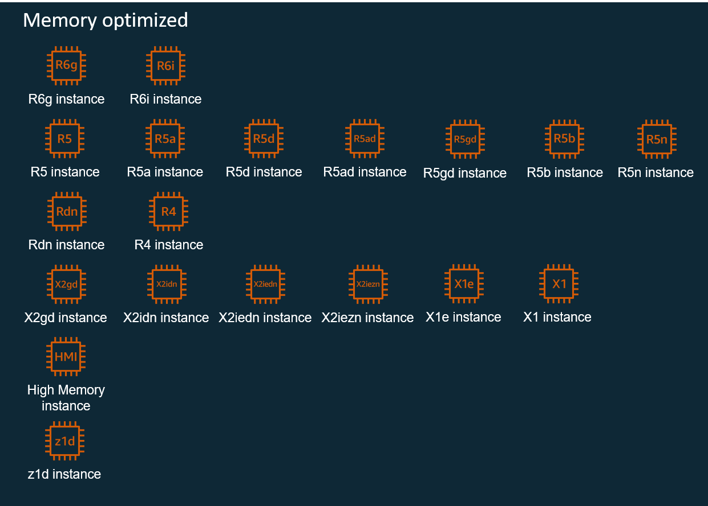
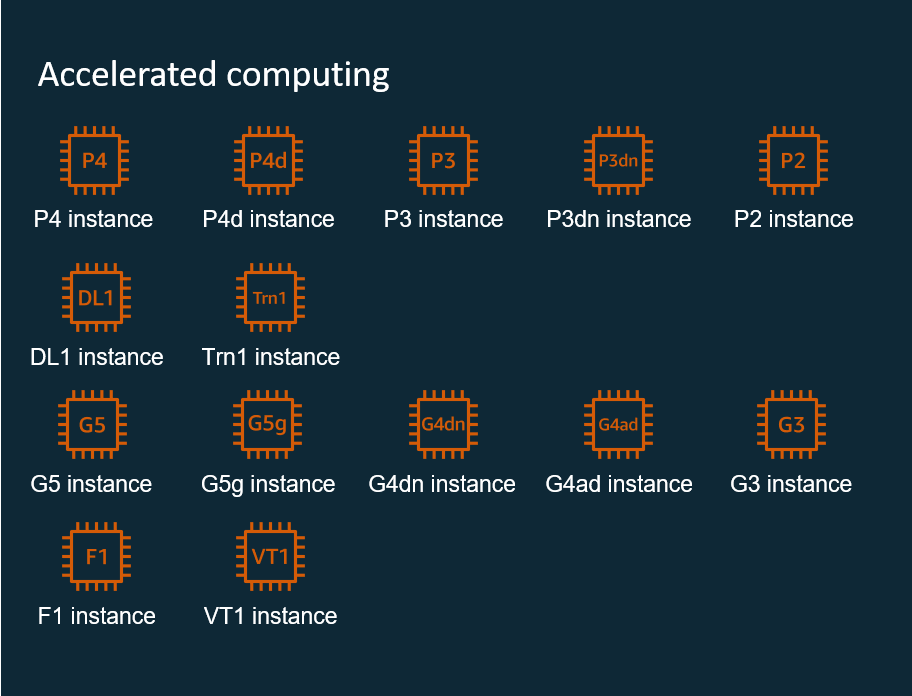

# ec2 instance types

## Instance types

An EC2 instance is a virtual machine (VM) that runs in the AWS Cloud. When you launch an instance, you decide the virtual hardware configuration by choosing an instance type. The instance type that you choose determines the hardware of the host computer used for your instance. Each instance type offers different compute, memory, and storage capabilities, and is grouped into an instance family based on these capabilities.


What to remember?

* An **instance** is a VM.
* An **instance type** is the combination of virtual hardware components, such as CPU and memory, that make up the instance.
* Instance types are grouped together into **instance families**. Each instance family is optimized for specific types of use cases.
* Instance families have **sub-families**, which are grouped according to the combination of processor and storage used.
* A virtual central processing unit (**vCPU**) is a measure of processing ability. For most instance types, a vCPU represents one thread of the underlying physical CPU core. For example, if an instance type has two CPU cores and two threads per core, it will have four vCPUs.


The AWS instances are currently categorized into five distinct families. To learn more, expand each of the following categories.

<strong>General purpose</strong>

General purpose instances provide a balance of compute, memory, and networking resources and can be used for a wide range of workloads. These instances are ideal for applications that use these resources in equal proportions, such as web servers and code repositories.

Burstable instance options: Many workloads are not busy all the time and do not require sustained CPU performance. Using a large instance for these low-to-moderate workloads leads to waste and unnecessary cost.

For these workloads you can take advantage of the low-cost burstable general purpose instances, which are the T family instances. A **burst** is when the activity on the instance exceeds normal operation for a short period; for example, when the workload temporarily spikes. The T instance family provides a baseline CPU performance with the ability to burst above the baseline at any time for as long as required. The T instances offer a balance of compute, memory, and network resources. They provide you with the most cost-effective way to run a broad spectrum of general purpose applications that have a low-to-moderate CPU usage.

For additional information, see [Burstable performance instances.](https://docs.aws.amazon.com/AWSEC2/latest/UserGuide/burstable-performance-instances.html)

<strong>Compute optimized</strong>

Compute optimized instances are ideal for compute-bound applications that benefit from high-performance processors. Instances belonging to this family are well suited for compute-intensive operations, such as the following:

* Batch processing workloads
* Media transcoding
* High performance web servers
* High performance computing (HPC)
* Scientific modeling
* Dedicated gaming servers and ad server engines
* Machine learning (ML) inference

<strong>Memory optimized</strong>

Memory optimized instances are designed to deliver fast performance for workloads that process large data sets in memory.

<strong>Storage optimized</strong>

Storage optimized instances are designed for workloads that require high, sequential read and write access to very large data sets on local storage. They are optimized to deliver tens of thousands of low-latency, random input/output (I/O) operations per second (IOPS) to applications.

<strong>Accelerated computing</strong>

Accelerated computing instances use hardware accelerators, or co-processors, to perform some functions more efficiently than is possible in software running on CPUs. Examples of such functions include floating point number calculations, graphics processing, and data pattern matching. Accelerated computing instances facilitate more parallelism for higher throughput on compute-intensive workloads.

If you require high processing capability, you will benefit from using accelerated computing instances, which provide access to hardware-based compute accelerators such as graphics processing units (GPUs), field programmable gate arrays (FPGAs), or AWS Inferentia.

