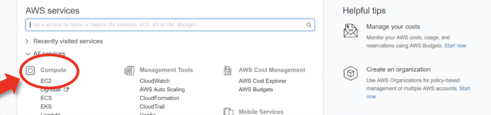
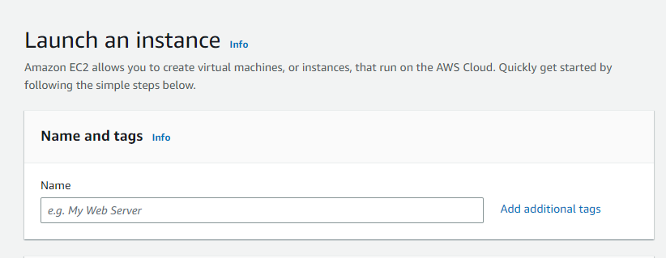
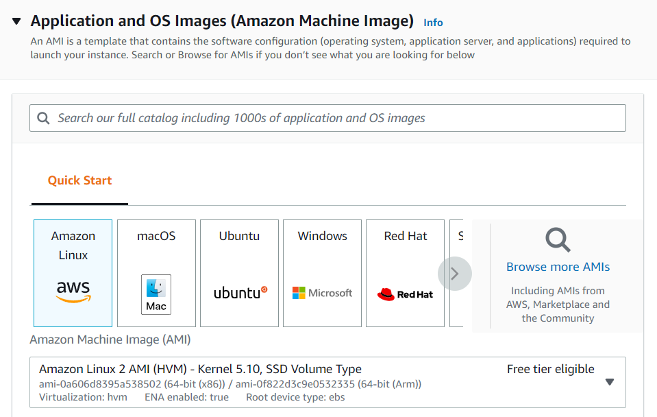
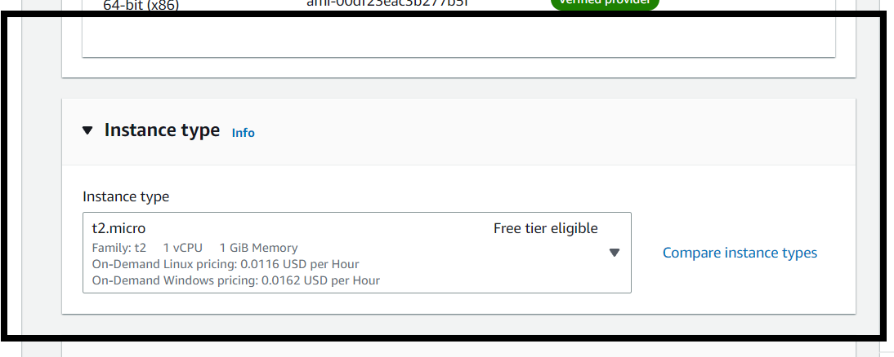
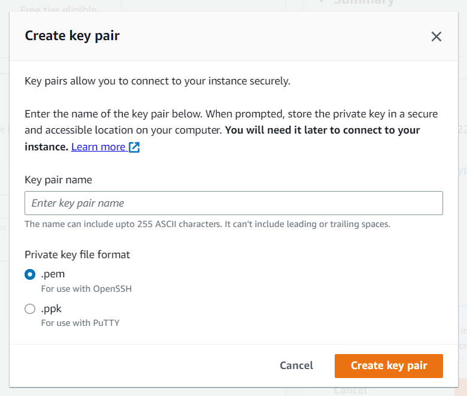
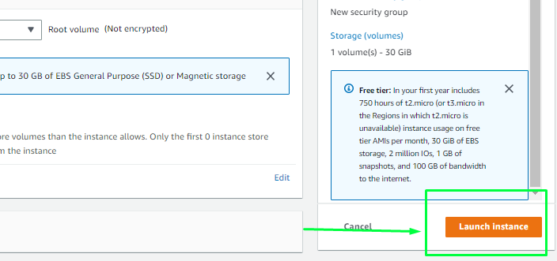

# create ec2 instance in aws

Amazon EC2 (Elastic Compute Cloud) is a cloud computing service provided by AWS that allows users to rent virtual machines (VMs) to run applications on-demand. EC2 offers a scalable, cost-efficient, and flexible computing environment without the need for users to manage physical hardware.

Users can customize their instances by configuring CPU, memory, and storage according to specific requirements. Additionally, EC2 supports secure configurations using Virtual Private Clouds (VPCs), subnets, and security groups. With auto-scaling capabilities, EC2 instances can automatically scale up or down based on application traffic, ensuring optimal resource usage.

## How to Create EC2 Instance in AWS (Amazon)

Follow the steps below to create an EC2 instance in AWS (Amazon):



### Login and navigate to the EC2 dashboard

First, log into your AWS account and click on "services" in the AWS Management Console. From the drop-down menu, select "EC2". To create an AWS free tier account, refer to Amazon Web Services (AWS) – Free Tier Account Set up.

Under Resources >> Click on "Instances running" to see whether any EC2 instances are running.



### Launch a new instance

* Click on "Launch instance" to go to the launch page where you can create an instance.
* Enter a name for the instance and select the required configurations.




### Choose an Amazon Machine Image (AMI)

Select the AMI (required operating system) from the available options. Choose the OS as per your requirement.

[Select AMI](https://www.geeksforgeeks.org/what-is-amazon-machine-image-ami/)




### Select instance type

By default, a free tier-eligible instance is available if you qualify (for example, "t2.micro"). Instance types determine the number of CPUs and the amount of memory. Ensure you select a free tier-eligible instance if you want to avoid charges.

To know more about instance types refer to Amazon EC2 – Instance Types.




### Configure key pair

Create a key pair by clicking "Create new key pair". The key pair acts as the SSH key to connect to the instance.

* Create Key-Pair: Enter a name, select ".pem", and create.
* The key pair will be downloaded automatically. Select the created key pair for the instance.




### Network and storage configuration

Keep the network settings as the default unless you need specific VPC/subnet settings. For storage, free tier-eligible setups can get up to 30 GB of EBS storage — keep the default unless you require changes.

[Introduction to AWS Elastic Block Store (EBS)](https://www.geeksforgeeks.org/introduction-to-aws-elastic-block-storeebs/)




### Review and launch

Verify that all selected options are free tier-eligible (if applicable) and click "Launch instance". The instance will be created.




***

## How To Connect Terminal Using SSH-Key

Once your instance is launched, secure access is essential. Follow the steps below to connect using a terminal and your key pair:



### Locate connection details

Select the server you want to connect to and click the "Connect" button at the top of the instance details.




### Copy the SSH command

Copy the SSH command shown in the console. This uses the key pair (public/private key pair) to connect to the EC2 instance.

[How to create a public-private key pair](https://www.geeksforgeeks.org/how-to-create-a-public-private-key-pair/)




### Use the terminal

Open a terminal, change directory to where your .pem file is located, and paste/execute the copied SSH command.

To verify the connection, check the instance IP address — if it displays, you are connected successfully.

[What is an IP address?](https://www.geeksforgeeks.org/what-is-an-ip-address/)



***

## EC2 Instance States in AWS

The common EC2 instance states are: Pending, Running, Stopping, Stopped, Terminated, Shutting Down, and Rebooting. You can view the state of your instances in the EC2 Console, AWS CLI, or AWS SDKs. Below are descriptions of each state:

1. Pending: When you launch an EC2 instance, it enters the pending state while AWS creates the instance and initializes necessary components. The instance is not yet ready to be used.
2. Running: After initialization, the instance enters the running state and is ready for use. You can log in and run applications.
3. Stopping: When an instance is being stopped (manually or by an autoscaling action), it enters the stopping state while AWS prepares it for shutdown. Configuration and data are preserved.
4. Stopped: The instance is not running but its configuration and data are preserved. You can start it again later.
5. Terminated: The instance is permanently deleted; its configuration and data are lost.
6. Shutting-down: A brief state before termination when AWS is retiring an instance. The instance is not available for use.
7. Rebooting: The instance's OS is shut down and restarted; configuration and data are preserved.

Keep track of instance states to manage operations appropriately.

\</>
