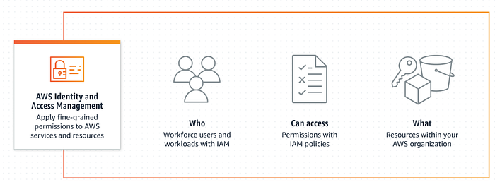

# IAM Basic concepts

## AWS IAM: Identities, Roles & Policies explained in simple terms



## Basic concepts

### Identities

> An identity refers to an entity that can make requests and interact with AWS resources. It can be a person, application, or service that needs to authenticate itself to access AWS resources.

* **Users:** End users, such as people, employees of an organization etc. These are identities with long-term credentials who can interact with AWS through accounts.
* **Groups:** A collection of users. Each user in the group will inherit the permissions of the group.
* **Roles:** An IAM role is an identity you can create that has specific permissions with credentials that are valid for short durations. Roles can be assumed by entities that you trust.

### Authorizations

> Authorizations are granted through policies. Authorizations dictate what actions can be performed on which AWS resources.

* **Policies:** A policy is an object in AWS that defines permissions. Policies are made up of documents (called ‘Policy documents’), which are stored in JSON format.

### How everything works together?



### Create identities

Create identities (User, User Group or Roles).



### Define custom policies (optional)

(Optional) Define custom (Customer Managed) policies.



### Attach policies

Attach policies (can be AWS managed or Customer managed policies) to identities.



## Policies: Deep dive

### Policy creation and management

Policy creation and management can be done by either AWS (AWS managed policies) or customers (Customer Managed policies).

### Policy types

The 2 most important policy types are —



### Identity-based policies

Identity-based policies grant permissions to an **identity**. To create identity-based policy, attach [managed](https://docs.aws.amazon.com/IAM/latest/UserGuide/access_policies.html#managedpolicy) and [inline](https://docs.aws.amazon.com/IAM/latest/UserGuide/access_policies.html#inline) policies to IAM identities (users, groups to which users belong, or roles).

Reference: [Identity-based policies](https://docs.aws.amazon.com/IAM/latest/UserGuide/access_policies.html#policies_id-based)



### Resource-based policies

Resource-based policies grant permissions to a **resource**. To create resource-based policy, attach inline policies to resources.

Reference: [Resource-based policies](https://docs.aws.amazon.com/IAM/latest/UserGuide/access_policies.html#policies_resource-based)



For other policy types, refer to the AWS documentation [here](https://docs.aws.amazon.com/IAM/latest/UserGuide/access_policies.html).

### Policy Documents: How does those look?

Here is a sample policy document:


```json
{
    "Version": "2012-10-17",
    "Statement": [
        {
            "Effect": "Allow",
            "Action": [
                "s3:GetObject",
                "s3:PutObject",
                "s3:ListBucket"
            ],
            "Resource": [
                "arn:aws:s3:::example-bucket/*",
                "arn:aws:s3:::example-bucket"
            ]
        }
    ]
}
```


The main parts of a policy document:



### Version

Specifies the policy language version (example: “2012–10–17”).



### Effect

This can be set to either **Allow** or **Deny**. By default, all IAM policies are set to deny. The effect either grants or restricts access to the **Action** defined in the Statement.

Note: A Deny always takes precedence over an Allow.



### Action

Lists the specific AWS actions that an identity is allowed to perform.



### Resource

Specifies the resources you wish the **Action** and **Effect** to be applied to using ARNs (Amazon Resource Names) in the form: arn:partition:service:region:account-id:resource



### Creating an IAM Policy Statement

IAM Policies can be created using any of the below methods:



### Copy an existing AWS Managed Policy

Use a pre-existing policy statement provided by AWS and customize it to meet your needs. This can save time and effort while providing necessary permissions for your use case.



### Use the AWS Policy Generator

Use the [AWS Policy Generator](https://awspolicygen.s3.amazonaws.com/policygen.html) tool.



### Create your own policy from scratch

Write the policy JSON document manually or use the AWS visual editor to duplicate an existing policy and modify it according to your requirements.


