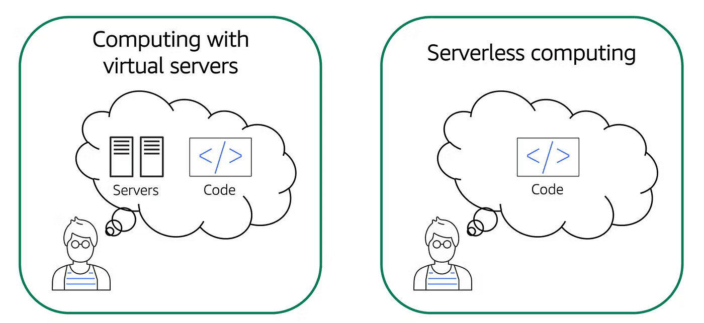
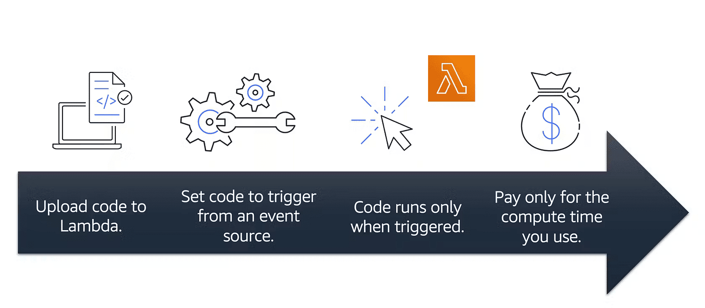
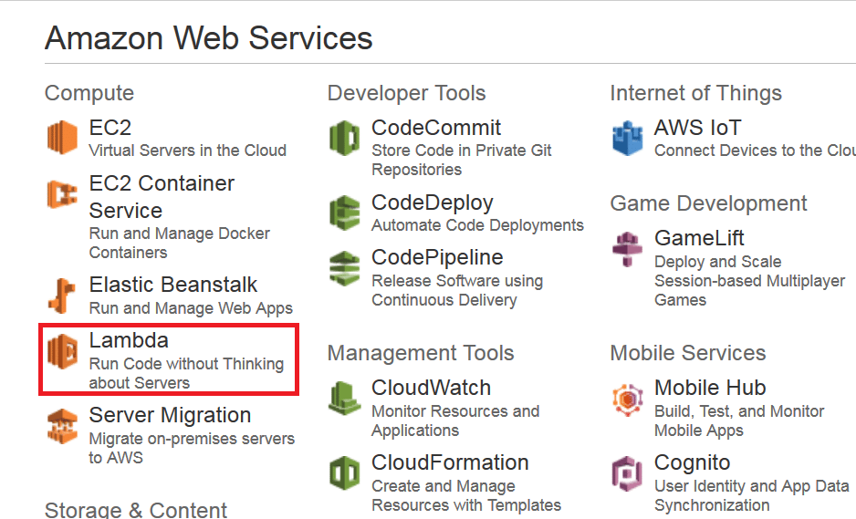
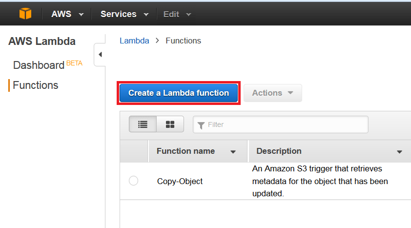
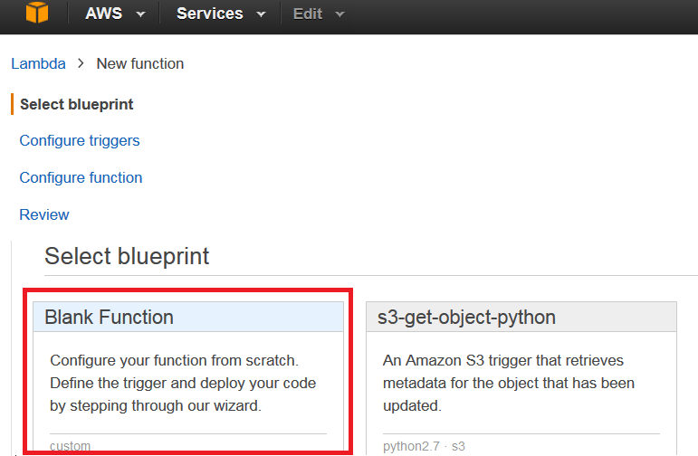
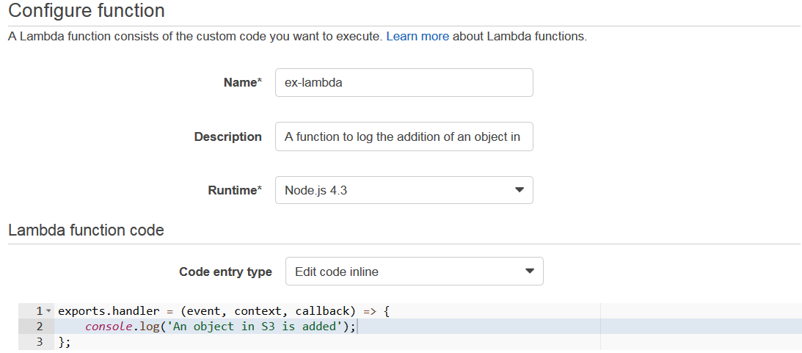
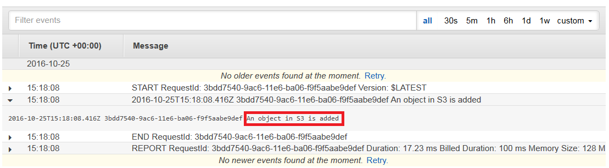

# serverless computing and lamda

## What is Serverless Computing?

<figure><figcaption>
Serverless Computing — Jay Tillu
</figcaption></figure>

Earlier we learned about Amazon EC2, a service that lets you run virtual servers in the cloud. If you have applications that you want to run in Amazon EC2, you must do the following:

* Provision instances (virtual servers).
* Upload your code.
* Continue to manage the instances while your application is running.

The term “serverless” means that your code runs on servers, but you do not need to provision or manage these servers. With serverless computing, you can focus more on innovating new products and features instead of maintaining servers.

Another benefit of serverless computing is the flexibility to scale serverless applications automatically. Serverless computing can adjust the applications’ capacity by modifying the units of consumption, such as throughput and memory.

An AWS service for serverless computing is AWS Lambda.

***

## AWS Lambda

[AWS Lambda](https://aws.amazon.com/lambda/) is a service that lets you run code without needing to provision or manage servers. Lambda is a platform that executes your code in response to events. You write the code, and Lambda takes care of everything else: provisioning, scaling, and managing the underlying infrastructure. This frees you from server headaches, allowing you to concentrate on building innovative applications.

With Lambda, you can execute code in response to triggers such as changes to data in Amazon S3 buckets, updates to Amazon DynamoDB tables, HTTP requests via Amazon API Gateway, or custom events generated by your applications.

***

## Features of AWS Lambda

* Serverless Computing: Lambda abstracts away infrastructure management tasks such as server provisioning, scaling, and maintenance. You just need to upload your code, and Lambda takes care of the rest.
* Event-Driven Execution: Lambda functions are triggered by various AWS services or custom events, enabling real-time reactive applications.
* Supported Runtimes: Lambda supports multiple programming languages including Node.js, Python, Java, Go, .NET Core, and Ruby.
* Scaling: Lambda automatically scales out to handle incoming workload, running multiple instances of a function in parallel as needed.
* Pay-Per-Use Pricing: You pay only for the compute time consumed by your functions, measured in milliseconds. No charges when your code is not running.
* Integration with AWS Services: Lambda integrates with services such as Amazon S3, DynamoDB, Kinesis, SQS, SNS, and more.
* Customizable Resource Allocation: Configure the memory (and indirectly CPU) allocated to functions to optimize performance and cost.

***

## How AWS Lambda Works?

<figure><figcaption>
How AWS Lambda Works — Jay Tillu
</figcaption></figure>



### Overview

You upload your code to Lambda and configure it to be triggered by events. Lambda runs your code only when triggered, and you pay only for the compute time used.



### Steps

* You upload your code to Lambda.
* You set your code to trigger from an event source, such as AWS services, mobile applications, or HTTP endpoints.
* Lambda runs your code only when triggered.
* You pay only for the compute time that you use.



Example: For an image-resizing function triggered when new images are uploaded to S3, you would only be charged for the compute time used while resizing.

***

## Real-World Applications of AWS Lambda

* Web Application Backend: Handle HTTP requests and execute business logic.
* Data Processing: Process and analyze streams, IoT data, and logs in real time.
* File Processing and Transformation: Automatically process files uploaded to S3, transform them, and store results.
* Microservices Architecture: Implement modular, scalable microservices.
* Scheduled Tasks: Automate recurring tasks (backups, reports, maintenance) via scheduled triggers.

AWS Lambda is one among several AWS compute options (EC2, Elastic Beanstalk, OpsWorks). This guide explains where Lambda fits and when to prefer it.

***

## What is AWS Lambda? (Concise)

Amazon defines AWS Lambda as a serverless compute service: developers upload code and Lambda runs it without needing to manage underlying resources. It lets you focus on building applications rather than managing servers.

***

## Where will I use AWS Lambda?

Lambda executes backend code by automatically managing AWS resources—including launching/terminating instances, health checks, auto-scaling, and updates/patches—so you don't need to manage the underlying infrastructure.

***

## Example: Image Upload Flow (S3 + Lambda)

Suppose you have an app that uploads images. The upload event in S3 can act as an Event Source that triggers a Lambda function to perform tasks like resizing, filtering, or compression.

<figure><figcaption></figcaption></figure>

The process below outlines how the S3 event triggers Lambda:



User uploads an image (object) to a source S3 bucket which has notifications configured for Lambda.



S3 reads the notification and decides where to send it.



S3 sends the notification to Lambda; this notification acts as an invoke call for the Lambda function.



An execution role in Lambda (configured via IAM) provides the function permissions to access required AWS resources (for this example: S3).



Lambda invokes the desired function which processes the uploaded S3 object.



Traditionally you would need to manage server provisioning, OS updates, security patches, and monitoring—tasks that are simplified or removed when using Lambda. Lambda supports Node.js, Python, Java, and other runtimes; you upload your code (ZIP), define the event source, and it's ready.

***

## When to use Lambda vs other compute options

Available options include:

* AWS EC2
* AWS Elastic Beanstalk
* AWS OpsWorks
* AWS Lambda

Why not EC2? With EC2 you must manage everything (load balancers, storage, software stack). Lambda removes that overhead—just provide code. However, if your code needs to run continuously for hours or handles a constant high-volume stream of requests, EC2 may be a better fit. Lambda is optimized for event-driven, sporadic workloads with spikes and quiet periods.

***

## Limitations of AWS Lambda

Some limitations are hardware-specific and some stem from Lambda's architecture:

* Disk (ephemeral /tmp) size limited to 512 MB.
* Memory range: 128 MB to 1,536 MB.
* Maximum execution timeout: 5 minutes (300 seconds).
* Maximum request payload size (invoke payload): 6 MB.
* Maximum request body (e.g., API Gateway payloads) often limited (example value shown: 128 KB in the original content).

These are architectural boundaries—if your use case doesn't fit these constraints, consider other AWS compute options.

***

## Pricing in AWS Lambda

Lambda is pay-per-use. Charges are based on:

* Number of requests to your Lambda functions.
* Duration for which your code executes.

Requests

* A request is counted each time Lambda starts executing in response to an event source or invoke call (including test invocations from the console).
* Pricing example from the source:
  * First 1 million requests per month are free.
  * $0.20 per million requests thereafter.

Duration

* Duration is measured from the time your code starts executing until it returns or terminates, rounded up to the nearest 100 ms.
* Pricing depends on the memory allocated. Example rate from the source: $0.00001667 per GB-second used.

_Source: AWS official website_

***

## Hands-on: AWS Lambda DIY

Create a Lambda function that logs "An object has been added" when an object is added to a specific S3 bucket.



From the AWS Management Console under Compute, select **AWS Lambda**.

<figure><figcaption></figcaption></figure>



On the AWS Lambda Console, click **Create a Lambda function**.

<figure><figcaption></figcaption></figure>



Select a blueprint. For this use-case, choose the blank function.

<figure><figcaption></figcaption></figure>



Set the trigger: choose S3 as the trigger and click Next.

<figure><figcaption></figcaption></figure>



On the configuration page, fill in the details:

* Add your code (or copy from this use-case).
* Fill the handler and role.
* Leave advanced settings as-is, then click Next.

<figure><figcaption></figcaption></figure>

<figure><figcaption></figcaption></figure>



Review all information and click **Create function**.

<figure><figcaption></figcaption></figure>



Now, when you add a file to your S3 bucket, you should see a log entry in CloudWatch indicating the function ran.

<figure><figcaption></figcaption></figure>



***

Serverless computing and AWS Lambda simplify infrastructure management and enable event-driven architectures, reducing operational overhead and improving scalability for many workloads.
