# sns deep dive

Introduction

As a continuation of our previous post where we had a deep dive into [SQS](https://medium.com/@joudwawad/aws-sqs-deep-dive-dfed03c8b640), we continue to explore more AWS services that are widely used in today's architecture and integrate together.

In today’s blog post, we’ll take an in-depth look at AWS Simple Notification Service (SNS), exploring its core components, functionality, implementation details, and how it integrates with other AWS services.

### What is AWS SNS?

Amazon Simple Notification Service (SNS) operates as a managed service designed to facilitate message delivery between _publishers_ (producers) and _subscribers_ (consumers).

In this system, publishers can send messages to a “topic,” which acts as a logical access point and communication channel. Subscribers, who wish to receive these messages, can subscribe to the SNS topic using various supported endpoint types. These endpoints include Amazon Data Firehose, Amazon SQS, AWS Lambda, HTTP, email, mobile push notifications, and SMS. Through this _asynchronous_ communication model, publishers and subscribers can effectively exchange information.

<figure>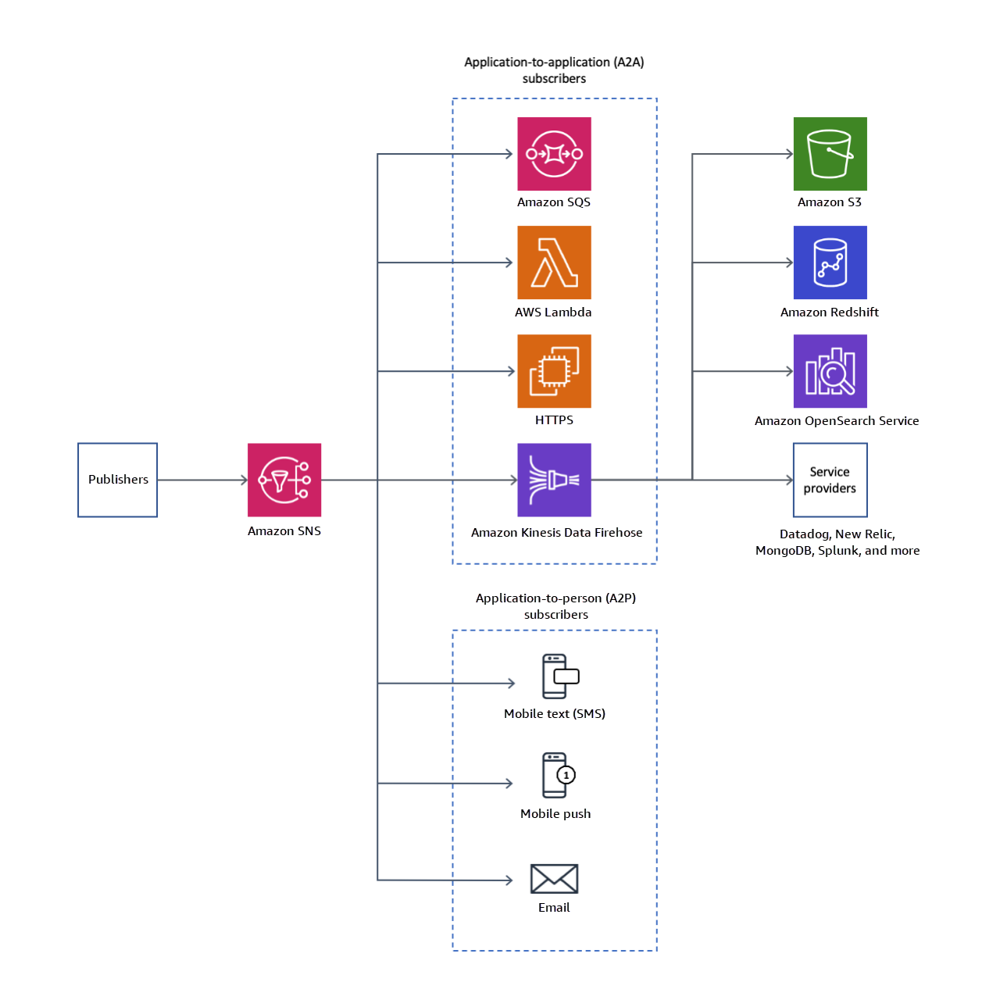<figcaption><p>SNS Service high-level overview ~ <a href="https://docs.aws.amazon.com/sns/latest/dg/welcome.html">Source AWS SNS Documentation</a></p></figcaption></figure>

SNS works on different levels and with different destinations (protocols). We categorize these destinations into two categories:

* **Application 2 Application (A2A):** Application-to-application messaging supports subscribers such as Amazon Data Firehose delivery streams, Lambda functions, Amazon SQS queues, and HTTP/S endpoints.
* **Application 2 Person (A2P):** Application-to-person notifications provide user notifications to subscribers such as mobile applications, mobile phone numbers, and email addresses.

SNS uses what is called “Topic” to publish a message to _multiple_ subscribers, thus it acts like a pub/sub. Due to SNS’s pub/sub nature it is mainly used when we need to use a fanout pattern in our architecture.

## What is a Fanout Pattern?

A **Fanout Pattern** refers to a system design approach for efficiently distributing data to multiple consumers in a scalable manner.

Fan-out is a messaging pattern where messages are broadcast in a _one-to-many_ arrangement. A basic example of this pattern can be seen in the functionality of a Publish/Subscribe messaging system, as Pub/Sub implies the ability to route messages from a single sender/multiple senders to multiple receivers.

<figure><figcaption><p>Pub/Sub Architecture</p></figcaption></figure>

When integrated with other AWS services, SNS becomes a powerful tool for building scalable, event-driven architectures. For instance, SNS can work alongside Amazon SQS (Simple Queue Service) to ensure that messages are queued and processed reliably. By subscribing an SQS queue to an SNS topic, messages published to the topic are automatically enqueued for further processing.

## SNS Core Components

As in any pub/sub architecture, SNS has three main components:

* Publisher
* Topic
* Subscriber

Let us examine each of them in detail.

### SNS Publisher

Publishers generate data that will be sent to a topic. AWS integrates SNS with many sources that we can divide into two categories:

* **AWS Publishers Through AWS SNS SDK:** AWS provides an SDK for SNS that can be used to publish messages to an SNS topic in multiple programming languages.
* **AWS Services:** AWS has built-in integrations between SNS and other AWS services. For example, SNS can receive notifications when changes occur to an Amazon S3 bucket when a file is uploaded. The following diagram shows an architecture of AWS integrated services with SNS:

<figure>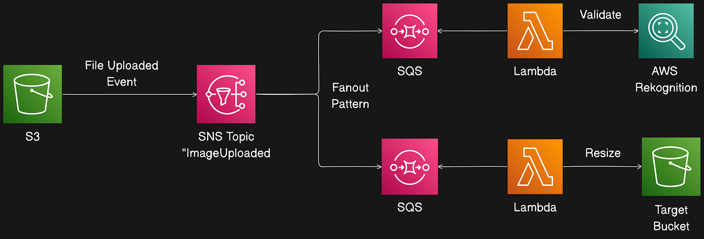<figcaption><p>AWS SNS Services Integration</p></figcaption></figure>

There is a large list of services that can be integrated — see the [official SNS documentation](https://docs.aws.amazon.com/sns/latest/dg/sns-event-sources.html).

### Publishing a message through the AWS SDK

AWS SNS SDK provides two APIs to publish messages to a topic:

* `Publish` — send a single message to a topic.
* `PublishBatch` — publish up to 10 messages in a single API request. Sending messages in batches can help reduce costs associated with many API calls.

Note: Each message in a `PublishBatch` needs a unique batch ID (up to 80 characters). For FIFO topics, in addition to a batch ID, each message requires `MessageDeduplicationID` and `MessageGroupId`.

### Message Attribute

Amazon SNS supports message attributes, which let you provide structured metadata items (timestamps, versioning, signatures, identifiers) about the message.

> Message attributes are sent only when the message structure is String, not JSON.

Reasons to use message attributes:

* Add metadata without altering the message body (for example, a version number).
* Make messages filterable using subscription filter policies (applied at the subscription level).
* Help structure push notification messages for mobile endpoints (attributes used only to structure push notification payloads — attributes may not be delivered to the endpoint as they are for SQS endpoints).

Example: publishing via JavaScript SDK v3


```javascript
import { SNSClient, PublishCommand } from "@aws-sdk/client-sns";
const client = new SNSClient(config);

const input = {
  TopicArn: "STRING_VALUE",
  TargetArn: "STRING_VALUE", // optional
  PhoneNumber: "STRING_VALUE", // optional
  Message: "STRING_VALUE",
  MessageAttributes: {
    "Version": {
      DataType: "Number",
      StringValue: "1"
    },
  },
  MessageDeduplicationId: "STRING_VALUE", // required for FIFO topics
  MessageGroupId: "STRING_VALUE", // required for FIFO topics
  Subject: "STRING_VALUE" // optional
};
const command = new PublishCommand(input);
const response = await client.send(command);
```


Key Publish options:

* TopicArn: target topic. If not provided, you must specify PhoneNumber or TargetArn.
* Message: the message body.
* MessageAttributes: key/value pairs used in Publish and filter policies.
* MessageDeduplicationId: for FIFO topics, a unique token used for deduplication within a 5-minute interval.
* MessageGroupId: for FIFO topics, required; tags a message to a specific message group for FIFO ordering.
* Subject: optional, used as a subject line for email endpoints.
* MessageStructure: set to `json` to send different messages per protocol. When `json`, Message must be a valid JSON object that includes a top-level `default` string and may include keys for specific protocols (e.g., `email`, `sqs`, `lambda`, `http`, `https`).

Example MessageStructure JSON:

```
{
 "default": "Sample fallback message",
 "email": "Sample message for email endpoints",
 "sqs": "Sample message for Amazon SQS endpoints",
 "lambda": "Sample message for AWS Lambda endpoints",
 "http": "Sample message for HTTP endpoints",
 "https": "Sample message for HTTPS endpoints"
}
```

If a protocol key is missing (e.g., SMS), SNS falls back to the `default` field.

> Reserved attributes exist for mobile push notifications; see the [AWS documentation](https://docs.aws.amazon.com/sns/latest/dg/sns-message-attributes.html#sns-attrib-mobile-reserved).

### Publishing large messages with Amazon SNS

To publish messages larger than 256 KB (up to 2 GB), AWS provides Extended Client Libraries for Java and Python. Alternatively, an architecture-agnostic approach is to upload large payloads to S3 and publish a reference via SNS. Example flow: client uploads large file to S3, S3 event triggers SNS fanout, and consumers retrieve the file from S3.

<figure><figcaption><p>Large files Flow with SNS</p></figcaption></figure>

## SNS Topics

Topics are the glue of SNS. An Amazon SNS topic is a logical access point that acts as a communication channel, grouping endpoints (Lambda, SQS, HTTP/S, email, etc.).

When creating a topic you can choose between a Standard topic and a FIFO topic.

<figure>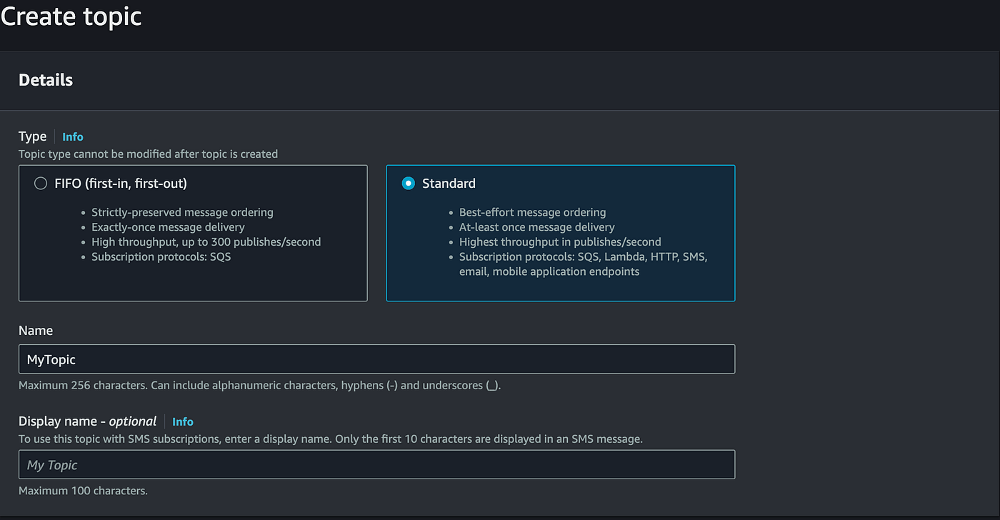<figcaption><p>SNS Topic Types</p></figcaption></figure>

We compare the main differences by considering:

* Message Ordering
* Message Duplication
* Throughput & Performance
* Supported Subscription Protocols

### System Architecture as an Example

Reference architecture: a notification flow where SNS fans out messages to multiple consumers (primarily SQS queues) that hold messages until processing.

<figure>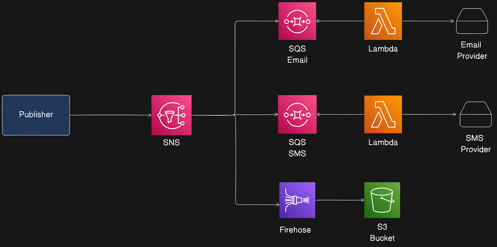<figcaption><p>Notification System Flow</p></figcaption></figure>

Flows include email notifications, SMS notifications, and a Firehose flow to S3 for analytics.

## Standard Topic

Characteristics:

* Best-effort message ordering (not guaranteed).
* At-least-once message delivery.
* Highest publish throughput.

### Message Ordering

Ordering is best-effort; SNS Standard topics do not guarantee preservation of publishing order. Consumers should handle potential reordering. SNS Standard topics cannot be used with SQS FIFO queues; Lambda invocations are asynchronous.

<figure>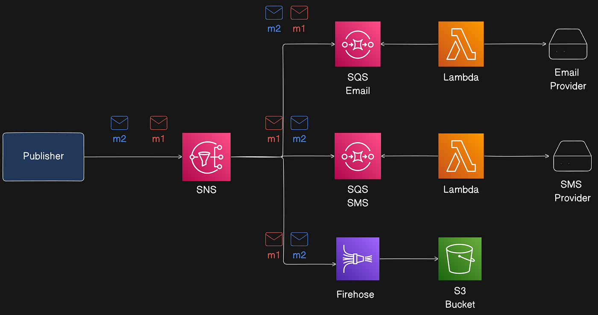<figcaption><p>Message Delivery in SNS Standard Topic</p></figcaption></figure>

### Message Duplication

Standard topics use at-least-once delivery; duplicates can happen (e.g., publisher retries due to lack of acknowledgment). Subscribers must handle idempotency (for example, include a UUID in message attributes).

<figure><figcaption><p>SNS Standard Topic Duplication</p></figcaption></figure>

### Throughput & Performance

Publish API limits vary by region. Standard topics generally support higher API requests per second than FIFO topics. Check the [AWS limits documentation](https://docs.aws.amazon.com/general/latest/gr/sns.html#limits_sns).

### Supported Subscription Protocols (A2A)

Standard topics support many A2A destinations, including:

* **AWS Firehose:** Deliver events to delivery streams (S3, Redshift, OpenSearch, third-party destinations).
* **AWS Lambda:** Deliver events to functions (invocation is asynchronous — Publish returns 200 when message is queued for Lambda’s event queue; Lambda’s own retry mechanism applies on failures).

<figure>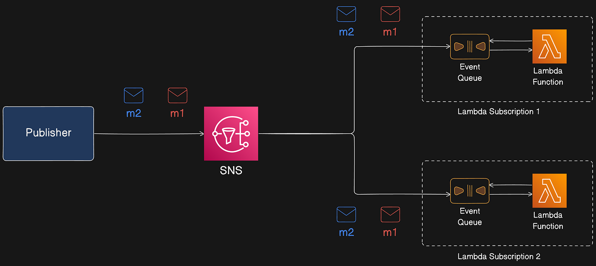<figcaption><p>Lambda Invocation with SNS</p></figcaption></figure>

* **AWS SQS:** SNS Standard topic can be connected to Standard SQS queues (not SQS FIFO).
* **AWS Event Fork Pipelines:** For backup, analytics, replay pipelines.
* **HTTP/S:** SNS can POST messages to HTTP or HTTPS endpoints. HTTPS supports SNI and basic/digest access authentication (username/password can be included in the URL). Note: SNS does not support private HTTP(S) endpoints. See AWS docs for subscription rules: https://docs.aws.amazon.com/sns/latest/dg/sns-subscribe-https-s-endpoints-to-topic.html

## FIFO Topic

Characteristics:

* Strictly-preserved message ordering.
* Exactly-once message delivery (when conditions are met).
* High throughput, but less than Standard topics.

### Message Ordering

SNS FIFO topics guarantee messages are delivered to subscribed SQS queues in the same order published, and only once — when the subscribed queue is SQS FIFO. SNS FIFO supports delivery to both SQS standard and FIFO, but only SQS FIFO preserves end-to-end ordering and deduplication.

<figure>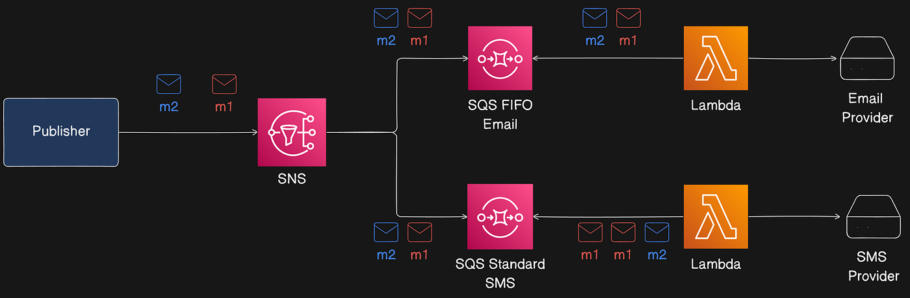<figcaption><p>SNS FIFO Topic with SQS Standard and FIFO</p></figcaption></figure>

Summary of flows:

* SQS FIFO subscribers preserve order and exactly-once delivery.
* SQS Standard subscribers may receive messages out of order and more than once.

### Message Ordering With Parallel Publishers

Multiple publishers can publish in parallel to an SNS FIFO topic. SNS assigns a 128-bit sequence number to each message (increasing per Message Group). The sequence number is included in messages delivered to SQS queues unless raw message delivery is enabled. Sequence numbers help determine ordering.

<figure><figcaption><p>Sequence Numbers in SNS</p></figcaption></figure>

### Message Grouping In FIFO Topics

Message grouping ensures messages with the same key are routed to the same partition. `MessageGroupId` is the routing key used in the Publish API. Messages in the same group are processed one by one in order.

<figure>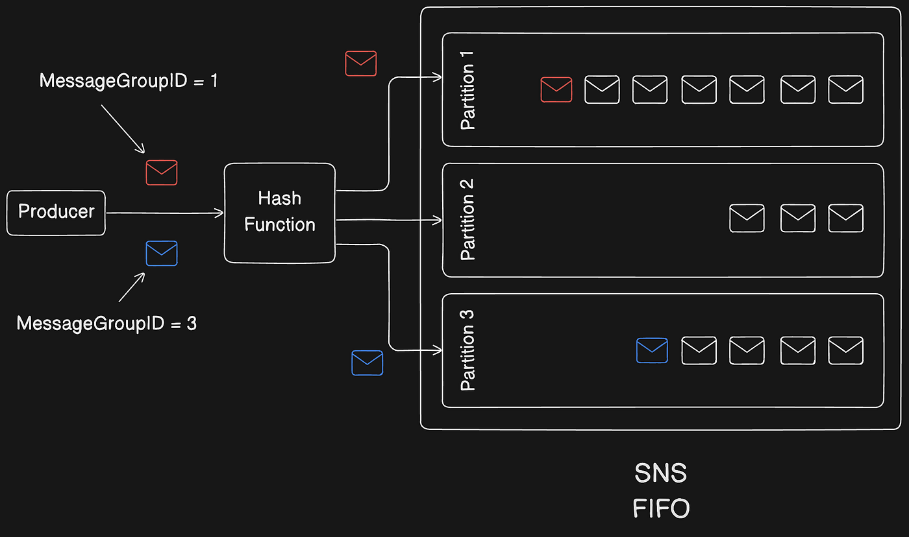<figcaption><p>MessageGroupID Routing Mechanism</p></figcaption></figure>

Notes:

* `MessageGroupId` is mandatory for FIFO topics and is passed to subscribed SQS FIFO queues.
* No limit on number of group IDs.
* MessageGroupId is not passed to SQS standard queues.
* Message groups are independent; ordering is preserved within a group, not across groups.

Example: preserving per-user ordering by using `userId` as MessageGroupId.

<figure>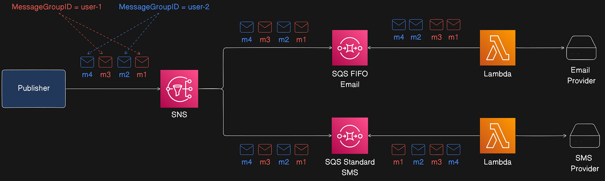<figcaption><p>FIFO Topic Message Grouping Behaviour</p></figcaption></figure>

### Improve Performance By Distributing messages through GroupID

SNS FIFO topics deliver messages from different message groups in parallel. Each message group can deliver up to 300 messages per second. To achieve higher throughput for a single topic, use many distinct MessageGroupIds. When using high-throughput publishing and subscribing SQS FIFO queues, enable high throughput on the queues.

> AWS recommends using many distinct message group IDs for optimized performance.

### Message Duplication

SNS FIFO topics and SQS FIFO queues support message deduplication (exactly-once delivery) when the following conditions are met:

* Subscribed SQS FIFO queue exists and grants SNS permission to deliver.
* SQS FIFO queue consumer processes and deletes the message before visibility timeout expires.
* SNS subscription has no message filtering (filtering causes at-most-once delivery because messages can be filtered out).
* No network disruptions prevent acknowledgments.

When publishing to a FIFO topic, include a deduplication ID. If a message with the same deduplication ID is published within a five-minute deduplication interval, it is accepted but not delivered. Content-based deduplication can be enabled to derive deduplication IDs from message bodies.

> Deduplication applies to the entire SNS FIFO topic, not a message group.

<figure>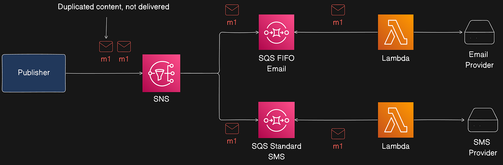<figcaption><p>Understanding Duplication in FIFO Topics</p></figcaption></figure>

### Throughput & Performance

SNS FIFO topics have a regional throughput guideline: 3,000 messages per second or 20 MB per second per topic (whichever comes first). For cross-region delivery, 1,000 messages per second or 6 MB per second.

### Supported Subscription Protocols

FIFO topics only support SQS. Choose:

* SNS FIFO + SQS FIFO for strict ordering and deduplication.
* SNS FIFO + SQS Standard for best-effort ordering and at-least-once delivery (potentially lower cost).

> SNS FIFO topics cannot deliver to customer-managed endpoints (email, mobile apps, SMS, HTTP/S) because these endpoints aren't guaranteed to preserve strict ordering. Attempts to subscribe such endpoints to an SNS FIFO topic result in errors.

## Message Delivery

Delivery options apply to both Standard and FIFO topics.

### Raw Message Delivery

SNS supports two message formats for delivery:

* Raw message delivery disabled (default): SNS delivers a JSON object with SNS metadata (Type, MessageId, TopicArn, Message, Timestamp, Signature, etc.).
* Raw message delivery enabled: SNS strips metadata and delivers the message body as-is.

Example SNS message (non-raw):

```
{
  "Type": "Notification",
  "MessageId": "dc1e94d9-56c5-5e96-808d-cc7f68faa162",
  "TopicArn": "arn:aws:sns:us-east-2:111122223333:ExampleTopic1",
  "Subject": "TestSubject",
  "Message": "This is a test message.",
  ...
}
```

With raw delivery enabled, the consumer receives:

```
This is a test message.
```

Notes:

* For HTTP/S endpoints, enabling raw delivery adds header `x-amz-sns-rawdelivery: true`. Message attributes are not sent with raw delivery to HTTP/S or Firehose endpoints.
* For SQS and Firehose, enabling raw delivery removes SNS metadata from the message body.
* Enable Raw Message Delivery using `SetSubscriptionAttribute` with `RawMessageDelivery=true`.

### Message attributes and raw message delivery for Amazon SQS subscriptions

When Raw Message Delivery is enabled for SQS subscriptions, a maximum of 10 message attributes can be sent. Messages with more than 10 attributes directed to SQS subscriptions with Raw Message Delivery enabled are discarded (client-side error). To send more attributes, disable Raw Message Delivery.

### Message delivery status

SNS can log delivery status for messages sent to endpoints:

* HTTP
* Amazon Data Firehose
* AWS Lambda
* Platform application endpoints
* Amazon SQS (only option for FIFO topics)

Delivery status logs go to CloudWatch Logs and provide insights such as whether messages reached endpoints, endpoint responses, and dwell time (time between publish and handoff). Example CloudWatch delivery log for Lambda:

```
{
    "notification": {
        "messageMD5Sum": "ed5359919d1600abfdb43cb90b01ba9c",
        "messageId": "3fcf1d02-fe87-5fb0-9358-424556de759d",
        "topicArn": "arn:aws:sns:us-east-2:<account_id>:testSNStopic",
        "timestamp": "2024-08-27 10:10:33.576"
    },
    "delivery": {
        "deliveryId": "72f4e6e9-dd5e-58c8-828e-b9ae7507af70",
        "destination": "arn:aws:lambda:us-east-2:<account_id>:function:SNSLambdaTester",
        "providerResponse": "{\"lambdaRequestId\":\"a2f654bc-9d46-483c-b62a-870e4c4bbee9\"}",
        "dwellTimeMs": 47,
        "statusCode": 202
    },
    "status": "SUCCESS"
}
```

## SNS Message Durability

This section covers failures to deliver messages and patterns to avoid message loss.

### Why do message deliveries fail?

Deliveries fail when SNS can’t access a subscribed endpoint due to client-side or server-side errors. If SNS receives a client-side error or continuous server-side errors beyond retry policy, SNS discards the message unless a dead-letter queue (DLQ) is attached to the subscription.

* Client-side errors: stale subscription metadata, deleted endpoints, or changed policies that prevent delivery. SNS does not retry deliveries that fail due to client-side errors.
* Server-side errors: endpoint unavailability or exceptions. SNS retries failed deliveries using linear or exponential backoff. For AWS-managed endpoints (SQS or Lambda), SNS retries up to 100,015 times over 23 days. For customer-managed endpoints, SNS retries per internal policies (HTTP endpoints support custom policies; SMTP, SMS, and mobile push have SNS internal retry policy \~50 times over 6 hours).

To avoid message loss, save messages in a durable store (e.g., SQS DLQ, S3 archive) until reprocessed or audited.

### SNS message delivery retries

Each delivery protocol has a delivery policy defining retry behavior. When the delivery policy is exhausted, SNS stops retrying and discards the message unless a DLQ is attached to the subscription.

<figure>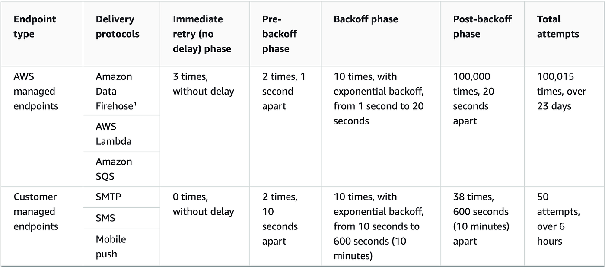<figcaption><p>SNS Message Delivery Retries ~ <a href="https://docs.aws.amazon.com/sns/latest/dg/sns-message-delivery-retries.html">Source AWS Documentation</a></p></figcaption></figure>

With the exception of HTTP/S, you can’t change SNS-defined delivery policies. Only HTTP/S supports custom policies.

Important: The total retry time for an HTTP/S endpoint cannot exceed 3,600 seconds.



### Immediate Retry Phase (No Delay)

Occurs immediately after the initial delivery attempt. There is no delay between retries in this phase.



### Pre-Backoff Phase

Follows the immediate retry phase. SNS attempts a set number of retries with specified delays before applying a backoff function.



### Backoff Phase

Controls the delay between retries using a retry-backoff function (arithmetic, exponential, geometric, or linear). Sets minimum and maximum delays and the growth function.



### Post-Backoff Phase

Final phase after backoff; specifies additional retries and delays. This is the last retry stage before the delivery policy is exhausted.



### How do dead-letter queues work?

A DLQ is attached to an SNS subscription (not a topic), because deliveries happen at the subscription level. A DLQ is an SQS queue; set its retention period via SQS attributes (recommendation: set max retention to 14 days). The DLQ helps retain messages that otherwise would be discarded after retry policy exhaustion.

### DLQ with Notification System

In the notification system, assign an SQS DLQ to each SNS subscription and to each subscribed SQS queue to protect against notification loss.

<figure><figcaption><p>DLQ pattern with SNS</p></figcaption></figure>

Constraints:

* DLQ associated with an SNS subscription must be the same SQS type as the subscribing queue (FIFO vs Standard).
* FIFO topics can archive messages up to 365 days for replay (discussed next).

For more on SQS and DLQs, see: https://medium.com/metalab-tech/aws-sqs-deep-dive-dfed03c8b640

## Message Archiving and Replay (FIFO Topics Only)

SNS message archiving and replay allows topic owners to archive messages for up to 365 days. Subscribers can replay archived messages to subscribed endpoints to recover lost messages or replicate application state.

Two components:

* Message archiving — enable archiving on the topic and set a retention period (up to 365 days). Monitor archived messages via CloudWatch.

<figure>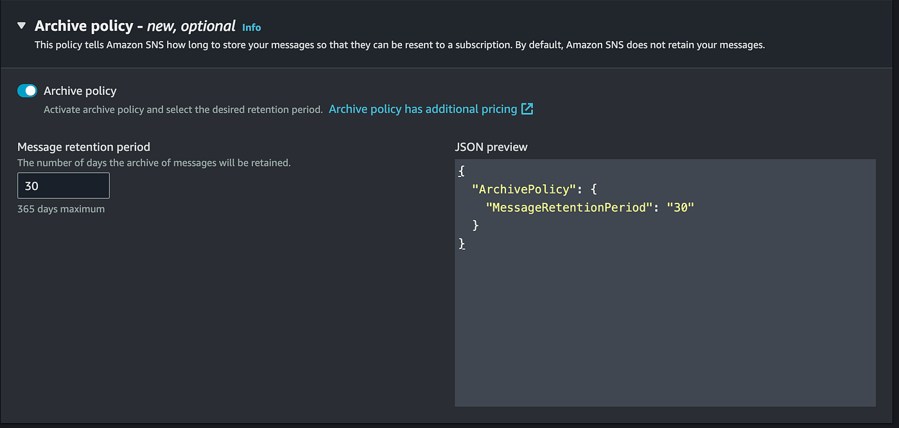<figcaption><p>Archiving Policy in FIFO Topic</p></figcaption></figure>

* Message replay — subscribers initiate replay of a set of messages from the topic to their subscribed endpoint.

<figure>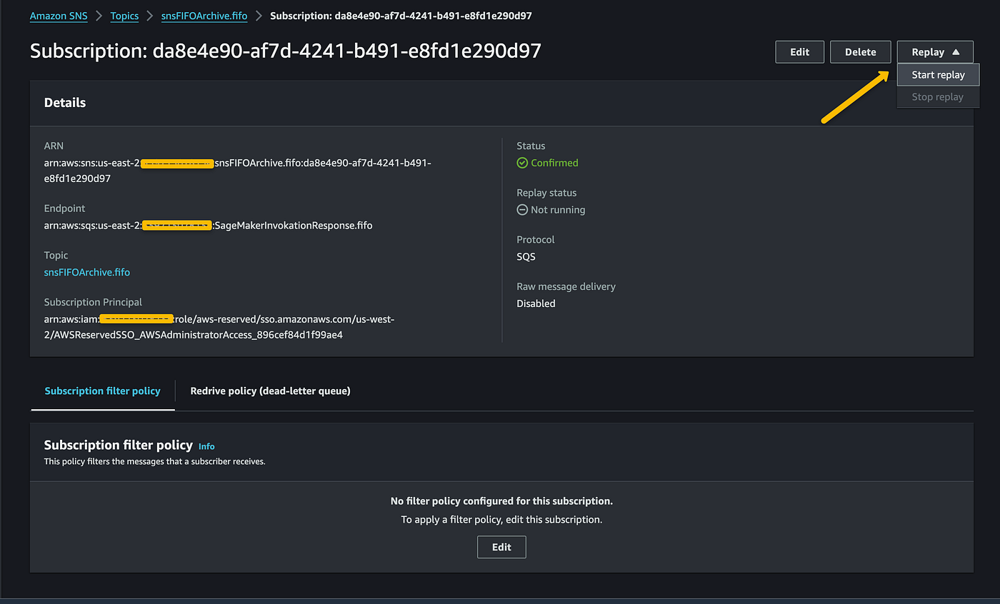<figcaption><p>Replay Messages For A Subscriber</p></figcaption></figure>

Note: Archiving and replay are available only for A2A FIFO topics.

## SNS Subscriber “Message Filtering”

By default, subscribers receive every message published to a topic. To receive only a subset, assign a filter policy (a JSON object) to the subscription. Filter policies can act on message attributes or the message body (set via `FilterPolicyScope`):

* `MessageAttributes` — filter policy applied to message attributes (default).
* `MessageBody` — filter policy applied to the message body (requires JSON payload).

When a message is published, SNS evaluates filter policies for each subscription and delivers to subscribers whose policies match.

For a full list of filter operations, see: https://docs.aws.amazon.com/sns/latest/dg/sns-subscription-filter-policies.html

### Applying “Message Filtering” to our notification system

Example system: two subscribers (Email and SMS) each have a filter policy based on a message attribute.

Email FIFO Queue filter policy:

```
{
  "NotificationServiceTarget": ["EMAIL"]
}
```

SMS FIFO Queue filter policy:

```
{
  "NotificationServiceTarget": ["SMS"]
}
```

Publisher code example:


```javascript
import { SNSClient, PublishCommand } from "@aws-sdk/client-sns";
const client = new SNSClient(config);

const input = {
  TopicArn: "topic_arn_value",
  Message: "This is a notification message body...",
  MessageAttributes: {
    "Version": {
      DataType: "Number",
      StringValue: "1"
    },
    // Determines the target subscriber for this message
    "NotificationServiceTarget": {
      DataType: "String",
      StringValue: "EMAIL"
    }
  },
  MessageDeduplicationId: "fec3f001-1e0c-4fd2-b26d-e975bbe9021c",
  MessageGroupId: "user_id_1234",
  Subject: "Random Notification"
};
const command = new PublishCommand(input);
const response = await client.send(command);
```


SNS checks subscription filter policies and delivers only to matching subscribers (in this example, only the Email subscriber receives the message).

<figure><figcaption><p>Notification System with “Message Filtering”</p></figcaption></figure>

## Message data protection (Standard Topic Only)

SNS provides message data protection for standard topics to audit, mask, redact, or block sensitive information that moves between applications or AWS services.

### What is message data protection?

Message data protection scans data in motion for PII and PHI using data identifiers (predefined or custom). Actions supported:

* **Audit** — Log findings to CloudWatch, S3, or Firehose.
* **De-identify** — Mask or redact sensitive data without interrupting publishing or delivery.
* **Deny** — Block transmission if sensitive data is present.

> Message data protection is supported for SNS standard topics only.

This helps meet compliance requirements (HIPAA, GDPR, PCI, FedRAMP) by identifying and preventing data leakage.

### Data protection policies

Data protection policies select which sensitive data to scan (via data identifiers) and the action to take (audit, de-identify, deny). SNS uses ML and pattern matching to detect sensitive data.

<figure><figcaption><p>Data Protection Policies In Action</p></figcaption></figure>

Policies are defined at the topic level and can route audit findings to S3 for analytics or mask sensitive fields before delivering to downstream systems.

<figure>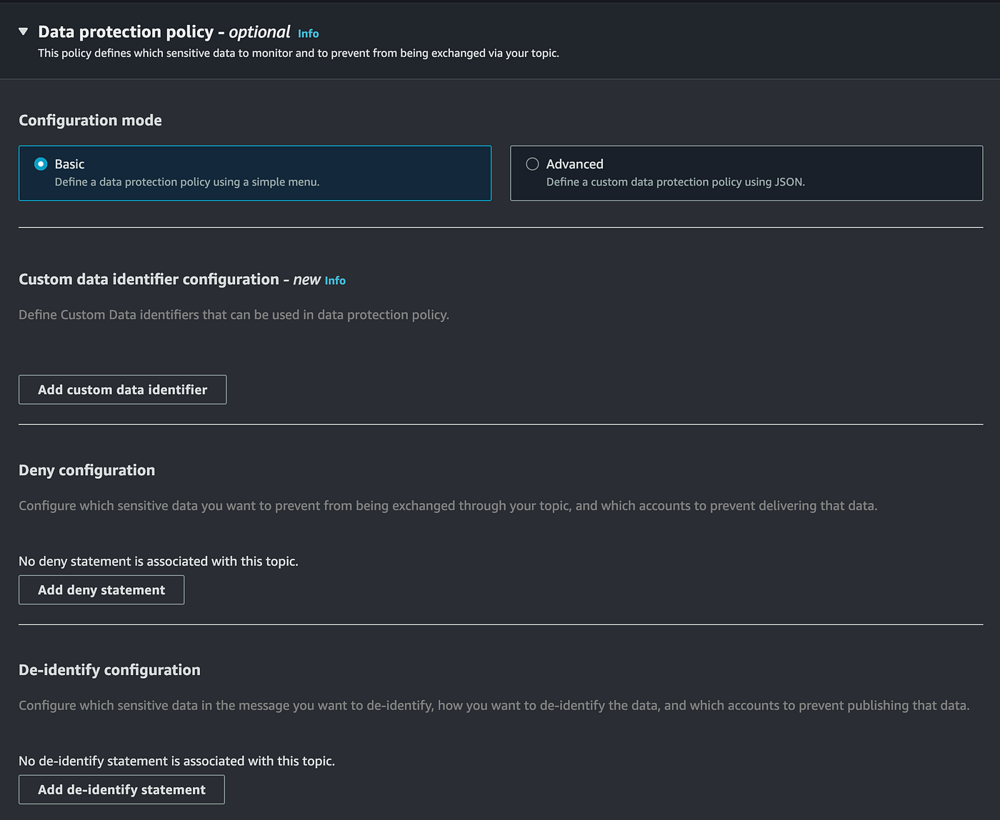<figcaption><p>SNS Data Protection Settings</p></figcaption></figure>

## Conclusion

SNS is the go-to tool when you need to:

* Send email, SMS, and push notifications to end-users in real time (Apple, Google, Fire OS, Windows devices).
* Broadcast messages to multiple subscribers (fan-out).
* Build workflow systems and pass events between distributed apps or update records across systems.
* Implement real-time alerts and monitoring applications.

SNS is a core AWS service for building resilient, scalable, event-driven architectures. Choosing between Standard and FIFO topics, and properly configuring delivery, filtering, durability (DLQ, archiving), and data protection, helps ensure your system meets its functional and compliance requirements.
