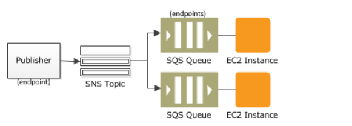
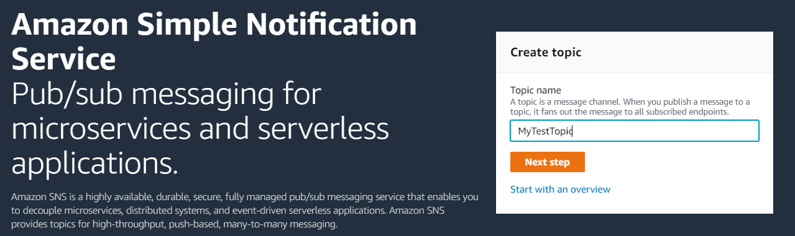
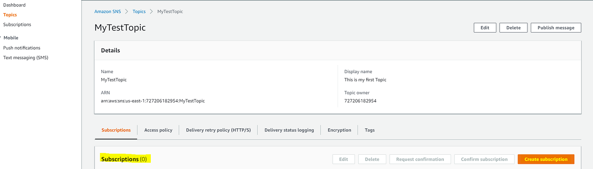
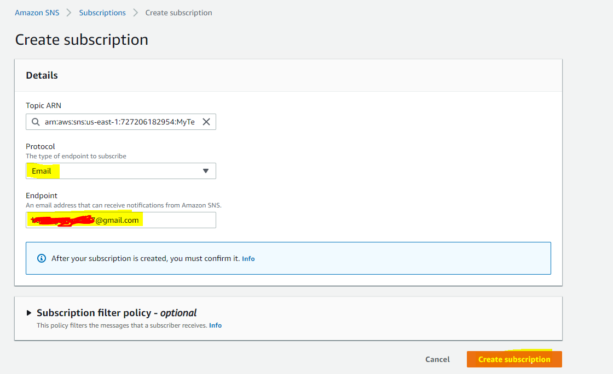
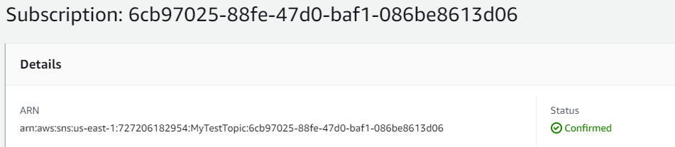
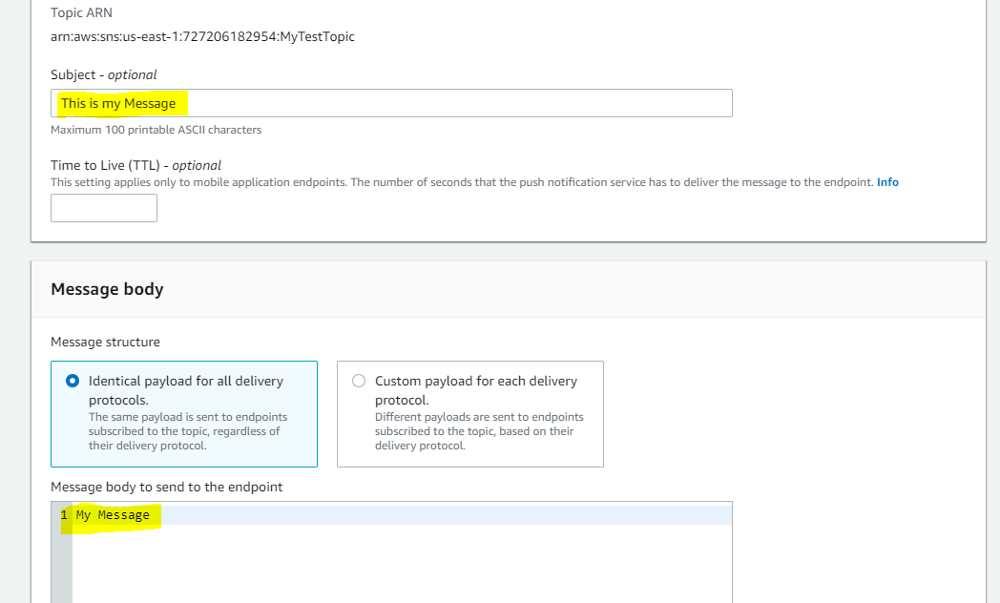
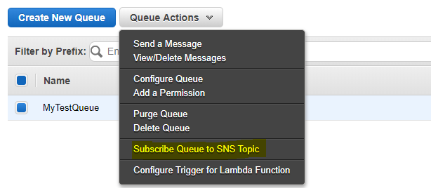

# sns

What if you want to send one message to many receivers? Instead of wiring your create service to call email, shipping, SQS, Lambda, etc. directly (which becomes complex), you can use Pub/Sub (publish–subscribe).

The create service publishes a message to an SNS topic. The SNS topic has many subscribers and delivers that message to all of them in real time: email, SMS, Lambda, SQS queues, HTTP endpoints, mobile push, etc. You send the message once to the topic and many services receive it.

<figure><figcaption>
AWS SNS
</figcaption></figure>

Basic Introduction

* An Amazon SNS topic is a logical access point that acts as a communication channel.
* A topic groups multiple endpoints (AWS Lambda, Amazon SQS, HTTP/S, email, SMS, mobile push).
* Typical use: a producer (e.g., e-commerce site) publishes events to a topic; multiple consumer systems subscribe to that topic to receive notifications.
* Each subscriber to the topic receives all messages (message filtering features exist).
* Limits: up to 10,000,000 subscriptions per topic and 100,000 topics per account (as stated in the original content).

Common subscriber types:

* SQS
* HTTP / HTTPS (with delivery retries)
* Lambda
* Email
* SMS messages
* Mobile notifications

<figure><figcaption></figcaption></figure>

SNS integrates with many AWS services:

* Amazon S3 (bucket events)
* Auto Scaling (ASG notifications)
* CloudWatch (alarms)
* CloudFormation (state changes)

SNS + SQS: Fan-out

* The “fanout” pattern: a single SNS message published to a topic is replicated and pushed to multiple Amazon SQS queues, HTTP endpoints, email addresses, etc.
* Use case: when an order is placed, publish an SNS message; multiple SQS queues subscribed to the topic receive identical notifications. Different consumers can process the messages independently (fulfillment, analytics, etc.).
* Benefits: parallel asynchronous processing, decoupling, no data loss, and ability to add receivers later.

<figure><figcaption>
Fanout
</figcaption></figure>

Hands-on: Creating a Topic and Subscriptions



### Create an SNS Topic

Go to the SNS console and create a topic. Give the topic a name (example: "MyTestTopic") and create it with default settings.

<figure><figcaption></figcaption></figure>

<figure><figcaption></figcaption></figure>



### Create a Subscription

Open the topic and create a subscription. Choose a protocol (Email, HTTP/HTTPS, Lambda, SQS, SMS, etc.). Example: choose Email and provide the email address, then create the subscription.

<figure><figcaption></figcaption></figure>

<figure><figcaption></figcaption></figure>



### Confirm the Subscription

Email subscriptions show as "Pending confirmation". Go to the specified email inbox, open the confirmation message from Amazon SNS, and click the confirmation link. The subscription status will change to "Confirmed".

<figure><figcaption></figcaption></figure>

<figure><figcaption></figcaption></figure>



### Publish a Message

You can add multiple subscriptions to the topic. To send a test message, click the "Publish message" button in the SNS console, provide the subject and message body, and publish.

<figure><figcaption></figcaption></figure>

<figure><figcaption></figcaption></figure>



### Verify Delivery to SQS (if subscribed)

If you subscribed an SQS queue to the topic (subscribe the queue before publishing), you can go to the SQS console and view messages in the queue (Actions → View/Delete Message) to see the SNS-published message.

Note: subscribe the SQS queue to the SNS topic before publishing messages.

<figure><figcaption></figcaption></figure>

You should see the message both in SQS and delivered to email subscribers.

<figure><figcaption></figcaption></figure>




Actions — Subscribe to SNS Topic: Make sure you subscribe the SQS queue (or other endpoint) to the topic before publishing messages. Otherwise that endpoint will not receive messages already published.


This is all about SNS.
