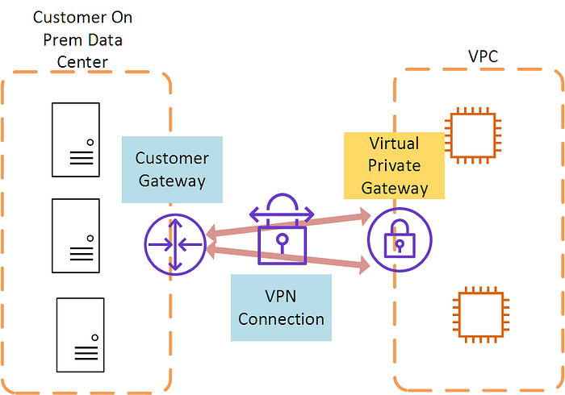
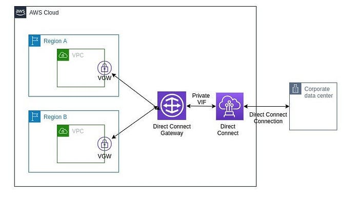
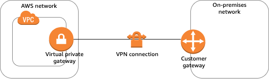

# vpc additional topics

## Customer Gateway (CGW) and Virtual Private Gateway (VGW) 

## Gateway 

In a general sense, a **gateway serves as a point of entry or access to a particular place**. When it comes to networking and technology, a gateway refers to a **device or software application that connects two distinct networks**, allowing them to communicate.

Various types of gateways

* **Network Gateway:** Connects networks with different **communication protocols**, translating data between various network architectures.
* **Default Gateway:** In computer networking, **the default gateway is the node assumed to be on the directly connected network for any given IP address not on the same subnet.**
* **Router:** Routers often **act as gateways in networks, directing traffic between different networks.**
* **API Gateway:** In web services, an **API gateway is a server serving as an API front-end.** It receives API requests, enforces throttling and security policies, passes requests to the back-end service, and returns responses to the requester.
* **Virtual Private Gateway (VGW):** In cloud computing, particularly in AWS, a **Virtual Private Gateway connects a VPC (Virtual Private Cloud) to an on-premises network.**
* **Customer Gateway (CGW):** In the context of AWS VPNs, the Customer Gateway represents the customer’s side of a VPN connection.

Now we will see **VGW and CGW**

## Virtual Private Gateway (VGW) 

The Virtual Private Gateway (VGW) is a key component in Amazon Web Services (AWS) that **facilitates secure communication between your on-premises network and your Virtual Private Cloud (VPC).**

Key concepts:

* **Virtual Private Cloud (VPC):** In AWS, a VPC is a virtual network dedicated to your AWS account. It provides a logically isolated section of the AWS Cloud where you can launch AWS resources.
* **Virtual Private Gateway (VGW):** The VGW is the AWS-side endpoint of your VPN connection. It allows you to connect your VPC with your on-premises network or another VPC using a secure IPsec VPN connection.

Core capabilities and behaviors:

* Connection to On-Premises Network: Establish a VPN connection between your on-premises network and the VGW.
* Connection to Another VPC: VGWs can also be used for connecting one VPC to another.
* Secure Communication: The VPN connection between the VGW and your on-premises network is encrypted, ensuring a secure communication channel over the public internet.
* Routing: The VGW plays a role in routing traffic between your VPC and your on-premises network, directing traffic appropriately.
* Attachment to VPC: The VGW is attached to a VPC, allowing it to serve as the gateway for that VPC. Multiple VPCs can share the same VGW, enabling connectivity between them.

Virtual Private Gateway is a crucial component for establishing secure and encrypted communication between your AWS resources in a VPC and your on-premises network. It facilitates a **seamless extension of your on-premises infrastructure into the AWS Cloud.**

## Customer Gateway (CGW) 

The Customer Gateway (CGW) is a crucial element within AWS, particularly in the setup of **Virtual Private Network (VPN)** connections.

* The Customer Gateway serves as the **customer’s endpoint for the VPN connection**, representing the **on-premises side that connects to AWS.**
* On-Premises Network Connection: Typically, the CGW is a physical device (such as a router or firewall) or a software application situated within the on-premises network infrastructure.
* Secure Communication: When establishing a VPN connection between the on-premises network and AWS, the CGW creates a secure and encrypted communication channel over the public internet.
* IPsec VPN Connection: The CGW initiates an IPsec VPN connection with the AWS-side Virtual Private Gateway (VGW).
* Configuration Details: To set up the VPN connection, specific details, including IP addresses and authentication credentials, need to be configured on the CGW.
* Bidirectional Communication: The VPN connection allows secure data flow between the on-premises network and AWS resources hosted within a VPC.
* High Availability: For enhanced redundancy and high availability, it’s possible to configure multiple customer gateways.

## VPC Endpoints

A **VPC endpoint** is a feature in AWS that enables private connections between your Virtual Private Cloud (VPC) and supported AWS services or VPC endpoint services. With VPC endpoints, resources in your VPC can access services without traversing the public internet, boosting both security and performance.

### Why Use VPC Endpoints? 

* **Eliminate exposure to the public internet:** Resources can communicate with AWS services privately, mitigating risks associated with public access.
* **Reduce latency and data transfer costs:** Traffic stays within AWS infrastructure.
* **Simplify network architecture:** No need for internet gateways, NAT devices, or VPNs for accessing AWS services.

### Types of VPC Endpoints 

There are three main types of VPC endpoints, each with distinct use cases and supported services:

| Endpoint Type                      | How It Works                                                                       | Typical Use Cases                    | Supported Services                           |
| ---------------------------------- | ---------------------------------------------------------------------------------- | ------------------------------------ | -------------------------------------------- |
| **Gateway Endpoint**               | Traffic is routed by a target in your VPC’s route table for S3 or DynamoDB         | Data storage, NoSQL access           | Amazon S3, DynamoDB                          |
| **Interface Endpoint**             | Elastic Network Interface (ENI) with a private IP is deployed in your subnet       | Access most AWS services, SaaS, APIs | Wide range: SQS, SNS, KMS, API Gateway, etc. |
| **Gateway Load Balancer Endpoint** | Routes traffic to virtual appliances (e.g., firewalls) via a Gateway Load Balancer | Third-party appliances, security     | Services behind Gateway Load Balancers       |

#### 1. Gateway Endpoints

* Used exclusively for Amazon S3 and DynamoDB.
* Functions by adding a target to a VPC route table. Instances in your VPC can access S3 or DynamoDB without public IPs, and data never leaves AWS’s internal network.
* No cost to use (except standard data transfer/storage fees).
* Controlled by endpoint policies to limit access to specific resources or workload requirements.

#### 2. Interface Endpoints (Powered by AWS PrivateLink)

* Works for dozens of AWS services (e.g., API Gateway, SQS, SNS, KMS, Systems Manager, Lambda, and many AWS Marketplace partner/SaaS services).
* Creates one or more ENIs (Elastic Network Interfaces) with private IPs in your subnets; traffic is directed to these internal IPs for service access.
* Supports security group association for traffic control.
* Use cases: secure API access, connecting to partner SaaS apps, private communications between VPCs.
* Billing note: Has an hourly charge plus per-GB data processed.

#### 3. Gateway Load Balancer Endpoints

* Used to connect to virtual appliances (such as firewalls, intrusion detection, packet inspection) deployed behind Gateway Load Balancers.
* Routes traffic via a central gateway, allowing inspection/scanning before reaching its destination.

### How VPC Endpoints Work 

* For Gateway Endpoints:
  * Add a route in the VPC route table targeting the endpoint for S3/DynamoDB destination prefixes.
  * Endpoints are tracked via prefix lists for efficient management.
  * No need for public IPs or NAT gateways for private subnets to reach S3/DynamoDB.
* For Interface Endpoints:
  * AWS creates ENIs in one or more subnets with private IPs.
  * DNS for the target service is automatically updated to resolve to the local interface endpoint.
  * Security groups control what can connect to the endpoint.
  * IAM endpoint policies can control access granularly.
* For Gateway Load Balancer Endpoints:
  * Route table entries send relevant traffic to the endpoint, which then forwards it to a Gateway Load Balancer and its attached appliances.

### Benefits of Using VPC Endpoints 

* **Enhanced Security:** No internet exposure.
* **Low Latency:** Internal AWS routing is highly optimized.
* **Reduced Data Transfer Costs:** Internal AWS transfers are usually more cost-effective.
* **Simplified Compliance:** Eases requirements for private-only, highly regulated architectures.

### Typical VPC Endpoint Use Cases 

* Private access to S3 from private subnets.
* Restricting access to AWS services via endpoint policies.
* Connecting to third-party services via PrivateLink, without going over the internet.
* Meeting regulatory and compliance requirements, especially when internet traffic is forbidden.
* Centralized access to security appliances (virtual firewalls, IDS/IPS).

### Best Practices 

* Use endpoint policies to restrict access as tightly as possible.
* Enable private DNS (for interface endpoints) to simplify integration with SDKs and applications.
* Monitor endpoint usage to optimize costs and spot unnecessary endpoints.
* Associate interface endpoints with security groups for granular access control.

### Visual Summary Table 

| Feature              | Gateway Endpoint         | Interface Endpoint               | Gateway Load Balancer Endpoint       |
| -------------------- | ------------------------ | -------------------------------- | ------------------------------------ |
| Target services      | S3, DynamoDB             | Most AWS, SaaS, custom services  | Virtual appliances behind GWLB       |
| Setup                | Route table target       | ENIs in subnets                  | Route table + GWLB                   |
| Private IP addresses | No (uses route targets)  | Yes (ENI IPs)                    | No (routes to GWLB endpoint)         |
| Cost                 | Free (standard AWS fees) | Hourly + per-GB data charge      | Standard data transfer, GWLB charges |
| Security controls    | Endpoint policy          | Endpoint policy, security groups | Security groups, appliance policies  |
