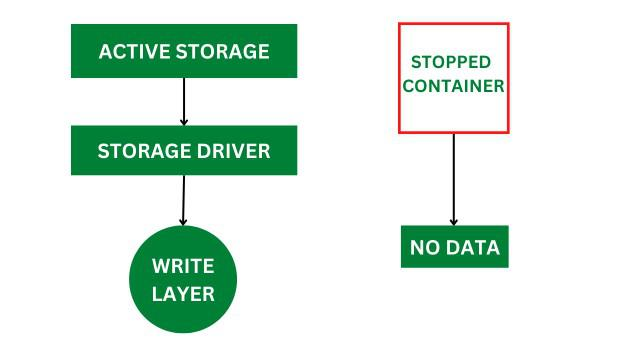

# architecture of docker

Docker makes use of a client-server architecture. The Docker client talks with the Docker daemon which helps in building, running, and distributing Docker containers. The Docker client runs with the daemon on the same system or can connect to the Docker daemon remotely. With the help of REST API over a UNIX socket or a network, the Docker client and daemon interact with each other.

### What is Docker Daemon?

Docker daemon manages all the services by communicating with other daemons. It manages Docker objects such as images, containers, networks, and volumes with the help of the API requests of Docker.

### Docker Client

With the help of the Docker client, Docker users can interact with Docker. The docker command uses the Docker API. The Docker client can communicate with multiple daemons. When a docker client runs any docker command on the docker terminal, the terminal sends instructions to the daemon. The Docker daemon gets those instructions from the Docker client in the form of the command and REST API requests.

The main objective of the Docker client is to provide a way to pull images from the Docker registry and run them on the Docker host. The common commands used by clients are **docker build**, **docker pull**, and **docker run**.

### Docker Host

A Docker host is a machine responsible for running one or more containers. It comprises the Docker daemon, images, containers, networks, and storage.

### Docker Registry

All Docker images are stored in the Docker registry. There is a public registry known as a [docker hub](https://www.geeksforgeeks.org/devops/what-is-docker-hub/) that can be used by anyone. You can also run a private registry. With the help of **docker run** or **docker pull**, you can pull required images from a configured registry. Images are pushed into a configured registry with **docker push**.

### Docker Objects

When using Docker, we create and use images, containers, volumes, networks, and other objects.

### Docker Images

An image contains instructions for creating a Docker container. It is a **read-only template** used to store and ship applications. Images enable collaboration between developers.

### Docker Containers

Containers are created from Docker images and are runnable instances of those images. With the Docker API or CLI, you can start, stop, delete, or move a container. A container can access only those resources defined in the image unless additional access is defined during the container runtime.

### Docker Storage

You can store data within the writable layer of a container, but it requires a storage driver. [Storage driver](https://www.geeksforgeeks.org/cloud-computing/data-storage-in-docker/) controls and manages the images and containers on the Docker host.

Types of Docker Storage:



### Data Volumes

Data Volumes can be mounted directly into the filesystem of the container and are essentially directories or files on the Docker host filesystem.



### Volume Container

To maintain the state of the containers (data) produced by a running container, Docker volume filesystems are mounted on Docker containers. Stored independently of container lifecycle, volumes reside on the host. This makes it simple to share filesystems among containers and back up data.



### Directory Mounts

A host directory that is mounted as a volume in your container.



### Storage Plugins

Docker volume plugins enable integration of Docker containers with external volumes like Amazon EBS, allowing containers to maintain state using external storage.



### Docker Networking

[Docker networking](https://www.geeksforgeeks.org/devops/basics-of-docker-networking/) provides isolation for Docker containers. A user can attach a Docker container to multiple networks. It requires very few OS instances to run the workload.

Types of Docker Network:



### Bridge

The default network driver. Use this when different containers communicate on the same Docker host.



### Host

Used when you don't need isolation between the container and the host.



### Overlay

Enables communication between swarm services.



### None

Disables all networking.



### macvlan

Assigns a MAC (Media Access Control) address to containers so they appear like physical devices on the network.


