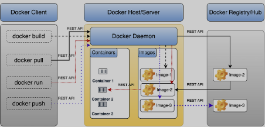

# docker from beginner to expert

Docker has revolutionized the way we develop, package, and deploy applications. It provides a standardized way to create lightweight, portable, and self-sufficient containers that can run virtually anywhere. In this comprehensive tutorial, we’ll take you from Docker novice to expert, covering everything from basic concepts to advanced techniques.


## What is Docker?

Docker is an open-source platform that automates the deployment, scaling, and management of applications using containerization. Containers are lightweight, standalone executable packages that include everything needed to run a piece of software, including the code, runtime, system tools, libraries, and settings.

## Why use Docker?

* Consistency: Docker ensures that your application runs the same way in every environment, from development to production.
* Isolation: Containers are isolated from each other and the host system, improving security and reducing conflicts.
* Portability: Docker containers can run on any system that supports Docker, regardless of the underlying infrastructure.
* Efficiency: Containers share the host OS kernel, making them more lightweight than traditional virtual machines.
* Scalability: Docker makes it easy to scale applications up or down quickly.

## Docker architecture

Docker uses a client-server architecture. The Docker client communicates with the Docker daemon, which does the heavy lifting of building, running, and distributing Docker containers. The client and daemon can run on the same system, or you can connect a Docker client to a remote Docker daemon.



Key components:

* Docker daemon: Background service managing building, running, and distributing containers.
* Docker client: CLI tool for interacting with the daemon.
* Docker registries: Repositories that store images (Docker Hub is a public registry).
* Docker objects: Images, containers, networks, volumes, plugins, etc.

***

## Installing Docker

The installation process varies by OS. Below are platform-specific instructions.

### Installing Docker on Ubuntu



### Update package index

```
sudo apt-get update
```



### Install packages to allow apt to use a repository over HTTPS

```
sudo apt-get install \
    apt-transport-https \
    ca-certificates \
    curl \
    gnupg-agent \
    software-properties-common
```



### Add Docker’s official GPG key

```
curl -fsSL https://download.docker.com/linux/ubuntu/gpg | sudo apt-key add -
```



### Set up the stable repository

```
sudo add-apt-repository \
   "deb [arch=amd64] https://download.docker.com/linux/ubuntu \
   $(lsb_release -cs) \
   stable"
```



### Update package index and install Docker

```
sudo apt-get update
sudo apt-get install docker-ce docker-ce-cli containerd.io
```



### Verify installation

```
sudo docker run hello-world
```



### Installing Docker on macOS

* Download Docker Desktop for Mac from the official Docker website.
* Double-click the downloaded `.dmg` file and drag Docker to your Applications folder.
* Open Docker from Applications; you may need to provide your system password.

### Installing Docker on Windows

* Download Docker Desktop for Windows from the official Docker website.
* Run the installer and follow the wizard.
* Docker Desktop should start automatically after installation.

Note: For older Windows (e.g., Windows 10 Home) you may need Docker Toolbox (uses VirtualBox). After installation, verify with:

```
docker version
```

***

## Docker Basics

### Docker CLI essentials

* Check Docker version:

```
docker version
```

* Display system-wide information:

```
docker info
```

* List available Docker commands:

```
docker
```

### Docker images

Images are read-only templates used to create containers.

* List locally available images:

```
docker images
```

* Pull an image from Docker Hub:

```
docker pull ubuntu:latest
```

### Running your first container

```
docker run -it ubuntu:latest /bin/bash
```

* `docker run`: Creates and starts a new container
* `-it`: Interactive terminal
* `ubuntu:latest`: Image
* `/bin/bash`: Command to run

Inside the container try:

```
ls
cat /etc/os-release
```

Exit with `exit` or `Ctrl+D`.

### Container lifecycle



### Create a container (without starting it)

```
docker create --name mycontainer ubuntu:latest
```



### Start a container

```
docker start mycontainer
```



### Stop a running container

```
docker stop mycontainer
```



### Restart a container

```
docker restart mycontainer
```



### Pause a running container

```
docker pause mycontainer
```



### Unpause a paused container

```
docker unpause mycontainer
```



### Remove a container

```
docker rm mycontainer
```

Note: To remove a running container use `-f` (force).



### Listing and inspecting containers

* List running containers:

```
docker ps
```

* List all containers (including stopped):

```
docker ps -a
```

* Inspect a container (JSON output):

```
docker inspect mycontainer
```

* View container logs:

```
docker logs mycontainer
```

Use `-f` to follow logs in real time.

### Running containers in detached mode

For background services:

```
docker run -d --name mywebserver nginx
```

You can interact with the container using other Docker commands even when detached.

***

## Working with Docker Images

### Anatomy

Images are made of stacked layers—each Dockerfile instruction creates a layer. Layers are cached and reused when possible.

### Finding and pulling images

* Search Docker Hub:

```
docker search nginx
```

* Pull an image:

```
docker pull nginx:latest
```

### Creating images

Two common approaches:

* Commit changes made in a container
* Build from a Dockerfile (preferred)

#### Committing changes



### Run a container and make changes

```
docker run -it ubuntu:latest /bin/bash
apt-get update
apt-get install -y nginx
exit
```



### Commit the changes to a new image

```
docker commit <container_id> my-nginx-image:v1
```

Replace `<container_id>` with the container ID.



#### Building from a Dockerfile

Create `Dockerfile`:

```
FROM ubuntu:latest
RUN apt-get update && apt-get install -y nginx
EXPOSE 80
CMD ["nginx", "-g", "daemon off;"]
```

Build the image:

```
docker build -t my-nginx-image:v2 .
```

### Managing images

* List images:

```
docker images
```

* Remove an image:

```
docker rmi my-nginx-image:v1
```

* Tag an image:

```
docker tag my-nginx-image:v2 my-dockerhub-username/my-nginx-image:v2
```

* Push an image to Docker Hub:

```
docker push my-dockerhub-username/my-nginx-image:v2
```

(You must be logged in: `docker login`.)

### Image layers and caching

See layers:

```
docker history my-nginx-image:v2
```

Understanding caching helps optimize Dockerfiles.

***

## Creating and Managing Docker Containers

### Useful docker run options

* Automatic removal when it exits:

```
docker run --rm ubuntu:latest echo "Hello, World!"
```

* Custom name:

```
docker run --name my-custom-container ubuntu:latest
```

* Publish a port:

```
docker run -p 8080:80 nginx
```

* Set environment variables:

```
docker run -e MY_VAR=my_value ubuntu:latest env
```

* Limit memory:

```
docker run --memory=512m ubuntu:latest
```

### Executing commands in running containers

```
docker exec -it my-custom-container /bin/bash
```

### Copying files between host and container

* Host to container:

```
docker cp ./myfile.txt my-custom-container:/path/in/container/
```

* Container to host:

```
docker cp my-custom-container:/path/in/container/myfile.txt ./
```

### Monitoring containers

* Resource usage:

```
docker stats
```

* View processes inside a container:

```
docker top my-custom-container
```

### Container resource constraints

* Limit CPU:

```
docker run --cpus=0.5 ubuntu:latest
```

* Set CPU shares:

```
docker run --cpu-shares=512 ubuntu:latest
```

* Limit memory and swap:

```
docker run --memory=1g --memory-swap=2g ubuntu:latest
```

### Updating containers

* Update resources:

```
docker update --cpus=1 --memory=2g my-custom-container
```

* Rename a container:

```
docker rename my-custom-container my-new-container-name
```

### Restart policies

```
docker run --restart=always nginx
```

Policies: `no`, `on-failure[:max-retries]`, `always`, `unless-stopped`.

### Attaching and detaching

* Attach:

```
docker attach my-custom-container
```

* Detach without stopping: Press `Ctrl-p` then `Ctrl-q`.

***

## Docker Networking

Docker networking allows containers to talk to each other and to the outside world.

### Network drivers

* bridge (default)
* host (no network isolation)
* overlay (multi-host, Swarm)
* macvlan (assign MAC to container)
* none (no networking)

### Listing and inspecting networks

* List networks:

```
docker network ls
```

* Inspect a network:

```
docker network inspect bridge
```

### Creating custom networks

```
docker network create --driver bridge my-custom-network
```

### Connecting containers to networks

* Connect a running container:

```
docker network connect my-custom-network my-container
```

* Disconnect:

```
docker network disconnect my-custom-network my-container
```

* Run and connect:

```
docker run --network my-custom-network nginx
```

### Container DNS

Containers on the same user-defined network can resolve each other by name.

Example:

```
docker network create my-app-network
docker run -d --name web --network my-app-network nginx
docker run -d --name db --network my-app-network postgres
```

`web` can reach `db` using hostname `db`.

### Port mapping

Expose container ports to the host:

```
docker run -p 8080:80 nginx
```

Bind to specific IP:

```
docker run -p 127.0.0.1:8080:80 nginx
```

### Network troubleshooting

* Check network settings:

```
docker inspect --format '{{json .NetworkSettings.Networks}}' my-container
```

* Run diagnostics inside container:

```
docker exec -it my-container ping google.com
docker exec -it my-container netstat -tuln
```

* Check logs:

```
docker logs my-container
```

* Check DNS config:

```
docker exec -it my-container cat /etc/resolv.conf
```

### Advanced networking

* Expose without publishing:

```
docker run --expose 80 nginx
```

* Legacy links (use user-defined networks instead):

```
docker run --name db postgres
docker run --link db:database nginx
```

* macvlan example:

```
docker network create -d macvlan \
  --subnet=192.168.1.0/24 \
  --gateway=192.168.1.1 \
  -o parent=eth0 my-macvlan-net
```

***

## Volumes and Data Management

Containers are ephemeral; use volumes and mounts to persist data.

### Types of persistence

* Volumes: Managed by Docker
* Bind mounts: Mount host file/dir into container
* tmpfs mounts: In-memory mounts

### Working with volumes

* Create:

```
docker volume create my-vol
```

* List:

```
docker volume ls
```

* Inspect:

```
docker volume inspect my-vol
```

* Remove:

```
docker volume rm my-vol
```

* Use in container:

```
docker run -v my-vol:/app/data nginx
```

### Bind mounts

```
docker run -v /host/path:/container/path nginx
```

Or verbose `--mount`:

```
docker run --mount type=bind,source=/host/path,target=/container/path nginx
```

### Read-only mounts

```
docker run -v /host/path:/container/path:ro nginx
```

### Sharing data between containers

* Named volume:

```
docker run -v shared-data:/app/data --name container1 nginx
docker run -v shared-data:/app/data --name container2 nginx
```

* `--volumes-from`:

```
docker run --name container1 -v /app/data nginx
docker run --volumes-from container1 --name container2 nginx
```

### Backup and restore volumes

* Backup:

```
docker run --rm -v my-vol:/source -v $(pwd):/backup ubuntu tar cvf /backup/backup.tar /source
```

* Restore:

```
docker run --rm -v my-vol:/target -v $(pwd):/backup ubuntu tar xvf /backup/backup.tar -C /target --strip-components=1
```

### Volume drivers example (NFS)

```
docker volume create --driver local \
    --opt type=nfs \
    --opt o=addr=192.168.1.1,rw \
    --opt device=:/path/to/dir \
    my-nfs-volume
```

***

## Writing Dockerfiles

A Dockerfile automates building an image.

### Dockerfile basics

Example:

```
FROM ubuntu:20.04
RUN apt-get update && apt-get install -y nginx
COPY ./my-nginx.conf /etc/nginx/nginx.conf
EXPOSE 80
CMD ["nginx", "-g", "daemon off;"]
```

Common instructions: FROM, RUN, COPY, ADD, EXPOSE, CMD, ENTRYPOINT.

### Best practices

* Use official base images.
* Minimize layers by combining commands:

```
RUN apt-get update && \
    apt-get install -y \
    package1 \
    package2 \
    package3 && \
    rm -rf /var/lib/apt/lists/*
```

* Use .dockerignore to exclude unnecessary files.
* Use multi-stage builds to reduce final image size.
* Set WORKDIR to organize commands.
* Use ENV for configuration.
* Use LABEL for metadata.

### Multi-stage builds example (Go)

```
# Build stage
FROM golang:1.16 AS builder
WORKDIR /app
COPY . .
RUN CGO_ENABLED=0 GOOS=linux go build -a -installsuffix cgo -o main .

# Final stage
FROM alpine:3.14
RUN apk --no-cache add ca-certificates
WORKDIR /root/
COPY --from=builder /app/main .
CMD ["./main"]
```

### Dockerfile instructions in depth

* HEALTHCHECK:

```
HEALTHCHECK --interval=30s --timeout=10s --start-period=5s --retries=3 \
  CMD curl -f http://localhost/ || exit 1
```

* ARG:

```
ARG VERSION=latest
FROM ubuntu:${VERSION}
```

* VOLUME:

```
VOLUME /app/data
```

* USER:

```
RUN groupadd -r mygroup && useradd -r -g mygroup myuser
USER myuser
```

***

## Docker Compose

Docker Compose defines and runs multi-container applications using a YAML file.

### Basic example

docker-compose.yml:

```
version: '3'
services:
  web:
    image: nginx:alpine
    ports:
      - "8000:80"
  db:
    image: postgres:12
    environment:
      POSTGRES_PASSWORD: example
```

### Key concepts

* Services: Containers making up an app
* Networks: How services communicate
* Volumes: Where services store/share data

### Common commands

* Start services:

```
docker-compose up
```

* Detached mode:

```
docker-compose up -d
```

* Stop services:

```
docker-compose down
```

* View running services:

```
docker-compose ps
```

* View logs:

```
docker-compose logs
```

* Run command in service:

```
docker-compose exec web bash
```

### Example file structure (more complex)

```
version: '3.8'

services:
  web:
    build: ./web
    ports:
      - "5000:5000"
    volumes:
      - ./web:/code
    environment:
      FLASK_ENV: development
    depends_on:
      - db

  db:
    image: postgres:12
    volumes:
      - postgres_data:/var/lib/postgresql/data
    environment:
      POSTGRES_PASSWORD: example

volumes:
  postgres_data:

networks:
  default:
    name: my_app_net
```

### Advanced features

* Scale services:

```
docker-compose up -d --scale web=3
```

* Extending services:

```
services:
  web:
    extends:
      file: common-services.yml
      service: webapp
```

* Using profiles:

```
services:
  web:
    image: nginx:alpine
    profiles: ["frontend", "dev"]
```

Start profile:

```
docker-compose --profile dev up
```

* Health checks in Compose:

```
healthcheck:
  test: ["CMD", "curl", "-f", "http://localhost"]
  interval: 1m30s
  timeout: 10s
  retries: 3
  start_period: 40s
```

***

## Docker Swarm

Docker Swarm is Docker’s native clustering and orchestration solution.

### Key concepts

* Node: Machine in the Swarm (manager or worker)
* Service: Definition of tasks to execute
* Task: A container and commands to run

### Setup

* Initialize a Swarm:

```
docker swarm init --advertise-addr <MANAGER-IP>
```

* Join a worker:

```
docker swarm join --token <TOKEN> <MANAGER-IP>:2377
```

* List nodes:

```
docker node ls
```

### Managing services

* Create a service:

```
docker service create --name my_web nginx
```

* List services:

```
docker service ls
```

* Scale a service:

```
docker service scale my_web=5
```

* Update a service (image):

```
docker service update --image nginx:1.19 my_web
```

* Remove a service:

```
docker service rm my_web
```

### Deploy stacks with Compose

```
docker stack deploy -c docker-compose.yml my_stack
```

### Swarm networking

Routing mesh: each node can accept connections on published ports for any service in the Swarm.

### Swarm secrets

* Create a secret:

```
echo "my_secret_data" | docker secret create my_secret -
```

* Use secret in service:

```
docker service create --name nginx --secret my_secret nginx
```

### Rolling updates and rollbacks

* Rolling update example:

```
docker service update --update-parallelism 2 --update-delay 10s my_web
```

* Rollback:

```
docker service update --rollback my_web
```

For more advanced orchestration features, consider Kubernetes.

***

## Docker Security Best Practices

Security is critical. Key recommendations:

1. Keep Docker up to date.
2. Use official or trusted images.
3. Scan images for vulnerabilities:

```
docker scan my-image:latest
```

4. Limit container capabilities and use non-root users.
5. Use read-only filesystems where appropriate:

```
docker run --read-only ubuntu:20.04
```

6. Limit resources:

```
docker run --cpus=0.5 --memory=512m ubuntu:20.04
```

7. Use secrets management:

```
docker secret create my_secret my_secret.txt
```

8. Implement network segmentation and security options:

```
docker run --security-opt=no-new-privileges ubuntu:20.04
```

9. Logging and monitoring:

```
docker run --log-driver=syslog ubuntu:20.04
```

10. Enable Docker Content Trust:

```
export DOCKER_CONTENT_TRUST=1
docker pull nginx:latest
```

11. Regular audits (example: Docker Bench for Security):

```
docker run -it --net host --pid host --userns host --cap-add audit_control \
    -e DOCKER_CONTENT_TRUST=$DOCKER_CONTENT_TRUST \
    -v /var/lib:/var/lib \
    -v /var/run/docker.sock:/var/run/docker.sock \
    -v /usr/lib/systemd:/usr/lib/systemd \
    -v /etc:/etc --label docker_bench_security \
    docker/docker-bench-security
```

12. Use multi-stage builds to reduce final image attack surface.
13. Implement proper access controls.

Security is ongoing—stay informed and apply best practices consistently.

***

## Advanced Docker Techniques

* Custom base images (FROM scratch)
* Dockerfile heredocs for readability
* Enable BuildKit for advanced builds:

```
export DOCKER_BUILDKIT=1
# syntax=docker/dockerfile:1.2
```

* Multi-arch builds with buildx:

```
docker buildx create --use
docker buildx build --platform linux/amd64,linux/arm64 -t myimage:latest .
```

* Distroless images for minimal attack surface.
* Image squashing:

```
docker build --squash -t myimage:squashed .
```

* Image slimming with DockerSlim:

```
docker-slim build myimage:latest
```

* Custom networks and plugins (e.g., sshfs plugin).
* CLI plugins for custom commands:

```
mkdir -p ~/.docker/cli-plugins
cp ./my-custom-command ~/.docker/cli-plugins/docker-my-custom-command
chmod +x ~/.docker/cli-plugins/docker-my-custom-command
```

* Docker contexts to manage multiple Docker environments:

```
docker context create my-remote-docker --docker "host=ssh://user@remote-host"
docker context use my-remote-docker
docker ps
```

* Composer `extends`, anchors, and aliases to DRY Compose configs.

***

## Docker in Production

Considerations for production deployments:

* Orchestration: Kubernetes is the industry standard; Swarm is simpler but less feature-rich.
* Monitoring & logging: Prometheus, Grafana, ELK, Fluentd; use logging drivers.
* CI/CD: Build, test, scan images automatically; use multi-stage builds.
* High availability: Multiple replicas, health checks, rolling updates.
* Persistent storage: Use appropriate volume drivers (EBS, GCE PD, etc.) and backups.
* Networking: Overlay networks, network policies, service discovery.
* Security: Harden hosts, use access controls, keep images updated.
* Resource management: Limits, quotas, autoscaling.
* Image management: Private registries, versioning, image scanning.
* Backup & disaster recovery: Regular backups, cross-region replication, tested runbooks.
* Performance optimization: Monitor, optimize Dockerfiles, choose storage drivers.
* Cost management: Right-size instances, autoscaling, spot instances where suitable.
* Documentation & runbooks: Keep them current.

***

## Troubleshooting and Debugging

Techniques and commands:

* Check container logs:

```
docker logs <container_id>
docker logs -f <container_id>
```

* Inspect container:

```
docker inspect <container_id>
docker inspect --format '{{.State.Status}}' <container_id>
```

* Execute inside container:

```
docker exec -it <container_id> /bin/bash
```

* Resource usage:

```
docker stats
```

* Network debugging:

```
docker network inspect <network_name>
docker exec -it <container_id> ping google.com
```

* Filesystem changes:

```
docker diff <container_id>
```

* Build troubleshooting:

```
docker build --progress=plain -t myimage .
```

* Monitor Docker events:

```
docker events
```

* Daemon logs (Linux):

```
journalctl -u docker.service
```

* Debug mode:

```
dockerd -D
```

* Compose debugging:

```
docker-compose logs
docker-compose ps
docker-compose top
```

* Third-party tools: Sysdig, cAdvisor, Weave Scope.

Common issues and solutions:

* Container won’t start: check logs, verify image, check ports.
* Container exits immediately: ensure a running process (CMD/ENTRYPOINT).
* Cannot connect to exposed port: verify port mapping and binding (0.0.0.0).
* Out of disk space: `docker system prune`, increase host storage.
* Container running but unresponsive: check `docker stats`, logs.
* Network issues between containers: verify networks with `docker network inspect`.

***

## Docker Ecosystem and Tools

A non-exhaustive overview:

* Orchestration: Kubernetes, Docker Swarm, Nomad
* Registries: Docker Hub, ECR, GCR, ACR, Harbor
* CI/CD: Jenkins, GitLab CI, CircleCI, Travis CI, GitHub Actions
* Monitoring & logging: Prometheus, Grafana, ELK, Fluentd, cAdvisor
* Security: Clair, Anchore, Trivy, Falco
* Development tools: Docker Compose, VS Code Docker extension, Portainer, Dive
* Networking: Weave Net, Calico, Cilium
* Storage: Rexray, Flocker, Longhorn
* Service discovery: Consul, etcd
* Platforms: Rancher, OpenShift, Docker Enterprise
* Serverless on containers: OpenFaaS, Knative
* Local dev: Docker Desktop, Minikube
* Image building: BuildKit, Kaniko, Buildah
* Config management: confd, envsubst
* Testing: Test Kitchen, Container Structure Test

***

## Conclusion and Next Steps

You’ve covered a comprehensive Docker tutorial—from basics to advanced topics and ecosystem tools.

Recap highlights:

* Core Docker concepts, installation, image and container management
* Networking, volumes, Dockerfiles, Compose, Swarm
* Security practices, advanced techniques, production concerns
* Troubleshooting and ecosystem tools

Suggested next steps:

* Practice regularly by containerizing applications.
* Learn Kubernetes for advanced orchestration.
* Explore cloud container services (AWS, GCP, Azure).
* Contribute to open-source Docker-related projects.
* Stay updated via blogs, webinars, and community forums.
* Consider certification (Docker Certified Associate).
* Investigate related technologies (service mesh, GitOps, serverless).
* Focus on container security and monitoring.
* Experiment with different application architectures (monoliths vs microservices).

Docker is a powerful tool—use it to improve development workflows, delivery, and to solve real-world infrastructure challenges. Good luck on your Docker journey!
