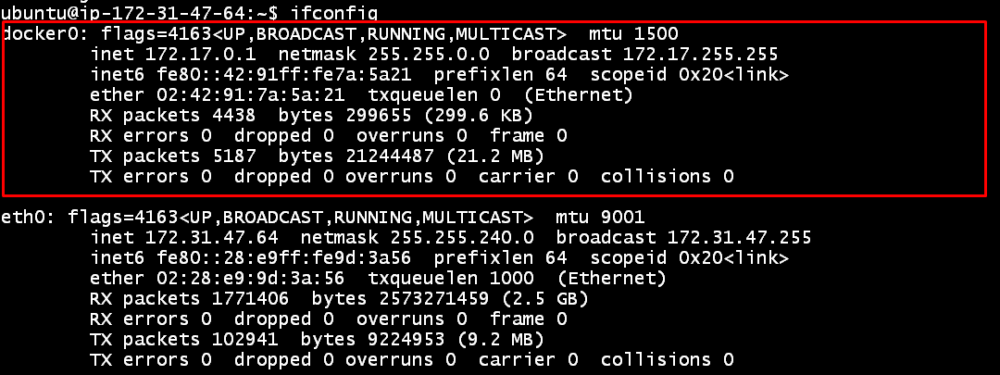
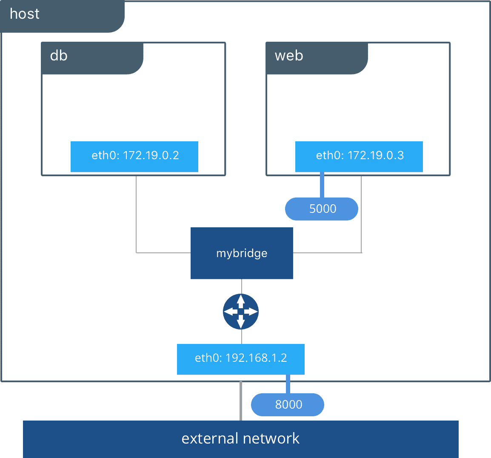
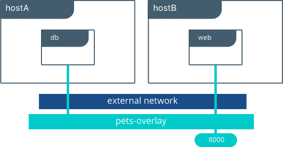
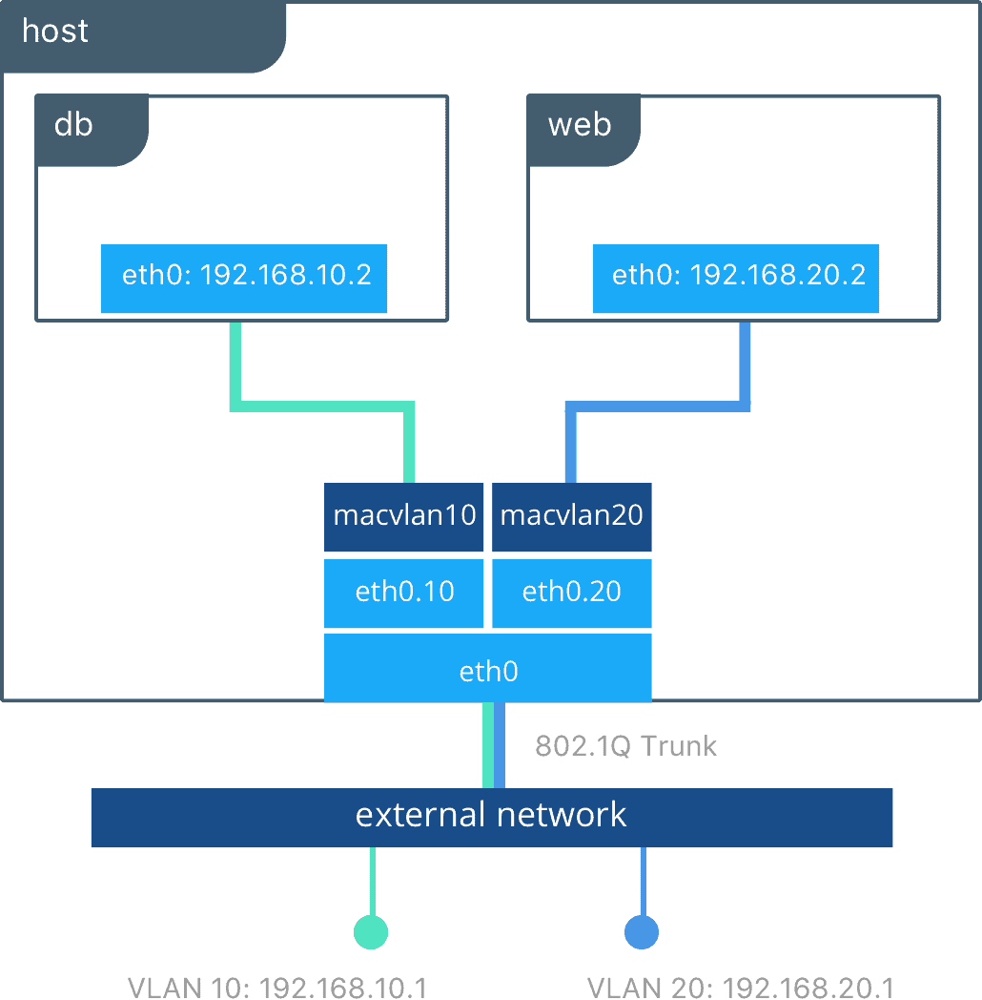
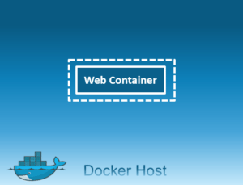

# docker networking


### Docker Network

* Docker networking is primarily used to establish communication between Docker containers and the outside world via the host machine.
* Docker Networks are used to provide complete isolation for Docker containers.
* Docker uses Linux’s [Namespace](https://medium.com/@BeNitinAgarwal/understanding-the-docker-internals-7ccb052ce) for resource isolation, which includes network resources.
* Docker isolates the network through Network Namespace and provides an independent network environment, including network cards, routing, iptable rules, and so on.
* When Docker is installed, a default bridge network named `docker0` is created. Each new Docker container is automatically attached to this network unless a custom network is specified.
* If you do an `ifconfig` on the Docker Host, you will see the Docker Ethernet adapter.



Also, check if you need to know about [docker0 and eth0](https://stackoverflow.com/questions/37536687/what-is-the-relation-between-docker0-and-eth0).

Docker supports networking for its containers via network drivers. These drivers include:

* Bridge
* Host
* Overlay
* Macvlan
* None

***

### The Bridge Driver



* It is a private default network created on the host.
* Containers linked to this network have an internal IP address through which they communicate with each other easily.
* The Docker server (daemon) creates a virtual ethernet bridge `docker0` that operates automatically, by delivering packets among various network interfaces.

Let’s see in action:



### Create and run containers attached to the bridge

Run two nginx containers:


```bash
$ docker run -itd --name nginx1 nginx
$ docker run -itd --name nginx2 nginx
```




### List running containers and inspect the bridge network

Check running containers:


```bash
$ docker ps
```


Inspect the default bridge network:


```bash
$ docker network inspect bridge | grep Name
```




Both Nginx containers will be attached to the `bridge` network by default.

***

### The Host Driver


* It is a public network.
* The container will use the host’s IP and port to run services inside the container.
* It removes network isolation between the container and the host machine where Docker is running.
* For example, if you run a container that binds to port 80 and uses host networking, the container’s application is available on port 80 on the host’s IP address.
* One limitation: host networking works on Linux hosts but not on Windows and macOS.
* It does not require network address translation (NAT).



### Create a container using host networking


```bash
$ docker run -itd --net host --name host_web httpd
```




### Inspect the host network

Check that the `host` network exists:


```bash
$ docker network ls
```


Inspect the `host` network:


```bash
$ docker network inspect host | grep Name
```




You can access the containerized service using the host's public IP.

***

## Overlay Driver



* Overlay allows containers across multiple hosts to communicate with each other without worrying about the underlying setup.
* It's intended for multi-host networking, such as with Docker Swarm or Kubernetes.
* It creates an internal private network that spans across all nodes participating in the swarm cluster.
* Think of an overlay network as a distributed virtualized network built on top of an existing network.

Note: You won't see an overlay network created by default in a standalone Docker engine. To create and use overlay networks, you must use Docker Swarm (or another orchestrator that supports overlay networks).

Example of creating an overlay network (requires Swarm):

```bash
$ docker network create -d overlay myStack1
```

If you attempt this outside a Swarm environment, Docker will not create a usable overlay network. To use the overlay driver, initialize or join a Swarm and create services that use the overlay network.

***

## Macvlan Driver



* Macvlan networks allow you to assign a MAC address to a container, making it appear as a physical device on your network.
* The Docker daemon routes traffic to containers by their MAC addresses.
* Using the `macvlan` driver can be the best choice for legacy applications that expect to be directly connected to the physical network.
* It is suitable when you want the container to be directly connected to the physical network rather than through the Docker host.

You typically won't see any macvlan networks by default.

Create a macvlan network bound to `eth0` on the host and attach containers:

### Create the macvlan network

Replace subnet/gateway/parent values as appropriate for your environment:


```bash
$ docker network create -d macvlan \
  --subnet 192.168.0.0/24 \
  --gateway 192.168.0.1 \
  -o parent=eth0 mvnet
```



## Run two containers on the macvlan network and test connectivity

```bash
$ docker run -itd --name C1 --net mvnet --ip 192.168.0.3 busybox sh
$ docker run -it --name C2 --net mvnet --ip 192.168.0.4 busybox sh
# From C2:
$ ping 192.168.0.3
```

In this example, the containers attached to the `mvnet` macvlan network can directly ping each other using their assigned IPs.

***

## None Driver



* In this mode, containers are not attached to any network.
* They do not have access to the external network or other containers.
* This network is used when you want to completely disable the networking stack on a container and only create a loopback device.

You can see existing networks with:

```bash
$ docker network ls
```

***

## Basic Docker Networking Commands

List Docker networks:

```bash
$ docker network ls
```

Create a network:

```bash
$ docker network create mynetwork
```

Disconnect a container from a network:

```bash
$ docker network disconnect mynetwork 0f8d7a833f42
```

Display detailed information on one or more networks:

```bash
$ docker network inspect mynetwork
```

Remove all unused networks:

```bash
$ docker network prune
```

Related tag: [Docker Networking](https://medium.com/tag/docker-networking?source=post_page-----bdebb478781f---------------------------------------)
