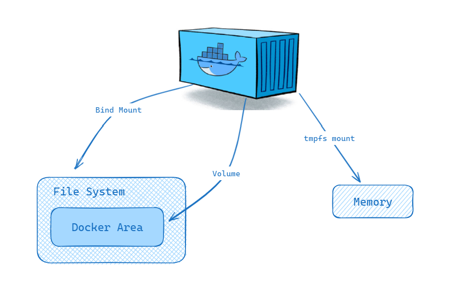
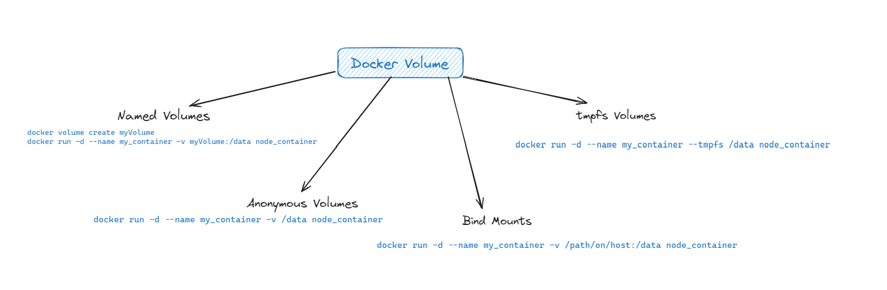
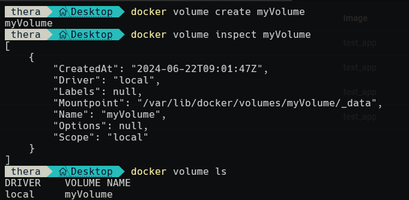
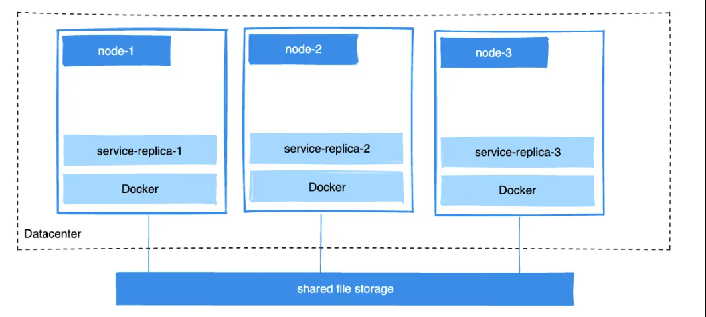
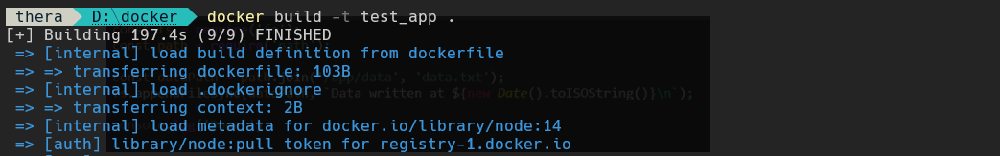
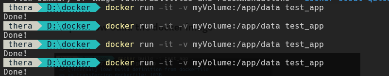
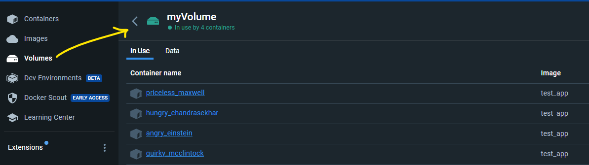

# docker volumes

Containers in Docker are designed to be stateless and easily disposable. Volumes provide a way to persist data generated and used by containers beyond the lifecycle of a single container. This is essential for databases, file storage, and other applications that require persistent storage.

This article delves into the various ways to create and use Docker volumes, complete with examples to illustrate their practical applications.



## Introduction to Docker Volumes

Docker volumes are a persistent storage mechanism designed to store data generated by and used by Docker containers. They provide a way to decouple the data lifecycle from the container lifecycle, ensuring that data remains intact even when containers are deleted or recreated.

## Types of Docker Volumes



### Named Volumes

Named volumes are user-defined volumes that can be easily referenced by name and reused across multiple containers. They are stored in Docker’s internal volume store.

```bash
docker volume create myVolume
docker run -d --name my_container -v myVolume:/data node_container
```

### Anonymous Volumes

Anonymous volumes are created when no name is specified. They are typically used for temporary data that does not need to persist beyond the container’s lifecycle.

```bash
docker run -d --name my_container -v /data node_container
```

### Bind Mounts

Bind mounts map a directory or file from the host filesystem to a container. This allows direct access to the host’s filesystem, making it ideal for scenarios where data needs to be shared between the host and the container.

```bash
docker run -d --name my_container -v /path/on/host:/data node_container
```

### tmpfs Volumes

tmpfs volumes mount a temporary filesystem in the container’s memory. They are useful for storing non-persistent data that shouldn’t be written to disk, like sensitive information or temporary files.

```bash
docker run -d --name my_container --tmpfs /data node_container
```

## Creating and Managing Docker Volumes

### Creating Volumes

To create a named volume:

```bash
docker volume create myVolume
```

### Inspecting Volumes

To inspect a volume and view its details:

```bash
docker volume inspect myVolume
```

### Removing Volumes

To remove a volume that is no longer needed:

```bash
docker volume rm myVolume
```



## Using Docker Volumes

### Mounting Named Volumes

```bash
docker run -d -v myVolume:/app/data myImage
```

### Mounting Anonymous Volumes

```bash
docker run -d -v /app/data myImage
```

### Using Bind Mounts

To use a bind mount, specify the host path and the container path:

```bash
docker run -d -v /host/data:/app/data myImage
```

## Examples



### Persisting Data with Named Volumes

Create a named volume and use it in a container:

```bash
docker volume create mydata
docker run -d -v mydata:/app/data myImage
```

Any data written to `/app/data` inside the container will persist even if the container is deleted.



### Sharing Data Between Containers

Use a named volume to share data between multiple containers:

```bash
docker volume create shared_data
docker run -d -v shared_data:/app/data container1
docker run -d -v shared_data:/app/data container2
```

Both containers can read and write to `/app/data`, facilitating data sharing.





## Using Bind Mounts for Development

Use bind mounts to map a host directory to a container, allowing for real-time code changes:

```bash
docker run -d -v $(pwd):/app myImage
```

Changes made to files in the host directory will be immediately reflected in the container.

## Example: simple Node.js application



### Create a Node.js Application

Create a simple Node.js application that writes data to a file.





### Create a Dockerfile

Dockerfile for the Node.js application:

```dockerfile
FROM node:14

WORKDIR /app

COPY . .

CMD ["node", "app.js"]
```



### Build the Docker image

Build the image (example):

```bash
docker build -t my-node-app .
```





### Spin up the container

Run the container and mount a volume:

```bash
docker run -d -v myVolume:/app/data my-node-app
```




-v myVolume:/app/data mounts a volume inside the container.

* myVolume: the name of the volume on the host machine.
* /app/data: the mount point inside the container.




### Check the content of the data file

Inspect the file written by the application inside the mounted volume. You can view volumes in Docker Desktop under the Volumes section.

 



## Best Practices for Using Docker Volumes

* Use named volumes for data that needs to persist beyond the container’s lifecycle.
* Use bind mounts for development purposes or when you need direct access to host files.
* Regularly inspect and clean up unused volumes to free up space.
* Ensure proper access permissions when using bind mounts to avoid security risks.

## Conclusion

Docker volumes are a powerful feature that enhances the flexibility and efficiency of containerized applications. By understanding the different types of volumes and how to manage them, you can effectively use Docker to persist, share, and manage data within your containers.
