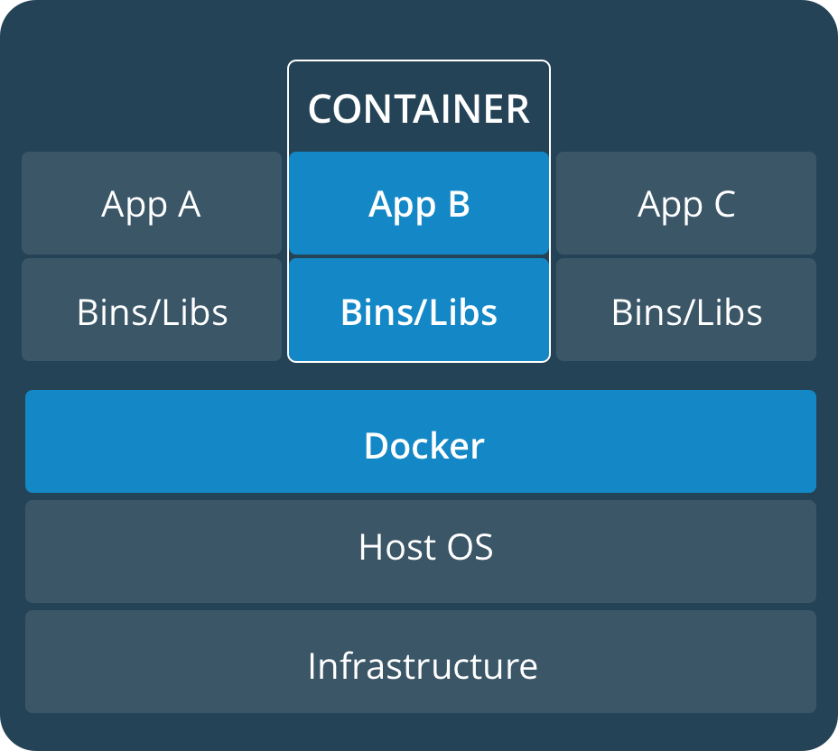
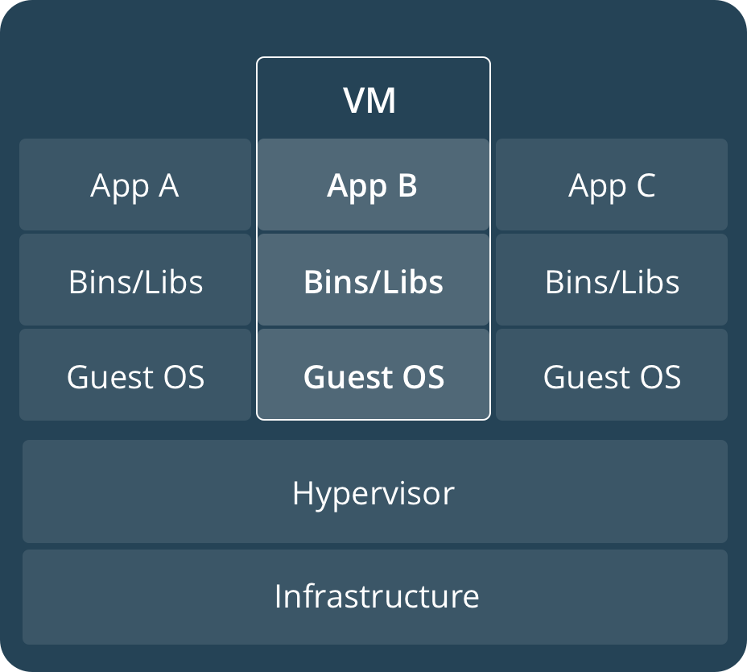
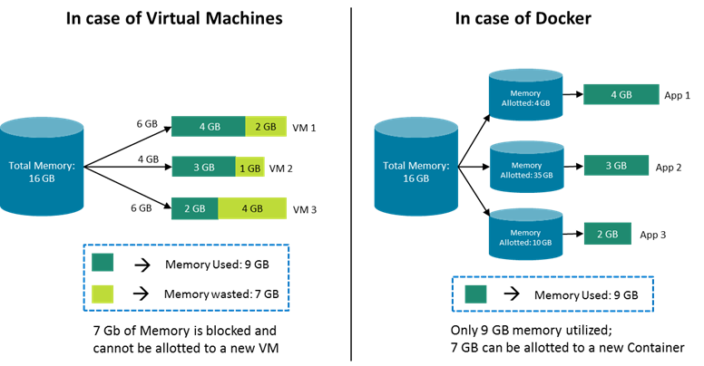
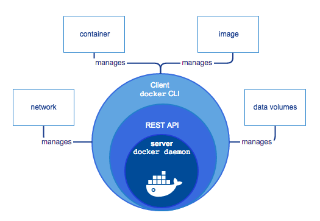
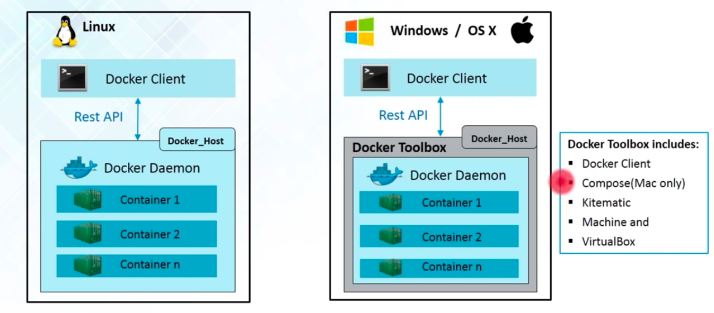

# README

**What is Docker?**

Docker is a set of platform as a service products that use OS-level virtualisation to deliver software in packages called containers. Containers are isolated from one another and bundle their own software, libraries and configuration files; they can communicate with each other through well-defined channels. All containers are run by a single [operating-system kernel](https://en.wikipedia.org/wiki/Kernel_\(operating_system\)) and are thus more lightweight than [virtual machines](https://en.wikipedia.org/wiki/Virtual_machine).[\[8\]](https://en.wikipedia.org/wiki/Docker_\(software\)#cite_note-what-is-a-container-9)

_**What is Container?**_

Docker Container is a standardised unit which can be created on the fly to deploy a particular application or environment. It could be an Ubuntu container, CentOs container, etc. to full-fill the requirement from an operating system point of view. Also, it could be an application oriented container like CakePHP container or a Tomcat-Ubuntu container etc.

## Docker concepts

Docker is a platform for developers and sysadmins to **build, share, and run** applications with containers. The use of containers to deploy applications is called _containerisation_. Containers are not new, but their use for easily deploying applications is.

Containerisation is increasingly popular because containers are:

* Flexible: Even the most complex applications can be containerised.
* Lightweight: Containers leverage and share the host kernel, making them much more efficient in terms of system resources than virtual machines.
* Portable: You can build locally, deploy to the cloud, and run anywhere.
* Loosely coupled: Containers are highly self sufficient and encapsulated, allowing you to replace or upgrade one without disrupting others.
* Scalable: You can increase and automatically distribute container replicas across a datacenter.
* Secure: Containers apply aggressive constraints and isolations to processes without any configuration required on the part of the user.

Welcome! We are excited that you want to learn Docker. The Docker Get Started Tutorial teaches you how to:



### Set up your Docker environment (on this page)



### Build an image and run it as one container

[Build an image and run it as one container](https://docs.docker.com/get-started/part2/)



### Set up and use a Kubernetes environment on your development machine

[Set up and use a Kubernetes environment on your development machine](https://docs.docker.com/get-started/part3/)



### Set up and use a Swarm environment on your development machine

[Set up and use a Swarm environment on your development machine](https://docs.docker.com/get-started/part4/)



### Share your containerized applications on Docker Hub

[Share your containerized applications on Docker Hub](https://docs.docker.com/get-started/part5/)



## Images and containers

Fundamentally, a container is nothing but a running process, with some added encapsulation features applied to it in order to keep it isolated from the host and from other containers. One of the most important aspects of container isolation is that each container interacts with its own, private filesystem; this filesystem is provided by a Docker **image**. An image includes everything needed to run an application — the code or binary, runtimes, dependencies, and any other filesystem objects required.

## Containers and virtual machines

A container runs _natively_ on Linux and shares the kernel of the host machine with other containers. It runs a discrete process, taking no more memory than any other executable, making it lightweight.

By contrast, a **virtual machine** (VM) runs a full-blown “guest” operating system with _virtual_ access to host resources through a hypervisor. In general, VMs incur a lot of overhead beyond what is being consumed by your application logic.

<figure><figcaption></figcaption></figure>

<div data-full-width="true"><figure><figcaption></figcaption></figure></div>

lets me summarise the learning till now:

* Virtual Machines are slow and take a lot of time to boot.
* Containers are fast and boots quickly as it uses host operating system and shares the relevant libraries.
* Containers do not waste or block host resources unlike virtual machines.
* Containers have isolated libraries and binaries specific to the application they are running.
* Containers are handled by Containerisation engine.
* Docker is one of the containerisation platforms which can be used to create and run containers.

**Why do we use docker?**

So we have discussed what Docker is. However, what is the need for the Docker? Well, Docker containers are lightweight and they are super easy to create and deploy.

Docker provides us with containers. And containerization consists of an entire runtime environment, an application, all its dependencies, libraries, binaries and configuration files needed to run it, bundled into one package. Each application runs separately from the other. Docker solves the dependency problem by keeping the dependency contained inside the containers. It unites developers against dependency of their project.

**Benefits of using Containers over Virtual Machines**

Now let’s discuss what is the benefit of Docker over VMs.

* Unlike VMs( Virtual Machines ) that run on a Guest OS, using a hypervisor, Docker containers run directly on a host server (for Linux), using a Docker engine, making it faster and lightweight

<figure><figcaption></figcaption></figure>

* Docker containers can be easily integrated compared to VMs.
* With a fully virtualized system, you get more isolation. However, it requires more resources. With Docker, you get less isolation. However, as it requires fewer resources, you can run thousands of container on a host.
* A VM can take a minimum of one minute to start, while a Docker container usually starts in a fraction of seconds.
* Containers are easier to break out of than a Virtual Machine.
* Unlike VMs there is no need to preallocate the RAM. Hence docker containers utilize less RAM compared to VMs. So only the amount of RAM that is required is used.

<figure><figcaption></figcaption></figure>

**How does Docker work?**

Since we now understand the benefits of using Docker. Let’s talk above the functioning of Docker. Docker has a **docker engine,** which is the heart of Docker system. It is a client-server application. It has three main components:

* A server which is a type of long-running process called a daemon process.
* A client which is Docker CLI( Command Line Interface), and
* A REST API which is used to communicate between the client( Docker CLI ) and the server ( Docker Daemon )

The Docker daemon receives the command from the client and manages Docker _objects_, such as images, containers, networks, and volumes. The Docker client and daemon can either run on the same system, or you can connect a Docker client to a remote Docker daemon. They can communicate using a REST API, over UNIX sockets or a network interface.

<figure><figcaption></figcaption></figure>

In Linux, Docker host runs docker daemon and docker client can be accessed from the terminal.

In Windows/OS X, there is an additional tool called Docker toolbox. This toolbox installs the docker environment on Win/OS system. This toolbox installs the following: Docker Client, Compose, Kitematic, Machine, and Virtual Box

<figure><figcaption></figcaption></figure>

**Technology Used in Docker**

The programming language used in Docker is `GO`. Docker takes advantage of various features of Linux kernel like `namespaces` and `cgroups`.

* namespaces: Docker uses `namespaces` to provide isolated workspace called `containers`. When a container is run, docker creates a set of namespaces for it, providing a layer of isolation. Each aspect of a container runs in a separate namespace and its access is limited to that namespace.
* cgroups( control groups ): croups are used to limit and isolate the resource usage( CPU, memory, Disk I/O, network etc ) of a collection of processes. `cgroups` allow Docker engine to share the available hardware resources to containers and optionally enforce limit and constraints.
* UnionFS( Union file systems ): are file systems that operate by creating layers, making them very lightweight and fast. It is used by Docker engine to provide the building blocks for containers.

Docker Engine combines the namespaces, cgroups, and UnionFS into a wrapper called a **container format**. The default container format is `libcontainer.`

## Install Docker Desktop

The best way to get started developing containerized applications is with Docker Desktop, for OSX or Windows. Docker Desktop will allow you to easily set up Kubernetes or Swarm on your local development machine, so you can use all the features of the orchestrator you’re developing applications for right away, no cluster required. Follow the installation instructions appropriate for your operating system:

* [OSX](https://docs.docker.com/docker-for-mac/install/)
* [Windows](https://docs.docker.com/docker-for-windows/install/)

## Docker Daily use commands



### docker –version

This command is used to get the currently installed version of docker



### docker pull

Usage: docker pull&#x20;

This command is used to pull images from the **docker repository**(hub.docker.com)



### docker run

Usage: docker run -it -d&#x20;

This command is used to create a container from an image



### docker ps

This command is used to list the running containers



### docker ps -a

This command is used to show all the running and exited containers



### docker exec

Usage: docker exec -it bash

This command is used to access the running container



### docker stop

Usage: docker stop

This command stops a running container



### docker kill

Usage: docker kill

This command kills the container by stopping its execution immediately. The difference between ‘docker kill’ and ‘docker stop’ is that ‘docker stop’ gives the container time to shutdown gracefully, in situations when it is taking too much time for getting the container to stop, one can opt to kill it



### docker commit

Usage: docker commit \<username/imagename>

This command creates a new image of an edited container on the local system



### docker login

This command is used to login to the docker hub repository



### docker push

Usage: docker push \<username/image name>

This command is used to push an image to the docker hub repository



### docker images

This command lists all the locally stored docker images



### docker rm

Usage: docker rm

This command is used to delete a stopped container



### docker rmi

Usage: docker rmi

This command is used to delete an image from local storage



### docker build

Usage: docker build

This command is used to build an image from a specified docker file



## Creating Our First Docker Application

Let say we have a PHP application and want to deploy it to our staging or production server. First, we make sure we have docker configuration script included in the root directory of the application.



### Create a Dockerfile in your application

Create a file with name `Dockerfile` at the root of your application and include the code below to tell docker what to do when running in the production or staging environment


```dockerfile
FROM PHP:7.2-Apache
COPY src/ /var/www/html/
EXPOSE 80
```


Above is a sample docker script which configures PHP version 7.2 on a staging or production server, copy the PHP files from `/src` directory to `/var/www/html/` and expose the port 80 to be reached on.



### Installing Docker on Staging Or Production Server

For Mac get docker [here](https://docs.docker.com/docker-for-mac/install/).

For Windows go [here](https://docs.docker.com/docker-for-windows/install/).



### Running Docker

After docker is installed on the staging or production server, _click on the whale icon_ to run docker



### Deploying Your Application

Copy the application to the staging or production server and do the following:

* Navigate to the project directory on the terminal and create a docker image.

Run the following command in the terminal and it will create a docker image of the application and download all the necessary dependencies needed for the application to run successfully

```
docker build -t <name to give to your image>
```

* Convert Docker image of the Application into a Running container.

Run the following command in terminal and it will use create a running container with all the needed dependencies and start the application.

```
docker run -p 9090:80 <name to give to your container>
```

The `9090` is the port we want to access our application on. `80` is the port the container is exposing for the host to access.



## Below are some useful Docker commands

**Stopping a running image**

```
docker stop <id-of-image>
```

**Starting an image which is not running**

```
docker start <id-of-image>
```

**Removing an image from docker**

```
docker rmi <id-of-image>
```

**Removing a container from docker**

```
docker rm <id-of-container>
```
