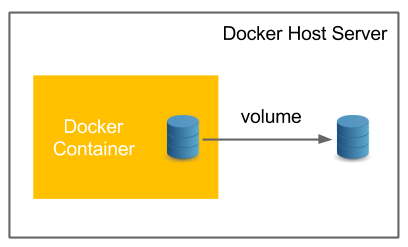
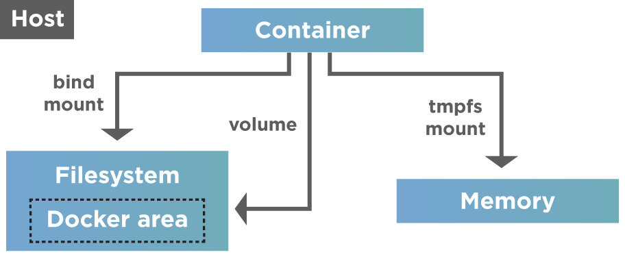

# volumes

Docker volumes are file systems mounted on Docker containers to preserve data generated by the running container.

* The data doesn’t persist when that container no longer exists, and it can be difficult to get the data out of the container.
* Volumes are easier to back up or migrate than bind mounts.
* You can manage volumes using Docker CLI commands or the Docker API.
* Volumes work on both Linux and Windows containers.
* Volumes can be more safely shared among multiple containers.

So, to keep data persistent in a Docker container, we use Docker Volumes or Bind Mounts.

## Data Management in Docker

* For example, if you are working on a Jenkins instance running in a Docker container, you will lose jobs, users, configuration changes, and everything once you restart the container unless you persist data.
* We can implement multiple strategies to persist data or add persistence to containers.
* These strategies are illustrated in the diagram below.

## Docker Volume

* Volumes are stored in a part of the host filesystem managed by Docker (for example, /var/lib/docker/volumes/ on Linux).
* When you create a volume, it is stored within a directory on the Docker host. Volumes are managed by Docker.
* Volumes are the recommended way to persist data in Docker and are isolated from the core functionality of the host machine.
* Volumes support volume drivers, allowing storage on remote hosts or cloud providers, among other possibilities.

## Bind Mounts

* Bind mounts may be stored anywhere on the host system.
* When using a bind mount, a file or directory on the host machine is mounted into a container and referenced by its full path on the host.
* The file or directory does not need to exist on the Docker host already; it is created on-demand if it does not exist.
* A limitation of bind mounts is that you cannot manage them using Docker CLI volume commands (they are host-managed).
* Example mount syntax: --mount type=bind,source=/host/path/,target=/container/path

## Tmpfs Mounts

* Tmpfs mounts are not persisted to disk.
* They are not persistent on either the host or the container filesystem.
* Create with: --mount type=tmpfs,destination=/app
* You do not need to create a file structure on the host to use tmpfs mounts; you specify only the destination path and it will be created in memory.

## Named Pipes

* A named pipe mount can be used for communication between the Docker host and a container.
* A common use case is running a third-party tool inside a container and connecting to the Docker Engine API using a named pipe.
