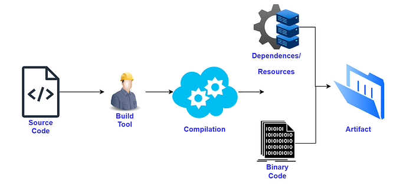
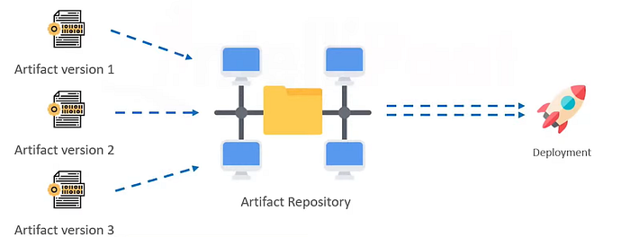
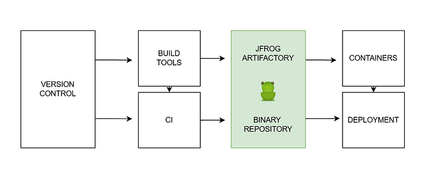
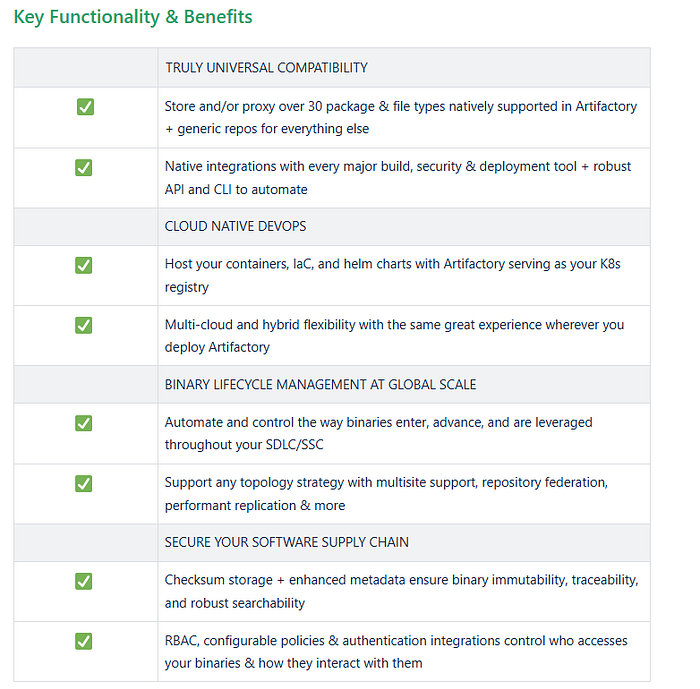
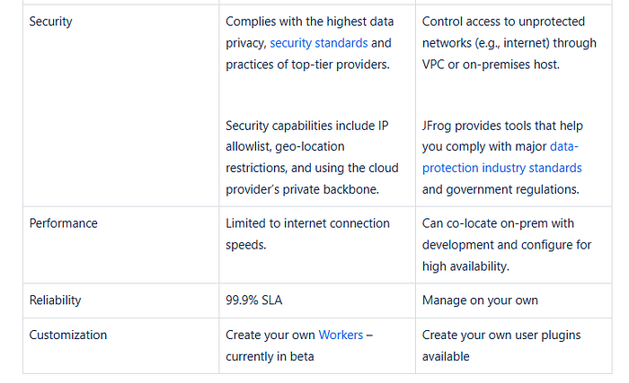
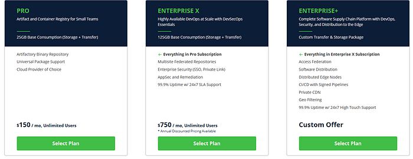
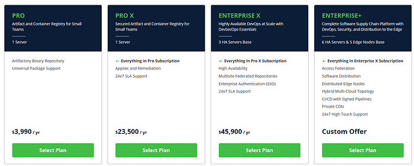
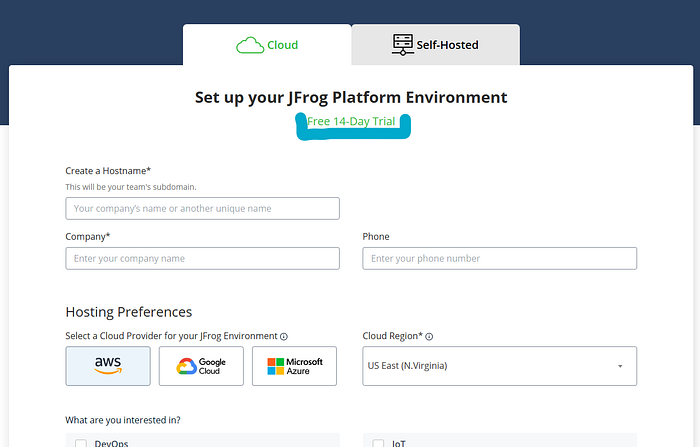
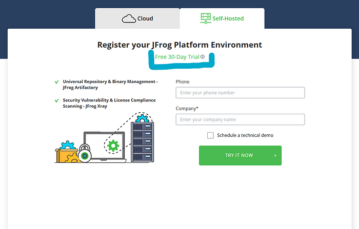

# basics of jfrog artifactory

## Understanding the Basics of JFrog Artifactory

* What is Artifact?
* What is an Artifact repository?
* What is JFrog Artifactory?
* Key Functionality & Benefits
* Cloud (SAAS) and Self-Hosting JFrog

### What is Artifact?

The files that contain both the compiled code and the resources that are used to compile them are know as artifacts. They are readily deployable files.

In Java, an artifact would be are .jar, .war, .ear file..

In NPM the artifact file would be .tar.gz file.

In .NET the artifact file would be a .dill file.

### What is an Artifact repository?

An artifact repository, sometimes referred to as a binary repository, is designed to house, manage, version, and deploy various types of artifacts from a central location.

Artifacts need to be stored and shared with all of the developers on a given project as well as different tools needed in typical [CI/CD](https://jfrog.com/devops-tools/article/an-introduction-to-devops-and-ci-cd/) processes. To ensure quality, reliability, and auditability, all artifacts need to be managed, versioned, and deployed across development teams and even sometimes across multiple sites. This can be a real challenge without the right tool.

Artifact repositories are widely considered the best solution for managing an ever-expanding number of artifacts.

### What is JFrog Artifactory?

Artifactory is a universal DevOps solution for hosting, managing, and distributing binaries and artifacts. Any type of software in binary form — such as application installers, container images, libraries, configuration files, etc. — can be curated, secured, stored, and delivered using Artifactory.

The name “Artifactory” reflects the fact that it can host any type of “artifact” needed in your software development “factory.” In software development, an artifact is any object produced during the software development and delivery process. Artifacts include the files used to install and run applications, as well as any complementary information necessary to configure or manage software.

Artifactory serves as the central hub for your DevOps processes. All artifacts, dependencies, packages, etc. ultimately get put into and pulled from Artifactory.

**Price of Cloud(SaaS) JFrog**

**Price of Self-Hosted JFrog**

**They have Free-Trial**

