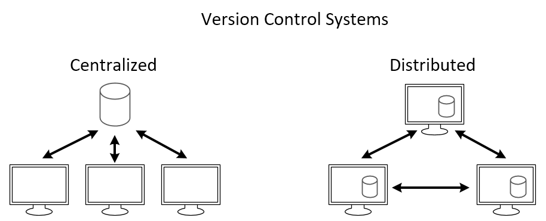
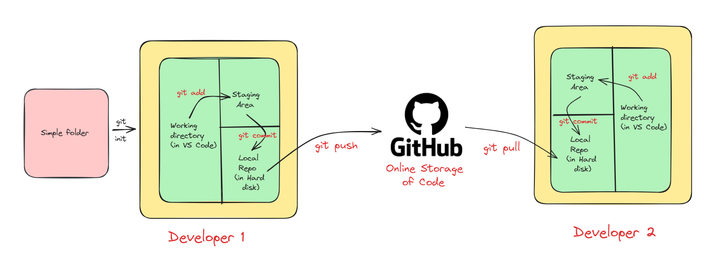

# git and github

### What is Source Code Management ?

Source code management is like a digital filing system for computer code. It helps developers work together on projects by keeping track of changes they make to the code. It saves different versions, lets people work on separate parts at the same time, and shows who did what and when. Popular tools include Git, which makes it easy to manage code changes and collaborate with others.



### Types of Source Code Management

There are mainly two types of source code management: centralized and distributed.

Centralized Source Code Management

* In this type, there is a central server that stores the code repository, and developers check out code from this central location to work on it.


Benefits of Centralized Source Code Management

* Centralized systems make teamwork easier by keeping all the project’s code in one place, controlling who can make changes, tracking those changes over time, and providing a clear history.

Drawbacks of Centralized Source Code Management

* Single Point of Failure: If the central server goes down, developers may lose access to the repository.
* Limited Offline Capabilities: Often require a stable internet connection.
* Difficulty with Branching and Merging: Can be complex and prone to conflicts when multiple developers work simultaneously.

Distributed Source Code Management

* Here, every developer has a local copy of the entire repository, including its history. Developers can work independently on their local copies and then share changes by pushing them to a central server or directly to other developers. Git and Mercurial are popular DSCM tools.


Benefits of Distributed Source Code Management

1. Flexibility: Work offline and independently on local copies.
2. Improved Collaboration: Share changes directly with others without always relying on a central server.
3. Reduced Dependency on Internet: Can work offline and sync later.

In this blog, we'll explore Git, the famous distributed version control system, and GitHub, which offers online storage and collaborative features for managing code projects.

### What is Git ?


Git is a tool that helps developers keep track of changes they make to their code. It’s like a time machine for your projects, letting you see what you’ve done and work with others easily.

To install Git, click here to go official Git installation page: https://git-scm.com/book/en/v2/Getting-Started-Installing-Git

### Git Workflows

The image below illustrates the workflow used with Git and GitHub.

* Local repository: Your project’s files stored in a folder on your computer.
* Working directory: Where you actively make changes to project files.
* Staging area: Temporarily store changes before saving them.
* Commit: Saving a snapshot of changes with a message (git uses SHA-1 checksum for tracking).
* Local repository (on hard disk): All your commits are permanently stored on your computer.
* GitHub repository (online): A copy of your local repository on GitHub’s servers.
* Push: Sending local commits to GitHub.
* Pull: Getting the latest changes from GitHub to your local repository.



### Live Demo of Git

### Create repository and initialize Git

Create a folder at your desired location (e.g., a folder named `demo`). Open the terminal inside VS Code and run:


```bash
git init
```


### Create and stage a file

Create a file (e.g., `demo.txt`) and add some content. Then stage changes:

```
This adds your file to the staging area.




## Commit changes

Commit the staged changes:


git commit -m "First commit"
```


## Push to GitHub

Create a repository on GitHub first. Then link and push from your terminal:

```
```

git remote add origin https://github.com/sachin0612/demo.git git branch -M main git push -u origin main

```

This pushes your files to GitHub.




### Some important Terminology

- git log: Shows a history of commits, including messages, authorship, and timestamps.
- git show: View detailed information about a specific commit, including file changes.
- .gitignore file: Specifies intentionally untracked files that Git should ignore (temporary files, build artifacts, etc.).

### git branch

A Git branch is a separate line of development within a repository, allowing developers to work on features, fixes, or experiments without affecting the main codebase.

Branch workflow:



## Create a branch
Create a new branch from the main (master) branch; this gives you a separate workspace.



## Make changes
Work locally in your branch and modify files as needed.



## Commit
Commit changes to your local branch to create snapshots.



## Push
Push the branch to a remote repository like GitHub to create a remote copy.



## Pull Request
Create a pull request on GitHub to request merging changes into the main branch and let others review.



## Merge
After approval, merge the branch into the main branch to integrate changes.




Some important Commands:


# To see list of available branches
git branch

# To Create new branch
git branch <branch name>

# To switch branch
git checkout <branch name>
# Files created in workspace will be visible in any branch workspace until you commit. Once you commit, that file belongs to that particular branch.


### git merge

Git merge integrates changes from one branch into another, creating a new commit that includes changes from both branches.

Example: merge `features` into `main`:

<div data-gb-custom-block data-tag="code">

git checkout main
git merge features

</div>

Then push merged changes to GitHub.

### Conflicts in git merge

Conflicts occur when both branches modify the same lines and Git cannot automatically resolve them. Git marks conflicted areas in files; developers must resolve them manually.

Resolving conflicts:

<div data-gb-custom-block data-tag="stepper">

<div data-gb-custom-block data-tag="step">

## Open conflicted files
Open the files that contain conflict markers added by Git.

</div>

<div data-gb-custom-block data-tag="step">

## Locate conflict markers
Find sections marked by Git that indicate conflicting changes.

</div>

<div data-gb-custom-block data-tag="step">

## Edit to resolve
Manually edit the files to choose which changes to keep or combine them.

</div>

<div data-gb-custom-block data-tag="step">

## Stage resolved files
After resolving, stage the files:

<div data-gb-custom-block data-tag="code">

git add <file>

</div>

</div>

<div data-gb-custom-block data-tag="step">

## Complete the merge
Create the merge commit:

<div data-gb-custom-block data-tag="code">

git commit

</div>

</div>

</div>

### git stash

Git stash temporarily stores changes that aren't ready to be committed so you can switch branches without losing work.

When you run git stash:
- It takes changes in the working directory and index and saves them as a stash.
- Resets working directory and index to the last commit.
- You can reapply stashed changes later.

Stashing workflow:

<div data-gb-custom-block data-tag="stepper">

<div data-gb-custom-block data-tag="step">

## Stash your changes
Save current changes:

<div data-gb-custom-block data-tag="code">

git stash

</div>

</div>

<div data-gb-custom-block data-tag="step">

## List stashes
View stashed items:

<div data-gb-custom-block data-tag="code">

git stash list

</div>

</div>

<div data-gb-custom-block data-tag="step">

## Apply or pop a stash
Reapply stashed changes:

<div data-gb-custom-block data-tag="code">

git stash apply stash@{number}
# or
git stash pop

</div>

</div>

<div data-gb-custom-block data-tag="step">

## Clear stash
Remove all stashes:

<div data-gb-custom-block data-tag="code">

git stash clear

</div>

</div>

</div>

Important stash commands:

<div data-gb-custom-block data-tag="code">

# To stash an item 
git stash
# To see the stashed items list
git stash list
# To apply stashed items
git stash apply stash@{number}
# To clear the stash item
git stash clear

</div>

### git reset

Git reset undoes changes in your working directory or staging area.

<div data-gb-custom-block data-tag="code">

git reset <file name>
# or
git reset .

</div>

### git revert

git revert undoes an existing commit by creating a new commit that reverts the changes. This preserves history while reversing the file state.

<div data-gb-custom-block data-tag="code">

git revert <commit id>

</div>

### Removing Untracked Files

<div data-gb-custom-block data-tag="code">

git clean -n   # (preview: ask which files would be deleted)
git clean -f   # (force delete)

</div>

### Tags

Tags give meaningful names to specific versions in the repository.

<div data-gb-custom-block data-tag="code">

git tag -a <tag name> -m <message> <commit-id>

# To see the list of tags
git tag

# To see particular commit content by using tag
git show <tag name>

# To delete a tag
git tag -d <tag name>

</div>

I hope this blog has enhanced your comprehension of Git and GitHub. If you’ve gained value from this content, consider following the original author for more posts. Thank you for reading!
```
