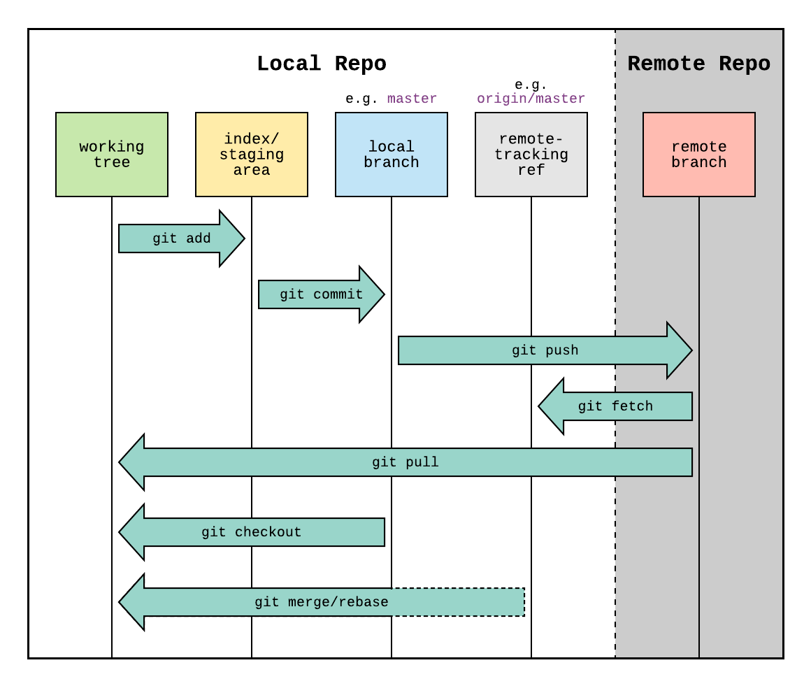

# git work flow

**Git Workflow**



Below is a concise, ordered explanation of a typical Git workflow covering the most common local and remote operations.



### Create a branch and make changes

Get into your project and create a new branch (example name shown):

```bash
git checkout -b new_branch
```

Work on your code locally on that branch.



### Stage changes

Move changes from the working tree to the staging area:

```bash
git add <files-or->.
```

This prepares files to be committed.



### Commit changes

When staged changes are ready, commit them to your local branch:

```bash
git commit -m "Your commit message"
```

This moves staged changes into your local repository.



### Push to remote

Push your local branch to the remote repository:

```bash
git push origin new_branch
```

This sends your local commits to the remote repo (e.g., GitHub).



### Fetch and integrate coworkers' changes

To fetch updates from the remote (without merging them into your working tree):

```bash
git fetch
```

After fetching, inspect the incoming changes and integrate them using either:

* Merge:

```bash
git merge origin/other_branch
```

* Or rebase:

```bash
git rebase origin/other_branch
```

Choose merge or rebase depending on your workflow and history preferences.



### Pull (fetch + merge in one)

If you want to fetch and immediately integrate the remote changes into your current branch:

```bash
git pull
```

Note: This is equivalent to `git fetch` followed by `git merge` (unless you configure a different behavior).



### Switch branches (checkout)

To switch to another existing branch or create-and-switch:

* Switch to existing:

```bash
git checkout some_branch
```

* Create and switch:

```bash
git checkout -b another_branch
```

This changes your working tree to the target branch so you can continue working locally.




`git fetch` + `git merge` is the explicit two-step approach that lets you review incoming changes before integrating. `git pull` combines both steps and is faster when you trust the incoming changes.


Keep working hard!
