# introduction to sonarqube and its features

<figure><figcaption></figcaption></figure>

### What is SonarQube? 

* SonarQube is a powerful tool for improving code quality in software development.
* SonarQube is an open-source platform developed by SonarSource for continuously inspecting code quality.
* It supports 30 major programming languages with various plugins.
* It acts as a code inspector, analyzing code to identify errors, bugs, issues, mistakes, duplication, and security vulnerabilities.
* SonarQube is developed using the Java programming language.
* Think of it as a digital assistant that helps programmers create reliable and secure software.
* SonarQube provides integration with different build tools like Maven, Ant, Gradle, MSBuild, and continuous integration (Azure DevOps, Atlassian Bamboo, Jenkins, Hudson, etc.).

### Features of sonarqube 



### Multi-Language Support

It offers analysis for more than 30 programming languages.

<figure>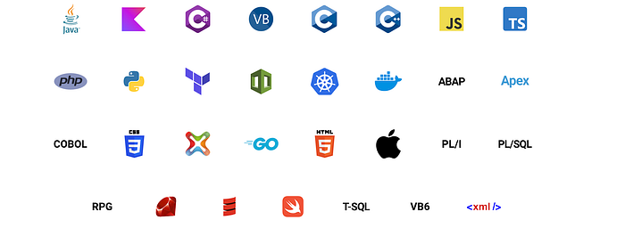<figcaption></figcaption></figure>



### It can detect various types of tricky issues in the code

#### Bugs

A bug is a tiny mistake or problem in the code that can cause the software to behave unexpectedly or even crash.

<figure>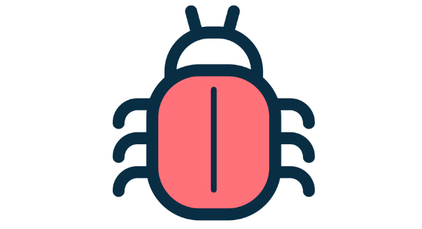<figcaption></figcaption></figure>

Imagine you’re building a calculator app to add numbers. You write code for addition like this:

<figure>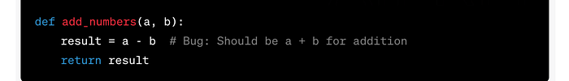<figcaption></figcaption></figure>

Here’s a bug: Instead of adding `a` and `b`, you accidentally subtract them. So, when users try to add 5 and 3, your app gives them 2 instead of the correct result, which should be 8.

SonarQube would spot this bug and tell you that the addition isn’t working as expected. It would suggest changing `a - b` to `a + b` to fix the bug and make sure your calculator app adds numbers correctly.



### Vulnerability

* A vulnerability refers to a weakness or flaw in the code.
* A security-related issue that represents a backdoor for attackers.

<figure>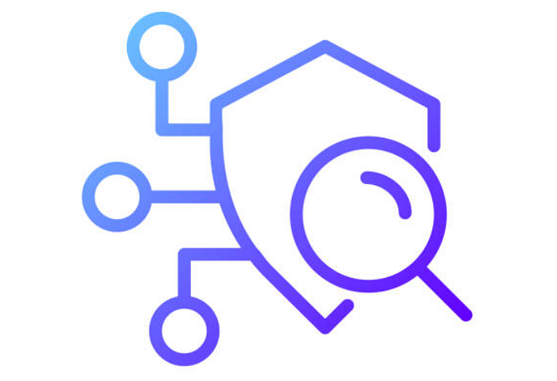<figcaption></figcaption></figure>

For example, imagine you’re building a login system for a website. If your code doesn’t properly validate user input and leaves room for SQL injection, attackers could manipulate the input to gain unauthorized access to sensitive data or even control the system.

<figure>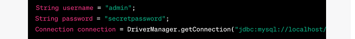<figcaption></figcaption></figure>

Another example of a vulnerability is hardcoding sensitive-value usernames, passwords, or tokens.



### Code smell

* Code smells are characteristics of code that indicate the possibility of a problem caused by code in the future.
* A maintainability-related issue in the code.
* A typical example of a code smell is duplicated code, a long method, or a long class.

<figure>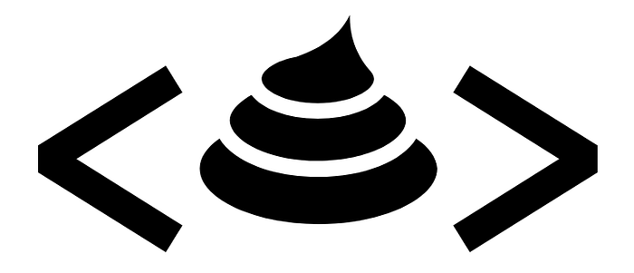<figcaption></figcaption></figure>

For example, suppose you have a Python function that calculates the area of different shapes and it has become quite lengthy:

<figure>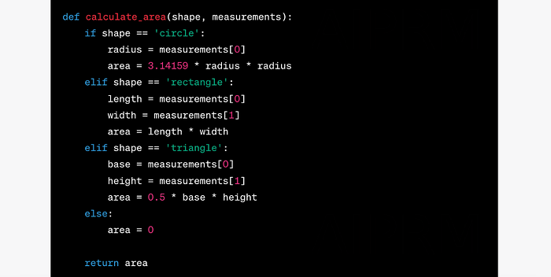<figcaption></figcaption></figure>

In this example, the `calculate_area` function handles different shapes, but the logic is combined into a single long method. This can make the code harder to read and maintain over time.

To address this code smell, you could break down the function into smaller, more focused functions:

<figure><figcaption></figcaption></figure>

By breaking down the code into smaller functions, you improve readability and maintainability.



### Code duplications

Code duplication in SonarQube means having the same or very similar pieces of code repeated in different parts of your program. It’s like copying and pasting the same instructions in multiple places.

For example, suppose you’re working on a Python program that converts temperatures from Celsius to Fahrenheit and vice versa. Here’s an example of code duplication:

<figure>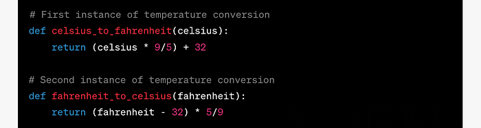<figcaption></figcaption></figure>

To address this code duplication, you can create a single function that handles both conversions:

<figure><figcaption></figcaption></figure>

SonarQube helps you spot and fix instances of code duplication like this, improving your code’s quality and readability.



### Security hotspots

Security hotspots are security-sensitive pieces of code that need to be manually reviewed. Upon review, you’ll either find that there is no threat or that there is vulnerable code that needs to be fixed.



### Code Coverage

It is a measure of how much of your code is tested by your automated tests. It shows the percentage of your code that gets exercised by your tests.

For example, you have a simple program in Java that calculates the square of a number.

<figure>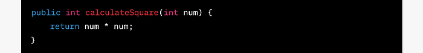<figcaption></figcaption></figure>

You create a test suite with a test for the `calculateSquare` function:

<figure>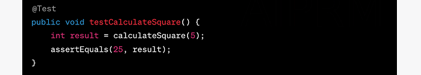<figcaption></figcaption></figure>

When you run your tests and analyze them in SonarQube, you might see that the code coverage for the `calculateSquare` function is 100%. This means that all lines of code in that function were executed during the test.



### Integration with CI/CD

Integrating SonarQube with your Continuous Integration and Continuous Deployment (CI/CD) pipeline enhances code quality and security checks throughout your software development lifecycle.

<figure>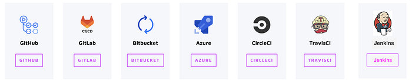<figcaption></figcaption></figure>



### Sonarlint IDE integration

SonarLint is a powerful tool that enhances code quality by providing real-time code analysis and feedback within your Integrated Development Environment (IDE). It helps you identify and address code issues early in the development process. SonarLint can be integrated with various IDEs to support different programming languages and frameworks.

<figure>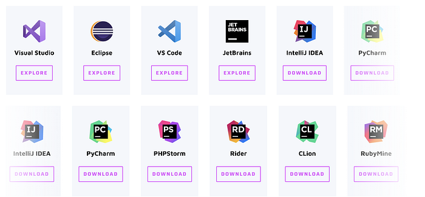<figcaption></figcaption></figure>



### Plugin Ecosystem

* Plugins in SonarQube are extensions that enhance the platform’s functionality by adding additional rules, integrations, and features.
* Think of plugins in SonarQube as adding extra tools to your toolbox.
* Plugins in SonarQube are like special add-ons that give it extra powers.

Imagine you’re building a website using CSS, but it might not automatically understand all the details of the code. This is where a plugin like “SonarCSS” will make SonarQube smarter and help detect the different issues.

<figure><figcaption></figcaption></figure>



### Sonarqube Rules

* A coding standard or practice that should be followed.
* Not complying with coding rules can lead to **bugs**, **vulnerabilities**, **security hotspots**, and **code smells**.

For example, let’s consider a specific rule called “Avoid Unused Variables.” This rule is designed to catch instances where you’ve declared variables in your code but haven’t used them anywhere.


