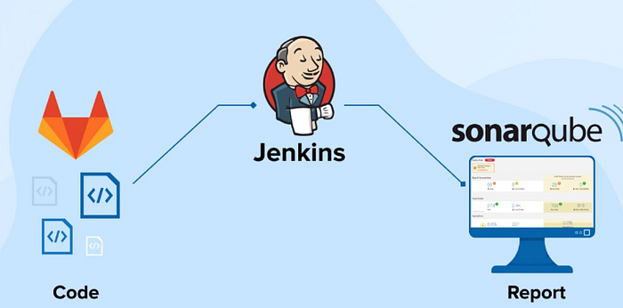
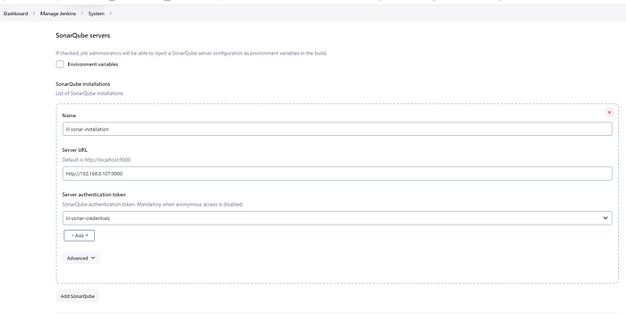
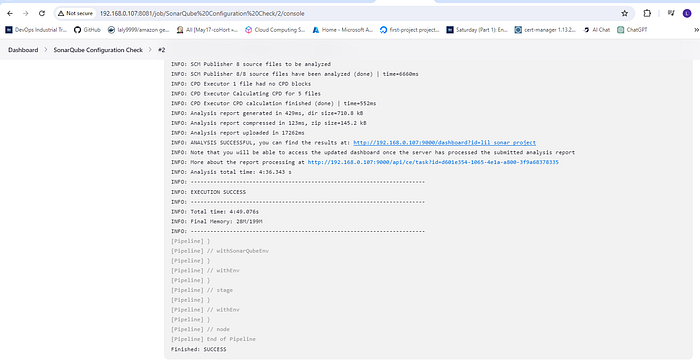
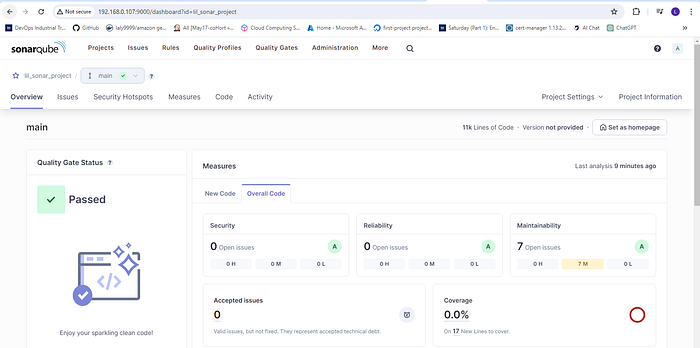

# integrating sonarqube with jenkins



## Introduction

In modern software development workflows, ensuring code quality is paramount. SonarQube and Jenkins are two powerful tools that, when integrated, can help achieve this goal efficiently. This guide walks through setting up SonarQube using Docker, configuring it in the Jenkins UI, and integrating it into a Jenkins pipeline job to scan code before building.

## Prerequisites

* Installed Docker
* Installed Jenkins
* Basic familiarity with Docker and Jenkins



### Step 1 — Setting Up SonarQube

Using Docker: pull the SonarQube Docker image and run it.


```bash
docker pull sonarqube
docker run -d --name sonarqube -p 9000:9000 sonarqube
```


Access SonarQube UI by navigating to http://your-IP-address:9000 (e.g., http://localhost:9000) in your web browser and follow the setup wizard to create an admin account.


Default login credentials: admin / admin




### Step 2 — Generate SonarQube Token

1. Log in to SonarQube using the admin credentials.
2. Go to My Account -> Security -> Generate Tokens.
3. Provide a name for the token and click Generate. Save the generated token securely.

To set up SonarQube credentials in Jenkins:

* Go to Manage Jenkins > Manage Credentials.
* Choose the appropriate domain.
* Click Add Credentials.
* Select credential type (e.g., Secret text for tokens, Username with password for username/password).
* Enter credential details, provide an ID and description, then save.



### Step 3 — Create a New Project in SonarQube

* Click Projects on the top menu.
* Click Create Project.
* Provide a unique project key and display name.
* Choose the language (SonarQube supports multiple languages).
* Click Set Up to proceed.

Configure analysis settings as prompted to define how SonarQube will analyze your code.



### Step 4 — Configure SonarQube Properties

Create a `sonar-project.properties` file in your project directory and add necessary properties, for example:


```properties
sonar.projectKey=lil_sonar_project
```




### Step 5 — Installing SonarQube Scanner in Jenkins

* Open Jenkins dashboard → Manage Jenkins → Global Tool Configuration.
* Scroll to SonarQube Scanner section.
* Click Add SonarQube Scanner and provide a name for the installation.
* Specify the path to the SonarQube scanner installation directory.
* Save the configuration.





### Step 6 — Install SonarQube Plugin

To run analyses with Jenkins, install:

* SonarQube Scanner plugin for Jenkins — version 2.11 or later

Navigate to Jenkins Dashboard → Manage Jenkins → Manage Plugins, go to the Available tab, search for "SonarQube Scanner" plugin, and install it.



### Step 7 — Configure SonarQube in Jenkins

* Jenkins Dashboard → Manage Jenkins → Configure System.
* Scroll to SonarQube servers and click Add SonarQube.
* Provide a name for the SonarQube server.
* Enter SonarQube server URL (for example: http://IP\_SonarQube:9000).
* Paste the SonarQube token generated earlier.
* Save the configuration.





### Step 8 — Integrate SonarQube into Jenkins Pipeline

Create or update your project's Jenkinsfile to include a stage that runs the SonarQube scanner. Example pipeline:


```
```


```groovy
pipeline {
    agent any 
    
    stages { 
        stage('SCM Checkout') {
            steps{
                git branch: 'main', url: 'https://github.com/lily4499/lil-node-app.git'
            }
        }
        // run sonarqube test
        stage('Run Sonarqube') {
            environment {
                scannerHome = tool 'lil-sonar-tool';
            }
            steps {
                withSonarQubeEnv(credentialsId: 'lil-sonar-credentials', installationName: 'lil sonar installation') {
                    sh "${scannerHome}/bin/sonar-scanner"
                }
            }
        }
    }
}
```

Make sure to replace the SonarQube tool name, installation name, and credentialsId with the names you configured in Jenkins.



### Step 9 — Checking SonarQube Configuration

* Run the Jenkins pipeline job.
* After the SonarQube stage executes, check the SonarQube dashboard (http://localhost:9000) for the analysis report.
* Verify that code quality metrics are populated.






