# monitoring with Prometheus & Grafana


In today’s fast-paced digital landscape, maintaining the performance and availability of applications and infrastructure is critical. Effective monitoring systems enable organizations to proactively identify and resolve issues, ensuring seamless user experiences and optimal resource utilization. Two powerful tools that have become staples in the monitoring ecosystem are Prometheus and Grafana. This introduction provides an overview of why we need monitoring. We will see how to setup these tools for a NodeJS Application.

## Prerequisites:

Before proceeding with this tutorial, you should have a basic understanding of the following:

* Docker (23.0.1 or higher)
* Dockerfile
* Docker-compose
* NodeJS v21

## Importance of Monitoring:

Monitoring helps you understand what is happening in your application. Monitoring gives us the following advantages:

### Analyzing long-term trends

You can track how your application behaves over the long term. How big is my database and how fast is it growing? How quickly is my daily active user count growing?

### Comparing over time or experiment groups

Let’s say that you released a new feature to your application, you can compare the performance of your application before and after the feature deployment. How does your application perform when you add an extra node?

### Alerting

If your application goes down, you need systems that automatically alert you. You can configure alerts that will tell you that the system is about to crash so that you can take the necessary actions.

### Conducting _**ad hoc**_ retrospective analysis

Let’s say the performance of your system drops, you need to know what else happened around the same time.

## The Four Golden Signals

[The four golden signals](https://sre.google/sre-book/monitoring-distributed-systems/) of monitoring are latency, traffic, errors, and saturation. If you can only measure four metrics of your user-facing system, focus on these four.

### Latency

The time it takes to service a request. It’s important to distinguish between the latency of successful requests and the latency of failed requests.

### Traffic

A measure of how much demand is being placed on your system. This represents the number of HTTP requests per second received by your web application.

### Errors

This measures the rate of requests that failed, either explicitly (e.g., HTTP 500s), or implicitly (for example, an HTTP 200 success response, but coupled with the wrong content).

### Saturation

A measure of how full your server is. Based on the performance of your system, you should determine how your system will be able to handle if the traffic doubles or increases by 10% or even decreases.

## Prometheus: A Robust Monitoring and Alerting Toolkit

Prometheus is an open-source systems monitoring and alerting toolkit designed for reliability and scalability. It was originally developed at SoundCloud in 2012. Prometheus excels in collecting and storing metrics as time series data. Prometheus uses a highly dimensional data model where metrics are identified by a name and a set of key-value pairs called labels. This allows for precise and flexible querying. [PromQL](https://prometheus.io/docs/prometheus/latest/querying/basics/) is a purpose-built language for querying and aggregating time series data.

### Components of Prometheus:

The Prometheus ecosystem consists of multiple components, many of which are optional:

1. The [Prometheus](https://github.com/prometheus/prometheus) server which scrapes and stores time series data
2. [Client libraries](https://prometheus.io/docs/instrumenting/clientlibs/) for instrumenting application code
3. A [push gateway](https://github.com/prometheus/pushgateway) for supporting short-lived jobs
4. Special-purpose [exporters](https://prometheus.io/docs/instrumenting/exporters/) for services like HAProxy, StatsD, Graphite, etc.
5. A [alertmanager](https://github.com/prometheus/alertmanager) to handle alerts

### Architecture of Prometheus:

This diagram illustrates the architecture of Prometheus and some of its ecosystem components:

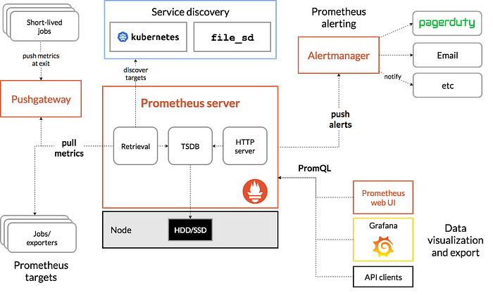

## Grafana: The Visualization Powerhouse

Grafana is an open-source platform for monitoring and observability that excels in visualizing time series data. It provides a rich set of features for creating, exploring, and sharing dashboards, making it an ideal companion to Prometheus. Grafana can be run through the [Grafana cloud](https://grafana.com/products/cloud/) or by hosting it ourselves.

### Key Features of Grafana:

1. **Flexible Dashboarding**: Grafana offers highly customizable dashboards with a wide variety of visualization options, including graphs, heatmaps, tables, and more.
2. **Multi-source Integration**: Grafana can integrate with a multitude of data sources, including Prometheus, Elasticsearch, InfluxDB, and many others, allowing for comprehensive monitoring across diverse systems.
3. **Alerting and Notifications**: Built-in alerting features enable the creation of complex alert rules, with support for multiple notification channels such as email, Slack, and PagerDuty.
4. **Templating and Variables**: Grafana supports templating and variables, which allow users to create dynamic and reusable dashboards.
5. **Community and Plugins**: A vibrant community and extensive plugin ecosystem extend Grafana’s functionality, offering additional visualization types, data source integrations, and application-specific plugins.

### How to setup Prometheus and Grafana:

You can refer to the entire source code in this [repo](https://github.com/dinesh24murali/reference_repo/tree/main/prometheus_grafana_example). You can refer to the files in the repo and follow along as I explain the individual services. You will notice a [docker-compose file](https://github.com/dinesh24murali/reference_repo/blob/main/prometheus_grafana_example/docker-compose.yml) with all the services. All the services are part of the same network called `sample-net`. We will learn how to set up Prometheus and Grafana by setting up monitoring for a simple NodeJS application. One thing to note at this point is Prometheus by itself cannot capture the metrics. It needs other services to capture and expose relevant metrics through HTTP endpoints. Prometheus will scrape the data those services expose. The API endpoint is usually a GET and POST API with “ **/metrics”** as the path.

The following is the list of services we are using:

1. We have a simple web server built with NodeJS. We will run the application inside a Docker container.
2. [**Traefik**](https://doc.traefik.io/traefik/observability/metrics/prometheus/): We will use the Traefik load balancer to redirect requests to our NodeJS application. We need this to track the HTTP request coming to our NodeJS application. We will expose these [metrics](https://doc.traefik.io/traefik/observability/metrics/prometheus/) so that Prometheus can collect data regarding the requests coming to our server.
3. [**Node Exporter**](https://prometheus.io/docs/guides/node-exporter/): exposes a wide variety of hardware and kernel-related metrics
4. [**cAdvisor**](https://github.com/google/cadvisor): (short for container Advisor) analyzes and exposes resource usage and performance data from running containers.
5. [**Prometheus**](https://prometheus.io/): can scrape and store the metrics, and
6. [**Grafana**](https://grafana.com/): can read the metrics captured by Prometheus

The following flow chart is a summary of our integration:

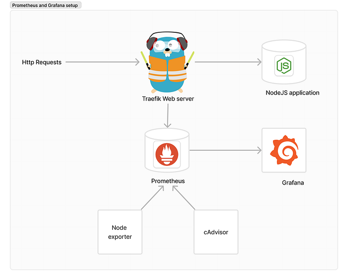

The HTTP requests coming to Traefik will be redirected to our NodeJS application. Traefik will expose the metrics so that Prometheus can scrape. The node exporter and cAdvisor will also expose the metrics. We can use Grafana to visualize the data scraped by Prometheus.

### 1. NodeJS application:

The following is the code for the [NodeJS Application](https://github.com/dinesh24murali/reference_repo/blob/main/prometheus_grafana_example/index.js). It has 2 APIs, `/` the default route will return a 200 status with the message `hello world`, and the `/error_or_not/:text` route will return a 500 error if the text passed to the API is `error`, else it will return the same text with status code 200. I have added these APIs to create metrics for Traefik. The server runs on port 3000 inside the container.

```javascript
var express = require("express");
var app = express();

app.get("/", function (req, res) {
  res.send("Hello world!");
});

app.get("/error_or_not/:text", function (req, res) {
  if (req.params.text === "error") {
    res.status(500).send(req.params.text);
    return;
  }
  res.status(200).send(req.params.text);
});

app.listen(3000);
```

We have a simple [docker file](https://github.com/dinesh24murali/reference_repo/blob/main/prometheus_grafana_example/Dockerfile) for this application. There is nothing complicated in the docker file.

```dockerfile
FROM node:20
WORKDIR /app
COPY package.json .
ARG NODE_ENV
RUN if [ "$NODE_ENV" = "development" ]; \
        then npm install; \
        else npm install --only=production; \
        fi

COPY . ./
EXPOSE 3000
```

For the NodeJS application in the docker-compose file, we are using the docker file and setting up Traefix to send requests to the port `3000`inside the container. We will go through the Traefik configuration later in the tutorial.

```yaml
nodeapp:
  networks:
    - sample-net
  labels:
    - "traefik.enable=true"
    - "traefik.http.routers.api-redirect.entryPoints=web"
    - "traefik.http.routers.api-redirect.rule=PathPrefix(`/`)"
    - "traefik.http.services.nodeapp-service.loadBalancer.server.port=3000"
  build:
    context: .
    args:
      NODE_ENV: production
  volumes:
    - ./:/app
    - /app/node_modules
  command: ["npm", "run", "start"]
```

> traefik.http.routers.api-redirect.entryPoints=web

We have specified which [entry point](https://doc.traefik.io/traefik/routing/entrypoints/) in the Traefik configuration to use. In Traefik entry points are port mappings.

> traefik.http.routers.api-redirect.rule=PathPrefix(`/`)

By specifying ``PathPrefix(`/`)`` in the redirection rule, we are telling Traefik to send all requests to this application.

> traefik.http.services.nodeapp-service.loadBalancer.server.port=3000

We are specifying which port to redirect the request to.

### Traefik Integration:

We won’t be diving deep into Traefik in this tutorial, I will explain the necessary parts. Traefik configurations can be defined both [statically and dynamically](https://doc.traefik.io/traefik/getting-started/configuration-overview/#configuration-introduction). What we see in the [Traefik configuration file](https://github.com/dinesh24murali/reference_repo/blob/main/prometheus_grafana_example/traefik.yml) is static, and the Traefik configuration we mention under the node service (that we saw above) in the docker-compose file is dynamic.

The following is the Traefik configuration file:

```yaml
providers:
  docker:
    network: sample-net
    exposedbydefault: false

# API configuration
api:
  insecure: true

log:
  level: DEBUG

entryPoints:
  web:
    address: :80

  websecure:
    address: :443

  metrics:
    address: :8082

metrics:
  prometheus:
    addRoutersLabels: true
    addEntryPointsLabels: true
    buckets:
      - 0.1
      - 0.3
      - 1.2
      - 5.0
    entryPoint: metrics
```

Under providers, we are instructing Traefik to use the docker driver and the `sample-net` network. The `sample-net`network will get created by the docker engine when we run the compose file. You will notice the web entry point that is mapped to port 80. This is the entry point we used in the NodeJS application.

> metrics:
>
> address: :8082

We have created an entry point for exposing the metrics.

We can enable metrics in Traefik for Prometheus under the `metrics` section. You can check the [documentation](https://doc.traefik.io/traefik/observability/metrics/prometheus/) for all the available options.

> addRoutersLabels: true

Enable metrics on routers. We have only one route in our Traefik config for our NodeJS application.

> addEntryPointsLabels: true

Enable metrics on entry points.

> buckets:

We can put the metrics in different buckets based on the latency.

> entryPoint: metrics

We can mention the port through which we want to expose the metrics.

```yaml
  traefik:
    image: traefik:v2.10.7
    networks:
      - sample-net
    ports:
      - "80:80"
      - 8082:8082
    volumes:
      - ./traefik.yml:/etc/traefik/traefik.yml
      - "/var/run/docker.sock:/var/run/docker.sock:ro"
```

We are using the Traefik config file in the Traefik service. Since Traefik needs to listen to docker events to look for dynamic configurations, we need to map the docker socket. We have exposed port 80 to listen for incoming requests and port 8082 for Prometheus metrics.

### 3. [Node Exporter](https://prometheus.io/docs/guides/node-exporter/):

```yaml
  node-exporter:
    image: quay.io/prometheus/node-exporter:latest
    volumes:
      - /proc:/host/proc:ro
      - /sys:/host/sys:ro
      - /:/rootfs:ro
      - /:/host:ro,rslave
    command:
      - "--path.rootfs=/host"
      - "--path.procfs=/host/proc"
      - "--path.sysfs=/host/sys"
      - --collector.filesystem.ignored-mount-points
      - "^/(sys|proc|dev|host|etc|rootfs/var/lib/docker/containers|rootfs/var/lib/docker/overlay2|rootfs/run/docker/netns|rootfs/var/lib/docker/aufs)($$|/)"
    networks:
      - sample-net
    restart: always
```

The Integration for Node Exporter is simple. We are mapping the volumes of the host machine with the container in read-only mode (:or). We have setup the necessary commands to setup the root file system for node-exporter to scrape from and other system paths so that node-exporter can get details regarding the hardware.

### 4. [cAdvisor](https://github.com/google/cadvisor)

```yaml
  cadvisor:
    image: gcr.io/cadvisor/cadvisor
    ports:
      - 8080:8080
    volumes:
      - /:/rootfs:ro
      - /var/run:/var/run:rw
      - /sys:/sys:ro
      - /var/lib/docker/:/var/lib/docker:ro
      - /var/run/docker.sock:/var/run/docker.sock:ro
    networks:
      - sample-net
```

The integration for cAdvisor is also simple. We map the required volumes so that cAdvisor can extract metrics from the host machine and docker engine. It runs on port 8080.

### 5. Prometheus:

The following is the [configuration](https://github.com/dinesh24murali/reference_repo/blob/main/prometheus_grafana_example/prometheus/prometheus.yml) for Prometheus.

```yaml
global:
  scrape_interval: 15s
  scrape_timeout: 10s

scrape_configs:
  - job_name: prometheus
    honor_timestamps: true
    scrape_interval: 15s
    scrape_timeout: 10s
    metrics_path: /metrics
    scheme: http
    static_configs:
    - targets:
      - prometheus:9090

  - job_name: "node"
    static_configs:
    - targets: ["node-exporter:9100"]

  - job_name: "cadvisor"
    scrape_interval: 15s
    static_configs:
    - targets: ["cadvisor:8080"]

  - job_name: 'traefik'
    static_configs:
      - targets: ['traefik:8082']
```

Let’s go through the config.

> global:
>
> scrape\_interval: 15s
>
> scrape\_timeout: 10s

We can give some global configurations such as the scrap interval, and scrape timeout.

Under `scrape_configs` we have four jobs.

* **Prometheus job:** Prometheus can scrap data about itself. We need to mention the target as `prometheus` . Docker will resolve this with the IP address of the [Prometheus service](https://github.com/dinesh24murali/reference_repo/blob/main/prometheus_grafana_example/docker-compose.yml#L32) we have in the docker-compose file.
* **Node job:** The node job listens to port 9100 in the node-exporter service. This will scrape the metrics from the [node-exporter](https://github.com/dinesh24murali/reference_repo/blob/main/prometheus_grafana_example/docker-compose.yml#L58)
* **cadvisor job:** The cAdvisor job will fetch metrics from the [cAdvisor service.](https://github.com/dinesh24murali/reference_repo/blob/main/prometheus_grafana_example/docker-compose.yml#L45)
* **Traefik job:** The Traefik job will fetch metrics from the [Traefik service](https://github.com/dinesh24murali/reference_repo/blob/main/prometheus_grafana_example/docker-compose.yml#L4).

Each of these jobs will listen to the targets that are configured under them. Under the Prometheus service, we are loading the config file into the container. Prometheus will store the data it scrapes in the host machine.

```yaml
  prometheus:
    image: prom/prometheus
    ports:
      - 9090:9090
    command:
      - "--config.file=/etc/prometheus/prometheus.yml"
    restart: unless-stopped
    networks:
      - sample-net
    volumes:
      - ./prometheus:/etc/prometheus
      - prom_data:/prometheus
```

### 6. Grafana:

For Grafana, although it is not mandatory, we have [configured Prometheus](https://github.com/dinesh24murali/reference_repo/blob/main/prometheus_grafana_example/grafana/datasources/datasource.yml) as the default data source:

```yaml
apiVersion: 1

datasources:
- name: Prometheus
  type: prometheus
  url: http://prometheus:9090
  isDefault: true
  access: proxy
  editable: true
```

Under the [Grafana service](https://github.com/dinesh24murali/reference_repo/blob/main/prometheus_grafana_example/docker-compose.yml#L75), we can pass environment variables to set the credentials (GF\_SECURITY\_ADMIN\_USER, and GF\_SECURITY\_ADMIN\_PASSWORD) as shown below:

```yaml
  grafana:
    image: grafana/grafana
    restart: unless-stopped
    environment:
      - GF_SECURITY_ADMIN_USER=admin
      - GF_SECURITY_ADMIN_PASSWORD=grafana
    volumes:
      - ./grafana/datasources:/etc/grafana/provisioning/datasources
    ports:
      - 3000:3000
    networks:
      - sample-net
```

Run the following command under the `reference_repo/prometheus_grafana_example` directory to build the image for the NodeJS app. This will pick up the [docker-compose file](https://github.com/dinesh24murali/reference_repo/blob/main/prometheus_grafana_example/docker-compose.yml) in the directory.

```bash
docker compose build
```

Run the following command to start all the services:

```bash
docker compose up -d
```

Let’s check whether everything is working as expected. Though we can use Grafana for visualizing the metrics, some of the services (like cAdvisor, Traefik, and Prometheus) have dashboards of their own. But they won’t be as good as Grafana. You can use the following link to access the cAdvisor dashboards:

[http://localhost:8080/containers/](http://localhost:8080/containers/)

It should look something like this:

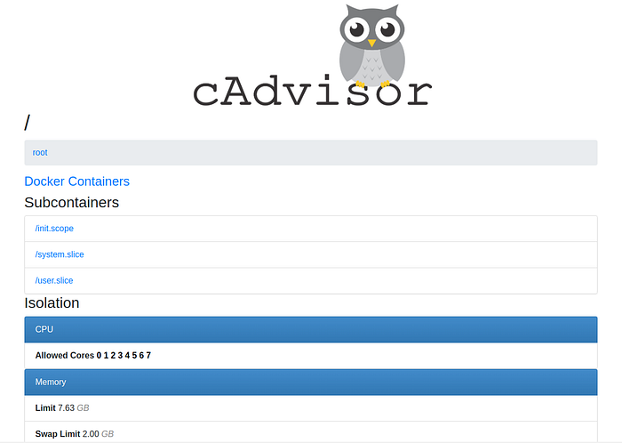

cAdvisor dashboard

If you can see this dashboard, it means that cAdvisor is running successfully. You can also access the metrics that cAdvisor exposes using the following URL:

[http://localhost:8080/metrics](http://localhost:8080/metrics)

Similarly, you can use the following link to see if metrics from Traefik are being exposed:

[http://localhost:8082/metrics](http://localhost:8082/metrics)

You should be able to see some plain text as shown below:

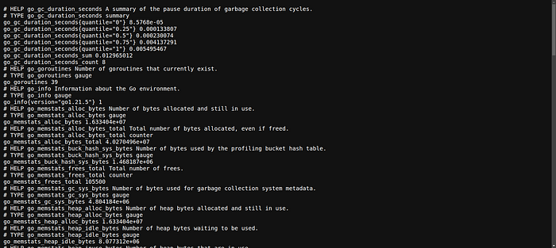

Metrics from Traefik

You can access the [Prometheus expression browser](https://prometheus.io/docs/visualization/browser/) using the following URL:

[http://localhost:9090/graph](http://localhost:9090/graph)

It will look something like the following:

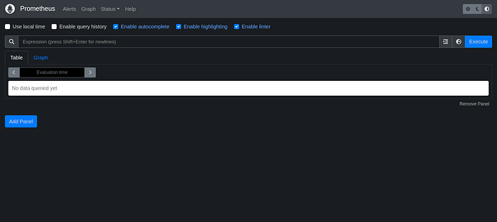

Prometheus query explorer

Here you can use [PromQL](https://prometheus.io/docs/prometheus/latest/querying/basics/) to query data present in Prometheus. For example, you can run the following query to get the average network traffic received, per second, over the last minute (in bytes).

```promql
rate(node_network_receive_bytes_total[1m])
```

You can type the query in the search box and hit execute. You can see the data in a graph by switching to the graph tab as shown below:

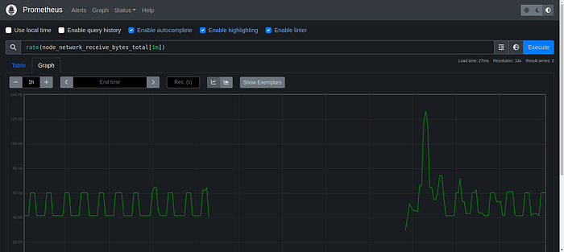

graph

## Creating dashboards in Grafana:

Grafana will Query data from Prometheus to show data for the dashboards. Before we start creating dashboards in Grafana, you can use these two links to generate some data for Traefik.

Generate a 200 request:

[http://localhost/error\_or\_not/no\_error](http://localhost/error_or_not/not_error)

Generate a 500 request:

[http://localhost/error\_or\_not/error](http://localhost/error_or_not/error)

These links are for the Traefik web server which will redirect the request to the NodeJS application.

Use the following link to access Grafana.

[http://localhost:3000/](http://localhost:3000/?orgId=1)

Grafana will look like the following:


Use the credentials we configured in the environment variables section under the Grafana service. The credentials are:

* username: admin
* password: grafana

### Checking the Prometheus Datasource:

Let’s check whether the Prometheus data source we configured is visible in Grafana. Click on data sources from the menu

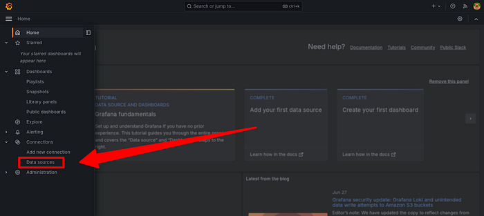

click on data sources from the menu

In the table you should be able to see Prometheus already configured:

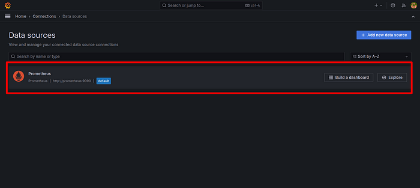

### Creating a Dashboard for Node Exporter:

Let’s create a dashboard in Grafana for node-exporter. We can create widgets ourselves in Grafana, but you need to build the PromQL queries ourselves. Luckily there are many open-source dashboards available on [Grafana’s website](https://grafana.com/) that we can import.



### Click on the Dashboards menu

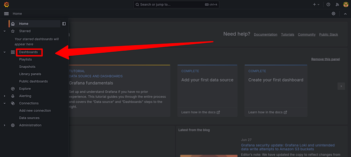



### Click on Create dashboard

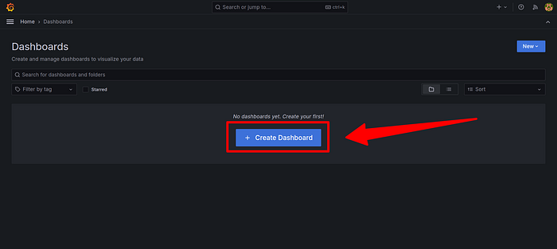



### Click on Import dashboard





### Use this [link](https://grafana.com/grafana/dashboards/1860-node-exporter-full/) to get the node-exporter dashboard’s ID from Grafana’s website. Click on the copy ID button.

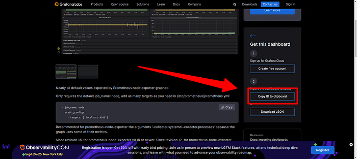



### Go back to our Grafana Import dashboard page. Now paste the ID into the text box and click the Load button.





### In the next screen you can give a name for your dashboard. Select Prometheus in the dropdown and click on the Import button.





The node-exporter dashboard will look like the following:

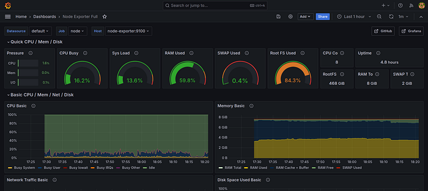

Node exporter

You can see metrics such as the CPU & memory usage, etc. Congratulations you have successfully created a dashboard in Grafana. You can follow the same steps to create Grafana dashboards for cAdvisor and Traefik. Here are the links to the dashboards:

[https://grafana.com/grafana/dashboards/14282-cadvisor-exporter/](https://grafana.com/grafana/dashboards/14282-cadvisor-exporter/)

[https://grafana.com/grafana/dashboards/17346-traefik-official-standalone-dashboard/](https://grafana.com/grafana/dashboards/17346-traefik-official-standalone-dashboard/)

### Frequently asked questions:

<details>

<summary>Do we need to run all these services in a single docker-compose file for it to work?</summary>

No. The location where you need to run the services depends on what the service does. The node-exporter and cAdvisor services need to run on the instance/machine for which you want to capture the metrics. Prometheus and Grafana can run on any instance. They don’t need to be run on the same instance where node-exporter or cAdvisor are running. All you need to take care of is access to the instance via HTTP and the ports through which the metrics are being exposed.

</details>

<details>

<summary>Can I add multiple targets in the Prometheus config for a job?</summary>

Yes, you can add multiple targets for a job by adding the instance URL to the [target](https://github.com/dinesh24murali/reference_repo/blob/main/prometheus_grafana_example/prometheus/prometheus.yml#L27).

</details>

<details>

<summary>Are there other ways of running these services other than Docker?</summary>

Yes, the installation file for Grafan can be [downloaded](https://grafana.com/grafana/download?pg=get\&plcmt=selfmanaged-box1-cta1). You can use the binary files to run [Prometheus](https://prometheus.io/download/) and [Node Exporter](https://prometheus.io/download/#node_exporter). cAdvisor can only be run using docker.

</details>

##
