# Prometheus and Grafana on Kubernetes using Helm

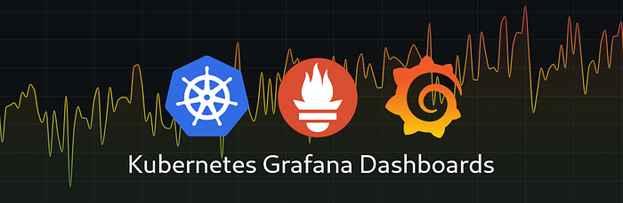

In the dynamic world of Kubernetes, effective monitoring and visualization are crucial for maintaining the health and performance of your applications. In this blog, we’ll explore the seamless deployment of Prometheus and Grafana on the minikube cluster using Helm.

### Overview of Prometheus, Grafana, and Helm:

**Prometheus:** An open-source monitoring and alerting toolkit designed for Kubernetes, Prometheus excels in collecting and querying real-time metrics.

**Grafana:** A powerful analytics and monitoring platform that integrates seamlessly with Prometheus, offering visually stunning dashboards.

**Helm:** The Kubernetes package manager that simplifies the deployment and management of applications through charts.

### Prerequisites:

1. Minikube
2. kubectl
3. Helm installed

Let’s get Started…

## Prometheus Installation



### Search for the Prometheus Helm chart

Search for the Prometheus helm chart using the below command

```bash
helm search hub Prometheus
```

This command will list the following Prometheus helm chart

```
URL                                                     CHART VERSION   APP VERSION                                     DESCRIPTION

https://artifacthub.io/packages/helm/prometheus...      25.8.2          v2.48.1                                         Prometheus is a monitoring system and time seri...
https://artifacthub.io/packages/helm/truecharts...      13.1.0          2.48.1                                          kube-prometheus-stack collects Kubernetes manif...
https://artifacthub.io/packages/helm/prometheus...      13.0.0          2.22.1                                          Prometheus is a monitoring system and time seri...
https://artifacthub.io/packages/helm/saurabh6-p...      0.2.0           1.1                                             This is a Helm Chart for Prometheus Setup.
https://artifacthub.io/packages/helm/cloudposse...      0.2.1                                                           Prometheus instance created by the CoreOS Prome...
https://artifacthub.io/packages/helm/mach1el-ch...      1.0.1           v2.47.0                                         Prometheus Helm chart for Kubernetes
https://artifacthub.io/packages/helm/bitnami/pr...      0.5.1           2.48.1                                          Prometheus is an open source monitoring and ale...
https://artifacthub.io/packages/helm/wener/prom...      25.8.2          v2.48.1                                         Prometheus is a monitoring system and time seri...
https://artifacthub.io/packages/helm/stakater/p...      1.0.32                                                          prometheus chart that runs on kubernetes
```

Or else you can go to the [Artifact Hub](https://artifacthub.io/) repository and search for the Prometheus helm chart.

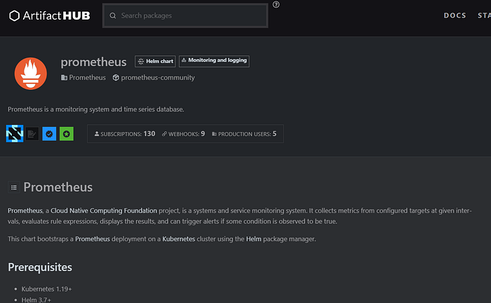



### Add the Prometheus Helm repository

Run the following commands to add the Prometheus helm chart

```bash
helm repo add prometheus-community https://prometheus-community.github.io/helm-charts
helm repo update
```

Output:

```
helm repo update
Hang tight while we grab the latest from your chart repositories...
...Successfully got an update from the "hashicorp" chart repository
...Successfully got an update from the "grafana" chart repository
...Successfully got an update from the "prometheus-community" chart repository
Update Complete. ⎈Happy Helming!⎈
```

We have downloaded the latest version of the Prometheus.



### Install Prometheus Helm Chart on Kubernetes Cluster

To install the Prometheus helm chart we need to run the “helm install” command as below shown

```bash
helm install prometheus prometheus-community/prometheus
```

Output:

```
helm install prometheus prometheus-community/prometheus
NAME: prometheus
LAST DEPLOYED: Tue Dec 19 11:04:13 2023
NAMESPACE: default
STATUS: deployed
REVISION: 1
TEST SUITE: None
NOTES:
The Prometheus server can be accessed via port 80 on the following DNS name from within your cluster:
prometheus-server.default.svc.cluster.local

Get the Prometheus server URL by running these commands in the same shell:
  export POD_NAME=$(kubectl get pods --namespace default -l "app.kubernetes.io/name=prometheus,app.kubernetes.io/instance=prometheus" -o jsonpath="{.items[0].metadata.name}")
  kubectl --namespace default port-forward $POD_NAME 9090

The Prometheus alertmanager can be accessed via port 9093 on the following DNS name from within your cluster:
prometheus-alertmanager.default.svc.cluster.local

Get the Alertmanager URL by running these commands in the same shell:
  export POD_NAME=$(kubectl get pods --namespace default -l "app.kubernetes.io/name=alertmanager,app.kubernetes.io/instance=prometheus" -o jsonpath="{.items[0].metadata.name}")
  kubectl --namespace default port-forward $POD_NAME 9093
#################################################################################
######   WARNING: Pod Security Policy has been disabled by default since    #####
######            it deprecated after k8s 1.25+. use                        #####
######            (index .Values "prometheus-node-exporter" "rbac"          #####
###### .          "pspEnabled") with (index .Values                         #####
######            "prometheus-node-exporter" "rbac" "pspAnnotations")       #####
######            in case you still need it.                                #####
#################################################################################

The Prometheus PushGateway can be accessed via port 9091 on the following DNS name from within your cluster:
prometheus-prometheus-pushgateway.default.svc.cluster.local

Get the PushGateway URL by running these commands in the same shell:
  export POD_NAME=$(kubectl get pods --namespace default -l "app=prometheus-pushgateway,component=pushgateway" -o jsonpath="{.items[0].metadata.name}")
  kubectl --namespace default port-forward $POD_NAME 9091

For more information on running Prometheus, visit:
https://prometheus.io/
```

We have successfully installed Prometheus on Kubernetes. Now to check the deployed Kubernetes resources by running the `kubectl` command.


When you install the Prometheus Helm chart, it creates several Kubernetes resources to set up the Prometheus monitoring system. Here’s a brief list of the key resources that are typically created:

* **ConfigMaps:** Prometheus-server: Contains the main Prometheus configuration.
* **Prometheus-rule files:** Stores Prometheus alerting and recording rules.
* **Secrets:** Prometheus-server-TLS: Contains TLS certificates for secure communication.
* **ServiceAccounts:** Prometheus-server: Defines the service account used by the Prometheus server components.
* **ClusterRole and ClusterRoleBinding:** Prometheus-server: Grants necessary permissions to the Prometheus server components.
* **StatefulSet:** Prometheus-server: Manages the stateful deployment of Prometheus server pods.
* **Service:** Prometheus-server: Exposes the Prometheus server within the cluster.

The next step is to access and launch the Prometheus Kubernetes application. You’ll access the application using the Kubernetes services for Prometheus. To get all the Kubernetes Services for Prometheus, run this command:

```bash
kubectl get service
```

Output:

```
kubectl get service
NAME                                  TYPE        CLUSTER-IP      EXTERNAL-IP   PORT(S)    AGE
kubernetes                            ClusterIP   10.96.0.1       <none>        443/TCP    24h
prometheus-alertmanager               ClusterIP   10.103.177.50   <none>        9093/TCP   19m
prometheus-alertmanager-headless      ClusterIP   None            <none>        9093/TCP   19m
prometheus-kube-state-metrics         ClusterIP   10.100.246.82   <none>        8080/TCP   19m
prometheus-prometheus-node-exporter   ClusterIP   10.106.54.11    <none>        9100/TCP   19m
prometheus-prometheus-pushgateway     ClusterIP   10.102.227.21   <none>        9091/TCP   19m
prometheus-server                     ClusterIP   10.105.79.116   <none>        80/TCP     19m
```

* **Prometheus-alert manager(ClusterIP):** Alertmanager is a component of Prometheus that manages and handles alerts. This service provides the ClusterIP for communication within the cluster on port 9093.
* **Prometheus-alert manager-headless(ClusterIP):** This is a headless service for Alertmanager, meaning it does not provide a ClusterIP. It is used for discovery purposes, typically when other services need to discover the IP addresses of Alertmanager instances.
* **Prometheus-kube-state-metrics (ClusterIP):** Kube-state-metrics is an add-on service for Prometheus that exposes Kubernetes resource metrics. This service provides a ClusterIP for communication within the cluster on port 8080.
* **Prometheus-prometheus-node-exporter (ClusterIP):** Node Exporter is a Prometheus exporter that collects system-level metrics from nodes in the cluster. This service provides a ClusterIP for communication within the cluster on port 9100.
* **Prometheus-prometheus-pushgateway (ClusterIP):** Pushgateway allows ephemeral and batch jobs to expose their metrics to Prometheus. This service provides a ClusterIP for communication within the cluster on port 9091.
* **Prometheus-server (ClusterIP):** Prometheus server is the core component that collects, stores, and queries metrics. This service provides a ClusterIP for communication within the cluster.



### Exposing the Prometheus-server service on Kubernetes

To expose the Kubernetes Prometheus-server service, run this command

```bash
kubectl expose service prometheus-server --type=NodePort --target-port=9090 --name=prometheus-server-ext
```

Output:

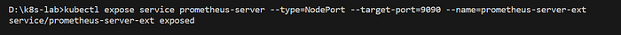

If you need to access Prometheus from outside the Kubernetes cluster, exposing it as a NodePort allows you to do so. You can use the node’s IP and the allocated NodePort to reach Prometheus. If you have external monitoring or visualization tools that need to connect to Prometheus, exposing it as a NodePort facilitates this external integration.

After making the Prometheus-server Kubernetes service accessible, let’s reach the Prometheus application by employing the provided command.

```bash
minikube service prometheus-server-ext
```

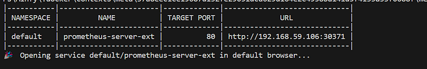

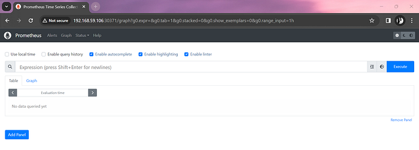

Our Prometheus web UI is available now. With the installation of Prometheus on Kubernetes via Helm, the Prometheus instance is now operational within the cluster, and we can reach it by navigating to a browser or using a specific URL.



## Grafana Installation

To begin, let’s initiate the Grafana installation. Subsequently, we’ll establish integration between Prometheus and Grafana, with Grafana configured to utilize Prometheus as its primary data source. Lastly, leveraging Grafana, we’ll craft insightful dashboards to monitor and observe the Kubernetes cluster.



### Search for the Grafana Helm chart

Now search for the Grafana helm chart by running the below command

```bash
helm search hub grafana
```

Output:

```
helm search hub grafana
URL                                                     CHART VERSION           APP VERSION             DESCRIPTION
https://artifacthub.io/packages/helm/grafana/gr...      7.0.19                  10.2.2                  The leading tool for querying and visualizing t...
https://artifacthub.io/packages/helm/surajwarbh...      0.1.0                   0.1.0                   A Helm chart to setup Grafana tool
https://artifacthub.io/packages/helm/saurabh6-g...      0.2.0                   1.1                     This is a Helm Chart for Grafana Setup.
https://artifacthub.io/packages/helm/romanow-he...      1.5.0                   8.3.4                   Grafana allows you to query, visualize, alert o...
https://artifacthub.io/packages/helm/kube-ops/g...      1.0.2                   7.3.6                   Grafana is an open source, feature rich metrics...
https://artifacthub.io/packages/helm/flagger/gr...      1.7.0                   7.2.0                   Grafana dashboards for monitoring Flagger canar...
https://artifacthub.io/packages/helm/stakater/g...      1.0.39                                          grafana chart that runs on kubernetes
```

An alternative approach is to navigate to the [Artifact Hub](https://artifacthub.io/) repository and explore the official Grafana Helm Chart.

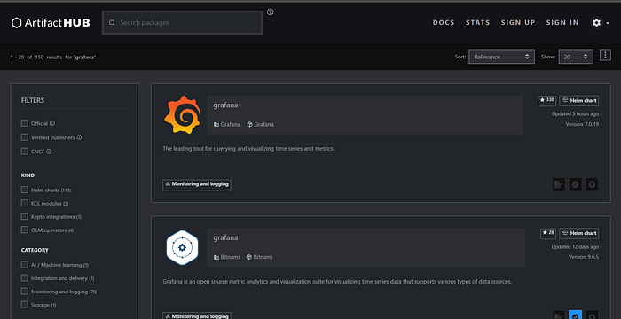



### Add the Grafana Helm repository

To get the Grafana Helm chart, run this command

```bash
helm repo add grafana https://grafana.github.io/helm-charts
helm repo update
```

Output:

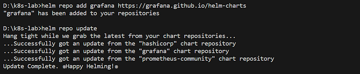

As you can see the Grafana repo is added successfully. Now we need to install the Grafana.



### Install Grafana Helm Chart on Kubernetes Cluster

For installing the Grafana on Kubernetes, use “helm install” command

```bash
helm install grafana grafana/grafana
```

Output:

```
helm install grafana grafana/grafana
NAME: grafana
LAST DEPLOYED: Tue Dec 19 12:36:38 2023
NAMESPACE: default
STATUS: deployed
REVISION: 1
NOTES:
1. Get your 'admin' user password by running:

   kubectl get secret --namespace default grafana -o jsonpath="{.data.admin-password}" | base64 --decode ; echo

2. The Grafana server can be accessed via port 80 on the following DNS name from within your cluster:

   grafana.default.svc.cluster.local

   Get the Grafana URL to visit by running these commands in the same shell:
     export POD_NAME=$(kubectl get pods --namespace default -l "app.kubernetes.io/name=grafana,app.kubernetes.io/instance=grafana" -o jsonpath="{.items[0].metadata.name}")
     kubectl --namespace default port-forward $POD_NAME 3000

3. Login with the password from step 1 and the username: admin
```

Having successfully installed Grafana on the Kubernetes Cluster, the Grafana server is now accessible through port 80. To retrieve the complete list of Kubernetes Services associated with Grafana, execute the following command:

```bash
kubectl get service
```

Output:

```
kubectl get service
NAME                                  TYPE        CLUSTER-IP      EXTERNAL-IP   PORT(S)        AGE
grafana                               ClusterIP   10.104.22.18    <none>        80/TCP         4m6s
```



### Exposing the Grafana Kubernetes Service

To expose the Grafana-service on Kubernetes we need to run this command

```bash
kubectl expose service grafana --type=NodePort --target-port=3000 --name=grafana-ext
```


By executing this command, we transition the service type from ClusterIP to NodePort, enabling external access to Grafana beyond the Kubernetes Cluster. The service will now be reachable on port 3000.

This below command will generate the following URL to access the Grafana dashboard

```bash
minikube service grafana-ext
```

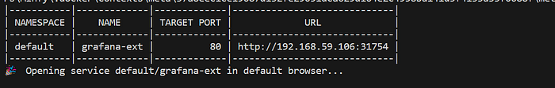

Grafana UI:


The image above shows the Grafana Login page. To get the password for `admin`, run this command on a new terminal.

```bash
kubectl get secret --namespace default grafana -o jsonpath="{.data.admin-password}" | ForEach-Object { [System.Text.Encoding]::UTF8.GetString([System.Convert]::FromBase64String($_)) }
```

**NOTE:** You need to open a new terminal to run this process to leave the Grafana tunnel running

#### Login to Grafana


Now lets add the data source as Prometheus. To add Prometheus as the data source, follow these steps:

* On the Welcome to Grafana Home page, click `Add your first data source`:
* Select `Prometheus` as the data source:

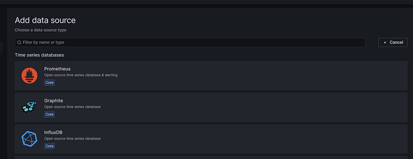

Include the internal cluster URL of your Prometheus application by referring to the initial URL displayed when executing the `minikube service prometheus-server-ext` command earlier.


Click on ‘Save and Next’.

You have successfully added the Prometheus as Data source.





## Grafana Dashboard

In this section, our focus will be on importing a Grafana Dashboard to streamline the process.



### Get the Grafana Dashboard ID

To import a Grafana Dashboard, follow these steps:

* Get the Grafana Dashboard ID from the [Grafana public Dashboard library](https://grafana.com/grafana/dashboards/)

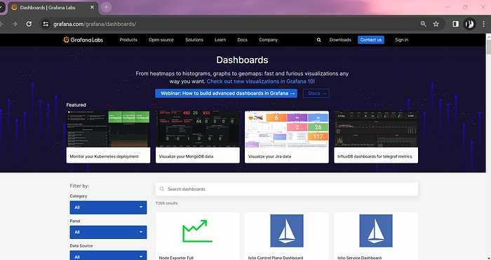



### Search for Kubernetes dashboards

* Now go to the search dashboard, and search for Kubernetes :





### Select a dashboard and copy the ID

* Select Dashboard and copy the Dashboard ID:

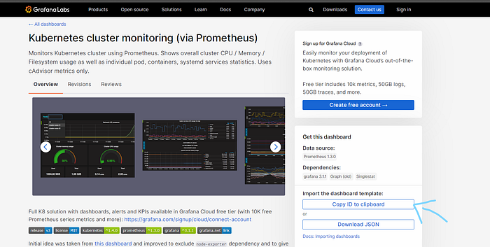



### Import the dashboard in Grafana

* Go back to the Grafana home, and go to the dashboard on left corner


* Now click on the new->import

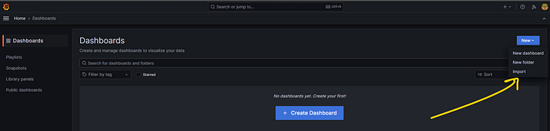

* Add the Grafana Id, and click on ‘Load’

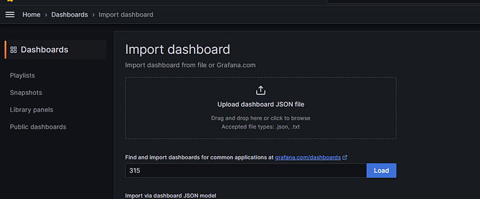

* Select a Prometheus Data Source and Click `Import`

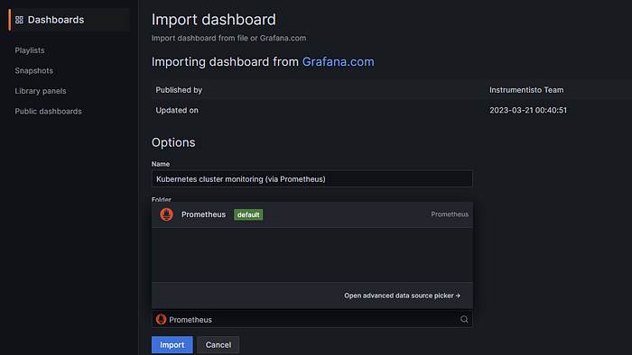

* It will the launch the Dashboard shown below:





You use this dashboard to monitor and observe the Kubernetes cluster metrics. It displays the following Kubernetes cluster metrics:

* Network I/O pressure.
* Cluster CPU usage.
* Cluster Memory usage.
* Cluster filesystem usage.
* Pods CPU usage.

## Implementing Persistent Volume and Persistent Volume claim for Prometheus and Grafana

In this section will see what is PV and PVC

what is PV?

A _persistent volume_ (PV) is a piece of storage in the cluster that has been provisioned by an administrator or dynamically provisioned using [Storage Classes](https://kubernetes.io/docs/concepts/storage/storage-classes/). It is a resource in the cluster just like a node is a cluster resource. PVs are volume plugins like Volumes but have a lifecycle independent of any individual Pod that uses the PV. This API object captures the details of the implementation of the storage, be that NFS, iSCSI, or a cloud-provider-specific storage system.

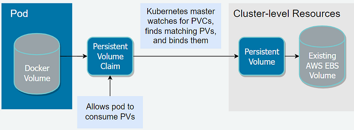

what is PVC?

A _PersistentVolumeClaim_ (PVC) is a request for storage by a user. It is similar to a Pod. Pods consume node resources and PVCs consume PV resources. Pods can request specific levels of resources (CPU and Memory). Claims can request specific size and access modes (e.g., they can be mounted ReadWriteOnce, ReadOnlyMany, ReadWriteMany, or ReadWriteOncePod, see [Access mode](https://kubernetes.io/docs/concepts/storage/persistent-volumes/#access-modes)).



### Create Persistent Volume for Prometheus

```yaml
apiVersion: v1
kind: PersistentVolume
metadata:
  name: prometheus-pv
spec:
  capacity:
    storage: 5Gi
  volumeMode: Filesystem
  accessModes:
  - ReadWriteOnce
  persistentVolumeReclaimPolicy: Retain
  storageClassName: local-storage
  local:
    path: /prometheus-data
  nodeAffinity:
    required:
      nodeSelectorTerms:
      - matchExpressions:
        - key: kubernetes.io/hostname
          operator: In
          values:
          - <NODE_PROMETHEUS_RUNS>
```

Now create a `.yaml` file by adding the above code and apply using `kubectl`

```bash
kubectl apply -f pv-prom.yaml
persistentvolume/prometheus-pv created
```



### Create a Persistent Volume Claim for Prometheus

Create another `.yaml` file for PVC and apply it using `kubectl`

```yaml
apiVersion: v1
kind: PersistentVolumeClaim
metadata:
  name: prometheus-pvc
spec:
  storageClassName: local-storage
  accessModes:
  - ReadWriteOnce
  resources:
    requests:
      storage: 5Gi
```

```bash
kubectl apply -f pvc-prom.yaml
persistentvolumeclaim/prometheus-pvc created
```



### Create a PV for Grafana

```yaml
apiVersion: v1
kind: PersistentVolume
metadata:
  name: grafana-pv
spec:
  capacity:
    storage: 5Gi
  volumeMode: Filesystem
  accessModes:
  - ReadWriteOnce
  persistentVolumeReclaimPolicy: Retain
  storageClassName: local-storage
  local:
    path: /grafana-data

  nodeAffinity:
    required:
      nodeSelectorTerms:
      - matchExpressions:
        - key: kubernetes.io/hostname
          operator: In
          values:
          - <NODE_GRAFANA_RUNS>
```

```bash
kubectl apply -f  pv.yaml
persistentvolume/grafana-pv created
```



### Create a PVC for Grafana

```yaml
apiVersion: v1
kind: PersistentVolumeClaim
metadata:
  name: grafana-pvc
spec:
  storageClassName: local-storage
  accessModes:
  - ReadWriteOnce
  resources:
    requests:
      storage: 5Gi
```

```bash
kubectl apply -f  pvc.yaml
persistentvolumeclaim/grafana-pvc created
```



* Update Prometheus to use the persistent storage:

```bash
helm upgrade prometheus prometheus-community/prometheus --set server.persistentVolume.enabled=true --set server.persistentVolume.storageClass=local-storage --set server.persistentVolume.existingClaim=prometheus-pvc
```

* Update Grafana to use the persistent storage:

```bash
helm upgrade grafana grafana/grafana --set persistence.enabled=true,persistence.storageClassName="local-storage",persistence.existingClaim="grafana-pvc"
```

***

Thanks !!
