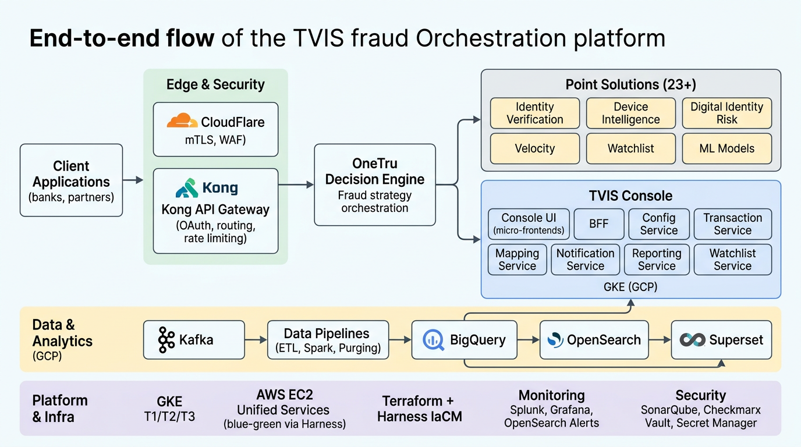

# Project Explanation in detail For Dec 25



### Can you explain your project?

I am part of the TVIS DevOps team at TransUnion, which is the infrastructure, platform, and operations backbone for the TruValidate Integrated Solutions (TVIS) fraud orchestration platform used by major global clients in both US and UK production environments. Our team owns TVIS Console DevOps, Unified Services DevOps, and the entire UK GCP infrastructure, ensuring the platform is highly available, secure, and compliant while enabling real-time fraud risk decisions.

The TVIS platform is a multi-layered fraud orchestration solution that sits in front of various identity, device, velocity, and watchlist services and orchestrates them through a central decision engine called OneTru. From the customer’s perspective, they integrate with an external API, configure their fraud strategies via the TVIS Console UI, and then rely on our platform to execute those strategies, store the data, and provide search, reporting, and analytics.

#### Key points

* **Business purpose**: TVIS helps financial institutions and other large clients detect and prevent fraud in real time using a combination of identity verification, device intelligence, digital identity risk, velocity checks, watchlists, and ML models.
* **Core components**:
  * External API: `api.transunion.com/truvalidate/gfs/fraud/1.0/` exposed to clients.
  * Core engine: OneTru Decision Engine (GTP/GSE portal) that orchestrates fraud strategies.
  * Console UI: `truvalidate.transunion.com/gfs/console` for internal and global delivery teams to configure rules and review transactions.
* **Authentication and security**: At the edge we use CloudFlare for mTLS certificate validation, and then Kong as an API Gateway to validate OAuth tokens before any request reaches OneTru.
* **Cloud footprint**:
  * GCP: GKE-based console services, UK production infrastructure, data pipelines, and BigQuery analytics.
  * AWS: Unified platform services running on EC2, deployed via blue-green deployments using Harness + Ansible.
* **Data and analytics**: Large volumes of transaction and audit data are processed via GCP data pipelines (ETL jobs, Spark transforms, BigQuery, OpenSearch) to power console listing pages, regulatory exports, and Superset-based reporting.
* **Migration and cost savings**: A key initiative is migrating legacy Unified platform services to OneTru/GCP, which is targeted to deliver around 2M USD of annual cost savings.



### What is your day-to-day task?

On a day-to-day basis, my role is a mix of ceremonies, hands-on engineering, production support, and platform improvements across GCP, AWS, Kubernetes, Terraform, and Harness. I work closely with IST and PST teams to keep the TVIS platform stable, secure, and continuously evolving, while also supporting audits and compliance requirements like SOC2 and PCI.

#### Ceremonies and coordination

* Daily Standup with both IST and PST time zones to sync on progress, blockers, and priorities across our DevOps squad.
* Sprint Planning, backlog grooming, demos, and retrospectives every sprint, aligned with the broader Orion ART cadence.
* Daily Alarm Digest review where we go through production alerts and overall platform health to prioritize fixes.

#### CI/CD and pipeline engineering (Harness)

* Creating, updating, and validating Harness CI/CD pipelines for TVIS Console services (UI, BFF, Config, Transaction, Superset, etc.) and Unified services like Mapper, Consumer, Velocity, Watchlist, and ETL.
* Integrating quality and security checks such as SonarQube (code quality and coverage) and Checkmarx SAST scans into the CI stage.

#### Infrastructure as Code and provisioning (Terraform + GCP/AWS)

* Implementing infrastructure changes using Terraform IaC, executed via Harness IaCM — for example, provisioning GKE namespaces, Kafka topics, GCS buckets, service accounts, and Vault roles.
* Managing infrastructure through lifecycle-based stacks (foundation, platform, shared-services, workloads, observability) with strict naming and tagging conventions enforced through pipelines.

#### Security, compliance, and certificates

* Managing SSL/TLS certificates (App Services, CDN, DocV sites, Trustev domains), ensuring timely renewals and correct deployment to CloudFlare and downstream services.
* Supporting SOC2 and similar audits by providing evidence related to privileged access, firewall rules, password policies, and user access reviews.

#### Operations, monitoring, and on-call

* Participating in L3 DevOps on-call rotations, monitoring Grafana and OpenSearch alerts, triaging Splunk dashboards, and joining technical bridges for P1/P2 incidents.
* Configuring and tuning Splunk and OpenSearch alerts, and contributing to our Daily Alarm Digest and uptime reporting.

#### Platform migrations and environment management

* Contributing to platform migration activities such as GKE Gateway API migration, Application Gateway V2 transition, Unified-to-OneTru migrations, and NIFE migration.
* Working on vulnerability patching, AMI refresh cycles, blue-green deployments for Unified services in AWS, and GCP entitlement reviews across environments.



### What is your challenging task in the current project? How did you resolve it and what are your learnings?

One of the most challenging tasks I worked on was stabilizing and hardening a critical UK production data pipeline that powers our console listing and regulatory reporting use cases. This pipeline is responsible for transforming OneTru audit logs into BigQuery tables and OpenSearch indices used by the TVIS Console and Superset reports.

#### Context and impact

* In UK Prod we have several key pipelines such as Advance Search ETL, Consumer DC Logs, Spark transform jobs, Purging jobs, and TruAssets monitoring running on GCP.
* The Spark transform job that converts OneTru staging data into `tvp.dc_events` (used by Superset reports) became unstable, causing delayed or incomplete reports and customer-visible impact on analytic dashboards.

#### Problem and challenges

* Failures were intermittent and environment-specific, involving a mix of resource exhaustion on GKE, schema drift in BigQuery, and error spikes visible in OpenSearch.
* Because the pipeline touches multiple layers (GKE jobs, Kafka topics, BigQuery tables, Superset dashboards), coordinating across teams and identifying the exact root cause was non-trivial.

#### Resolution steps

* Started with observability: correlated Splunk logs, OpenSearch error patterns, and GKE pod metrics to narrow down failure windows and identify recurring patterns.
* Worked with data engineering and application teams to align on a strict schema contract in BigQuery and added guardrails in the transform step to handle unexpected fields safely.
* Tuned resource requests/limits on the GKE jobs, adjusted backoff and retry strategies, and improved alerting thresholds so that we could catch degradation before customer SLAs were breached.
* Implemented all changes via Terraform and Harness pipelines, using our existing stack and workspace model, so the fix was reproducible and fully version-controlled.

#### Key learnings

* End-to-end observability across logs, metrics, and traces is critical when dealing with distributed data pipelines.
* Enforcing clear contracts (schemas, SLAs, ownership) between application and platform teams prevents regressions and speeds up incident resolution.
* Changes in regulated environments should always go through IaC and CI/CD rather than manual hotfixes.
* Progressive rollouts and well-tuned alerting dramatically reduce customer impact during future incidents.



### What is your Kubernetes architecture?

Our Kubernetes architecture is primarily based on Google Kubernetes Engine (GKE) in GCP, structured into multiple tiers aligned with data classification and compliance requirements for PCI and PII data. We operate separate environments (DEV, STG, NPP, PROD) and segregate workloads into Tier 1, Tier 2, and Tier 3 projects with strict networking and security controls.

#### GCP organization and project hierarchy

* We use a `TruValidateUK` folder, under which we create tiered console projects such as `tvisuk-cons-[dev|stg|npp|prod]-t1/t2/t3` for different environments and tiers.
* Tier 1 is PCI CDE (card data) and is PCI DSS compliant; Tier 2 handles PII data with UK GDPR compliance; Tier 3 is for third-party PII only.

#### Networking and tier connectivity

* Each tier has its own VPC: for example, Tier 1 uses `vpc-eu-prd-tier1-std-p7u8` and Tier 2 uses `vpc-eu-prd-tier2-std-g7j0` in `europe-west2` (London).
* Connectivity is tightly controlled: T1 ↔ T2 is allowed via VPC peering or controlled firewalls, but T1 ↔ T3 is explicitly denied to enforce PCI isolation, and T3 has controlled access only to T2.

#### GKE clusters and services

* On GKE, Tier 1 runs TVIS UI, BFF for UI, Watchlist services, and internal Kafka.
* Tier 2 runs backend services such as Transaction, Config, Reporting, Superset, Notification, Export, Mapping, Rules Engine, AI Agent, Advanced Search ETL, BigQuery access, and OpenSearch via Private Service Connect.
* Tier 3 hosts third-party integrations like Iovation over HTTPS, which are logically and network-wise isolated from card-holder data in Tier 1.

#### Security controls inside Kubernetes

* Workload Identity and least-privilege IAM roles are used for GKE service accounts, controlled at folder and project levels.
* VPC Service Controls are applied around Tier 1 PCI projects, all storage (GCS, CloudSQL, Secret Manager) is encrypted with CMEK, and TLS 1.2+ is enforced on internal and external endpoints.
* Binary Authorization ensures only signed images from Artifact Registry/JFrog can run on GKE, and Shielded VMs are enabled for nodes in Tier 1 and Tier 2.
* Access is via bastion hosts per tier using IAP tunnels only (no direct SSH), and all secrets are stored in GCP Secret Manager, never hard-coded in images.

#### Namespaces, DNS, and standards

* Kubernetes namespaces follow a standard pattern like `<component>-<env>-<tier>-uk` (for example `transaction-prod-t1-uk`) to make ownership and blast radius very clear.
* DNS follows strict patterns, e.g., `bff-prod-uk-t1.tvis.transu.net` in production and `bff-stg-uk-t1.tvis.np.transu.net` in non-prod.
* All GCP resources carry mandatory tags such as `env`, `region`, `service`, `repo`, `workspace`, `tier`, `managed-by`, and `dr` which are enforced by pipeline validation.



### Explain your project architecture

At a high level, the TVIS project architecture is an end-to-end fraud orchestration stack starting from the edge (CloudFlare) and API gateway (Kong), going through the OneTru decision engine and point solutions, and ending in the TVIS Console and data pipelines on GCP. Our DevOps team owns and operates all of these infrastructure layers — from networking and Kubernetes to CI/CD and observability.

#### Request ingress, edge, and API gateway

* Customer traffic first hits CloudFlare, where we enforce mTLS certificate validation; certificates are generated per customer via AppViewX and deployed to CloudFlare.
* Requests then go to Kong API Gateway, which validates OAuth tokens and enforces API-level policies before forwarding to the OneTru decision engine.

#### Decision engine and point solutions

* OneTru is the decision engine that executes customer-configured fraud strategies, orchestrating 23+ point solutions like Identity Verification, Device Risk, Digital Identity Risk, Zeus Model, Phone/Email verification, Velocity, and Watchlist.
* Based on the strategy, OneTru calls the necessary point solutions in sequence and returns a decision and risk score to the caller.

#### TVIS Console (GKE) and configuration layer

* TVIS Console, running on GKE, is the internal portal used by global delivery teams to configure business rules and workflows, view transaction data, and generate reports.
* The console architecture follows a micro-frontend pattern (modules like DocHub, Home, Layout, Report, Root-Config) with a BFF (Backend-for-Frontend) layer in between, and backend services for Configuration, Transaction, Mapping, Notification, Reporting, and Watchlist.

#### Data pipelines, storage, and analytics

* We have UK production data pipelines like Advance Search ETL (streaming), Consumer DC Logs, Transform Spark Jobs, Purging Jobs, and TruAssets monitoring running on GCP.
* These pipelines consume audit logs and transaction events from OneTru, transform them, and store them in BigQuery tables (for example `tvp.dc_events`) and OpenSearch indices for TVIS Console listings, FSAR exports, and Superset-based reporting.

#### Infrastructure stack and tooling

* Container orchestration is on GKE (US + UK tiers), Unified services run on AWS EC2 with blue-green deployments using Harness + Ansible, and BigQuery provides the main data warehouse.
* We use OpenSearch (via PSC), Kafka for event streaming, Vault plus GCP Secret Manager for secrets, Harness for CI/CD and IaC pipelines, and Terraform for all infrastructure provisioning.
* Security scanning is handled by SonarQube and Checkmarx in CI, while Splunk, Grafana, and OpenSearch alerts provide monitoring and observability across environments.

<figure><figcaption></figcaption></figure>

you can use this directly in interviews:

* Start from **Client Applications** on the left (banks, partners) and walk right through:
  * **CloudFlare (mTLS, WAF)** → **Kong API Gateway (OAuth, routing)**.
  * Then into **OneTru Decision Engine** and the **Point Solutions** (IDV, Device, Velocity, Watchlist, ML, etc.).
* Move down to **TVIS Console on GKE**: Console UI (micro‑frontends), BFF, Config, Transaction, Mapping, Notification, Reporting, Watchlist.
* Then explain **Data & Analytics**: Kafka → Data Pipelines (ETL, Spark, Purging) → BigQuery + OpenSearch → Superset and Console.
* Finally, highlight the **Platform & Infra** strip: GKE T1/T2/T3, AWS EC2 Unified Services (blue‑green via Harness), Terraform + Harness IaCM, monitoring (Splunk, Grafana, OpenSearch alerts), and security stack (SonarQube, Checkmarx, Vault, Secret Manager).

If you want, I can now produce a second, simplified version (fewer boxes) for quick whiteboard explanations, and a short script (30–60 seconds) that matches this exact diagram.

A short summary I use in interviews is:

> TVIS is a multi-layered fraud orchestration platform where CloudFlare and Kong secure ingress, OneTru executes fraud strategies, TVIS Console on GKE provides configuration and visibility, and GCP data pipelines with BigQuery and OpenSearch power reporting and analytics — all automated via Terraform and Harness with strong PCI/PII isolation.


