# Bluezone Project Explanation

## Profile

* **Role:** DevOps Engineer
* **Experience:** 4 years and 10 months
* **Status:** Actively job hunting

***

## Project Description

In Blue Zone project, I worked as a Support Engineer and also handled development-related DevOps activities for a healthcare and e-learning application. This application is used for health training, safety learning, and online education programs. Earlier, it was a monolithic application running on AWS EC2 servers. Later, the client planned to convert it into around 50 microservices for better performance, easy maintenance, and faster deployments. They also wanted to reduce infrastructure cost, so they moved the application to Docker and Kubernetes. Our team handled this migration and support work.

My daily work started with checking Jira tickets, production alerts, deployment requests, and support issues. We received tickets like application down, pod restart, build failure, deployment request, access request, performance issue, log check, and certificate renewal. Based on priority, I used to work on tickets, provide updates, and close them after resolution.

In migration activity, we took one microservice at a time. First, I checked how the application was running on EC2 servers, including dependencies, ports, and config files. Then, I created Dockerfiles, built Docker images, and tested the application in containers. If any issue came, I coordinated with the development team and fixed it.

After that, I created Kubernetes files like Deployment, Service, ConfigMap, Secret, and Ingress. I also created Helm charts for easy deployment across Dev, QA, and Prod environments.

I worked on Jenkins CI/CD pipelines for code checkout, build, Docker image creation, push to registry, and deployment to Kubernetes cluster. This helped reduce manual work and increased deployment speed.

In my support role, I monitored pods, node health, CPU, memory, disk space, and logs. If any application issue came, I checked logs, restarted pods, increased replicas, or performed rollback if needed. I also supported production releases during weekends and maintenance windows.

I worked closely with developers, QA team, database team, and support team for smooth releases and quick issue resolution. I updated Jira tickets with status, RCA, and closure details.

***

## Assumptions & Gaps


* Kubernetes platform assumed to be **AWS EKS** (since app was already on AWS EC2)
* Team size assumed to be **\~6–8 people** (2 DevOps, developers, QA, DBA, support)
* Container registry assumed to be **AWS ECR**
* Ingress controller assumed to be **Nginx Ingress Controller**
* STAR challenge scenario options provided — pick the one closest to your real experience


***

## Interview Answer 1 — "Can you explain your project?"

> Sure. The project is called Bluezone — it's a healthcare and e-learning platform used for health training, safety programs, and online education. The client serves a fairly large user base, so uptime and release stability were critical requirements.
>
> When I joined, the application was a monolith running on AWS EC2. The client had made a strategic decision to break it into around 50 microservices — primarily to improve deployment agility, reduce downtime, and also bring down infrastructure costs. My team owned the entire containerization and Kubernetes migration for that initiative.
>
> On the tech side, we were working with Docker, Kubernetes on AWS EKS, Jenkins for CI/CD, Helm for deployment packaging, and we used ECR as our container registry. Monitoring was handled through a combination of CloudWatch and log inspection at the pod level.
>
> My role was DevOps Engineer — I was involved in both the migration work and day-to-day production support. So it was a dual responsibility: building and automating on one side, and firefighting and stabilizing on the other.
>
> The team was roughly 6 to 8 people — two of us on the DevOps side, a development team, QA, a DBA, and a support function. I was the main person handling Kubernetes workloads, pipeline setup, and Helm chart management.
>
> In terms of key contributions — I led the containerization of microservices one by one, creating Dockerfiles, building and testing images, and then writing all the Kubernetes manifests — Deployments, Services, ConfigMaps, Secrets, and Ingress configs. I also built the Jenkins CI/CD pipelines end to end, which significantly cut down manual deployment effort. And on the support side, I was the go-to person for production incidents — pod crashes, performance issues, rollbacks, certificate renewals — all of that came through me.
>
> It's been a very hands-on project — I've touched everything from writing the first Dockerfile for a service to managing a 2 AM production incident. That breadth is something I really value from this experience.

***

## Interview Answer 2 — "Can you explain your Kubernetes architecture?"

> Happy to walk you through it. We were running on AWS EKS since the application was already in the AWS ecosystem — it made sense to stay within that and use managed control planes rather than maintaining our own masters.
>
> For the cluster setup, we had separate clusters — or at least separate node groups — for Dev, QA, and Production. Production had its own dedicated node group with autoscaling enabled, so we could scale out during peak loads without manual intervention. The nodes were EC2-based, sized appropriately for the workload — mostly memory-optimized instance types since several of the microservices were Java-based and memory-hungry.
>
> For namespace organization, we kept it clean: one namespace per environment — dev, qa, and prod — with RBAC policies applied so developers had limited access in production but full freedom in dev and QA.
>
> Most of our workloads ran as Deployments since they were stateless microservices. We set resource requests and limits for every deployment — CPU and memory — which was especially important after a few early incidents where one runaway service was starving others on the same node.
>
> For networking and ingress, we used the Nginx Ingress Controller with host-based and path-based routing to direct traffic to the right services. TLS termination happened at the Ingress layer, and certificate renewals were part of my recurring support tasks. Services were mostly ClusterIP internally, with the Ingress being the only external entry point.
>
> For configuration management, we used ConfigMaps for non-sensitive configs — things like environment variables, feature flags — and Kubernetes Secrets for credentials, database passwords, API keys, and so on. These were referenced in the pod specs rather than hardcoded anywhere.
>
> We packaged everything using Helm charts. Each microservice had its own chart with a values.yaml per environment — so promoting from QA to Prod was essentially a controlled Helm upgrade with a different values file. That made releases much more predictable.
>
> For scaling, HPA — Horizontal Pod Autoscaler — was configured on the more traffic-sensitive services, scaling based on CPU thresholds. And at the node level, the EKS cluster autoscaler handled adding or removing nodes based on pending pod pressure.
>
> Storage wasn't a major concern since most services were stateless, but where persistence was needed — like certain session or file handling services — we used EBS-backed Persistent Volumes.
>
> For high availability in production, we enforced a minimum of 2 replicas per deployment and used Pod Disruption Budgets to make sure rolling updates didn't take everything down at once. We also used RollingUpdate strategy with proper maxUnavailable and maxSurge settings to keep the app live during deployments.
>
> It's a fairly standard but solid EKS setup — nothing over-engineered, but built with production stability in mind.

### Architecture Diagram

```
┌─────────────────────────────────────────────────────────────────┐
│ DEVELOPER WORKSTATION                                           │
│ git push → GitHub/GitLab                                        │
└──────────────────────────┬──────────────────────────────────────┘
                           │ webhook trigger
                           ▼
┌─────────────────────────────────────────────────────────────────┐
│ JENKINS CI/CD                                                   │
│ Checkout → Build → Docker Build → Push to ECR → Helm Deploy     │
└──────────────────────────┬──────────────────────────────────────┘
                           │ helm upgrade
                           ▼
┌─────────────────────────────────────────────────────────────────┐
│ AWS ECR                                                         │
│ (Container Image Registry)                                      │
└──────────────────────────┬──────────────────────────────────────┘
                           │ image pull
                           ▼
┌─────────────────────────────────────────────────────────────────┐
│ AWS EKS CLUSTER                                                 │
│                                                                 │
│ ┌─────────────┐ ┌─────────────┐ ┌─────────────────────┐         │
│ │ Namespace   │ │ Namespace   │ │ Namespace           │         │
│ │ dev         │ │ qa          │ │ prod                │         │
│ │             │ │             │ │                     │         │
│ │ [pods]      │ │ [pods]      │ │ [pods] min 2 rep    │         │
│ │             │ │             │ │ HPA enabled         │         │
│ │             │ │             │ │ PDB configured      │         │
│ └─────────────┘ └─────────────┘ └─────────────────────┘         │
│                                                                 │
│ ┌──────────────────────────────────────────────────────────┐     │
│ │ Nginx Ingress Controller                                 │     │
│ │ Host/Path routing | TLS termination (ACM)               │     │
│ └──────────────────────────────────────────────────────────┘     │
│                                                                 │
│ Node Groups:                                                    │
│ [dev/qa node group - shared, cost-optimized]                    │
│ [prod node group - dedicated, autoscaling, m5 instances]        │
└──────────────────────────┬──────────────────────────────────────┘
                           │
          ┌────────────────┼────────────────┐
          ▼                ▼                ▼
   ┌──────────┐     ┌──────────┐     ┌──────────────┐
   │CloudWatch│     │EBS (PVs) │     │ RDS / other  │
   │ Logging  │     │ Storage  │     │ AWS services │
   └──────────┘     └──────────┘     └──────────────┘
```



### Start at Jenkins

Code gets committed, Jenkins picks it up, builds the image, pushes to ECR.



### Move to Nginx Ingress

Traffic from users hits the ingress controller, which does TLS termination and routes by host/path.



### Walk the namespaces

We kept dev, QA, and prod isolated by namespace, with the same Helm chart but different values files.



### Point to node groups

Prod runs on dedicated m5 nodes with HPA and Pod Disruption Budgets; dev/QA share a cheaper node group.



### Finish with AWS services

CloudWatch for monitoring, EBS for any stateful workloads, ACM for cert management.



<figure><figcaption></figcaption></figure>

***

## Interview Answer 3 — "What are your day-to-day tasks?"

> My day typically starts with a morning check-in ritual — I look at our monitoring dashboards first, check if there are any active alerts, and review overnight logs for anything that might have triggered but wasn't immediately critical. If something looks off — unusual memory spikes, pod restarts, elevated error rates — I investigate before the business day fully kicks off.
>
> Then I move to Jira. I go through the queue and triage tickets by priority. The ticket types vary a lot — deployment requests, access provisioning, application down incidents, build failures, log analysis requests, certificate renewals. I prioritize P1s and P2s first, update ticket statuses, and pick up what I'll own for the day.
>
> A good chunk of my time goes into CI/CD pipeline management — reviewing failed builds, checking why a deployment didn't go through, sometimes helping devs understand what went wrong in their build. If there's a new microservice or a pipeline change requested, I handle that configuration as well.
>
> For Kubernetes operations, I'm regularly checking pod health, node resource utilization, and HPA behavior. If a pod is crash-looping or a deployment is stuck, I dig into logs — kubectl logs, kubectl describe — figure out the root cause, and either fix it directly or loop in the right team.
>
> I also spend time on release coordination. Before any production release, I validate the Helm chart changes, check the values file for the target environment, review what's changing, and confirm with the QA and dev teams that sign-off is done. During weekend maintenance windows, I'm the one running the deployment, watching the rollout, and ready to rollback if something breaks.
>
> On the collaboration side, I'm in sync with the dev team for new service onboarding, with the DBA team if deployments involve database migrations, and with the QA team to make sure staging is stable before anything moves to prod.
>
> I also do housekeeping tasks periodically — cleaning up unused images in ECR, reviewing resource limits that might need tuning, checking if any Kubernetes versions or Helm charts are due for an upgrade.
>
> And of course, for every incident or significant task, I make sure Jira is updated — with status, root cause, resolution steps, and closure notes. That documentation habit is something I take seriously because it helps the whole team, not just me.

***

## Interview Answer 4 — "Most challenging task?" (STAR Format)

> Choose one of the three options below. Pick the one closest to your actual experience and use that as your answer.



**Category:** Migration-specific | **Rarity:** Very High | **Follow-up risk:** Low

**Situation:** While migrating a microservice from EC2 to Kubernetes, everything looked healthy — pods running, health checks passing, no errors in logs. But QA started reporting that certain user records were showing stale or incorrect data intermittently. The bug was completely invisible at the infrastructure level.

**Task:** Identify and fix what appeared to be a data integrity issue in a running production-candidate service, without any error signals from the infra side.

**Action:** I started by ruling out the obvious — database connectivity, network latency, config mismatches. All clean. Then I dug into how the original EC2 application was handling data. I discovered that the service was using the local server filesystem as a temporary cache layer — a pattern that works fine on a single EC2 server but completely breaks down in a containerized, multi-replica setup. Each pod had its own isolated filesystem. Writes from one pod were invisible to reads from another pod. No crash, no alert — just silently wrong data. I reproduced it locally by scaling to 2 replicas and running concurrent requests. I then worked with the dev team to refactor the caching layer to use a shared store (we moved it to ElastiCache Redis), and we added a validation test in QA that specifically tested behavior under multiple replicas before any service could be promoted.

**Result:** The issue was fully resolved before it reached production users. We also updated our migration checklist to include a "stateless verification" step for every service — specifically checking for any local filesystem usage before containerizing.

**Learning:** Containerization isn't just a packaging change — it's an architectural change. A service that works perfectly on a single server can behave incorrectly in a distributed, multi-replica environment if it carries hidden statefulness. That realization changed how I approach every migration now.

**Prevention:** Added a mandatory pre-migration checklist item — review all file I/O, local caching, and session handling before containerizing any service.



**Category:** Cluster/infra-level | **Rarity:** High | **Follow-up risk:** Medium

**Situation:** After migrating around 20 services to production, we started seeing intermittent 5xx errors — but only under moderate-to-high load, only for inter-service calls, and they disappeared on their own. Direct API calls from outside the cluster were unaffected. It was nearly impossible to reproduce on demand, which made it extremely frustrating to debug.

**Task:** Identify the root cause of non-reproducible inter-service failures in a live production Kubernetes cluster without causing further instability.

**Action:** I started by correlating error times with resource metrics. CPU and memory on the app pods looked fine. Then I noticed that the errors aligned with periods of higher deployment activity — when many pods were spinning up simultaneously. I shifted focus to cluster-level components and checked CoreDNS. I found two things: CoreDNS pods were being CPU-throttled during high-traffic periods, and the default `ndots:5` setting in Kubernetes was causing every DNS lookup to attempt 5 different search path combinations before resolving — multiplying the DNS query volume massively across 20+ microservices all doing service discovery. CoreDNS simply couldn't keep up. I scaled CoreDNS from 2 to 4 replicas, increased its CPU limits, and worked with the team to add `ndots:2` to the pod DNS config for internal service calls, which drastically cut the number of DNS queries per request.

**Result:** Intermittent errors dropped to zero. We also set up a specific CoreDNS latency alert so we'd catch any future degradation early.

**Learning:** In a microservices architecture, DNS is load-bearing infrastructure. Most people treat it as invisible plumbing, but when you have 20+ services all talking to each other, DNS query volume grows non-linearly. It needs to be sized and monitored like any other critical component.

**Prevention:** CoreDNS replica count and resource limits are now part of our cluster sizing review whenever we add a significant number of new microservices.



**Category:** CI/CD pipeline | **Rarity:** High | **Follow-up risk:** Low

**Situation:** Two developers triggered builds for two different microservices almost simultaneously. Both pipelines ran green — successful builds, successful image pushes. But in production, Service A got deployed with Service B's Docker image. No one caught it immediately because the health check passed — the service started fine, it just wasn't the right code. It was only caught when users reported unexpected behavior in a specific feature.

**Task:** Identify how the wrong image ended up in production, fix the immediate issue, and redesign the pipeline to prevent this class of failure entirely.

**Action:** I started by checking the deployment history in Kubernetes — `helm history` and the image tag in the running pod spec confirmed the wrong image. I rolled back the affected service immediately. Then I audited the Jenkins pipeline code. The root cause was that both pipelines were running on the same Jenkins agent, sharing a workspace directory, and the image tag was being written to a shared environment variable in the Jenkinsfile. When Job B ran slightly behind Job A, it overwrote the shared tag variable just before Job A's deploy step executed — so Job A pushed its correct image but deployed Job B's tag. I fixed this by switching to commit SHA-based image tagging (unique per build, no collisions possible), enforcing workspace isolation per pipeline using `ws()` blocks in Jenkinsfile, and adding a deploy-time validation step that verified the image digest in ECR matched what was being deployed before applying to Kubernetes.

**Result:** The wrong-image incident has not recurred. The commit SHA tagging also gave us a much cleaner audit trail — every deployment is now traceable to an exact commit.

**Learning:** Shared state in CI/CD pipelines is a silent killer. It works fine when pipelines run sequentially but fails unpredictably under concurrency. Pipeline design needs to treat concurrency as the default, not the exception.

**Prevention:** Updated our Jenkins pipeline template to use commit SHA tags by default, enforce workspace isolation, and include a pre-deploy image digest check. Also added this as a code review checklist item for any new pipeline.



***

## Quick Tips for Interview Day

* **For Q2:** Draw the architecture diagram on a whiteboard if given the chance — or share your screen on a video call. It immediately signals structured thinking.
* **For Q4:** Pause briefly before answering and say "let me think of a good example" — it sounds more natural than launching in immediately.
* **Have numbers ready:** \~50 microservices target, \~15–20 migrated, team of \~6–8 — interviewers appreciate specificity.
* **For virtual interviews:** Share your screen and walk the architecture diagram while narrating Q2.
* **Follow-up prep:** After your main answers, expect these follow-ups:
  * "How did you handle secrets management?"
  * "How did you monitor the cluster?"
  * "How did you handle rollbacks?"
  * "What was your branching strategy?"
  * "How did you manage Helm chart versioning?"
