# FinSecure Project Explanation

> **Profile:** DevOps Engineer | \~5 Years Experience | AWS, Kubernetes, Jenkins, Terraform

***

## Q1. "Can you explain your project?"

> _(2–3 minute verbal answer – structured overview)_

So my most recent project was **FinSecure Bank**, a digital banking and payments platform. It's a production-grade application used by real customers for things like fund transfers, bill payments, loan applications, credit card management, and account services. Given that we're dealing with financial transactions, availability and security were non-negotiable — even a few minutes of downtime had direct business impact.

The application was built on a **microservices architecture**, hosted entirely on **AWS**. We used services like **EKS** for container orchestration, **RDS** for managed relational databases, **S3** for object storage, **IAM** for access management, **Application Load Balancer** for traffic routing, and **CloudWatch** for monitoring and alerting. The services were containerized with **Docker** and deployed using **Helm charts** on Kubernetes.

My role was **DevOps Engineer**, and I was responsible for the full CI/CD pipeline lifecycle, infrastructure provisioning with Terraform, Kubernetes cluster management, and production support. I worked closely with developers, QA engineers, DBAs, and the support team — essentially acting as the bridge between development and operations.

We followed **Agile methodology** with 2-week sprints. I participated in sprint planning, daily stand-ups, and tracked all my work in Jira. My day-to-day covered everything from pipeline automation, deployment reviews, incident resolution, and infrastructure maintenance.

Overall, this project gave me really strong hands-on experience managing a high-availability, security-sensitive production system at scale — which I think is a solid foundation for any senior DevOps role.

***

## Q2. "Can you explain your Kubernetes architecture?"

> _(Technically detailed, easy to follow)_

<figure><figcaption></figcaption></figure>

Sure — let me walk you through how we had Kubernetes set up on **AWS EKS**.

### Cluster Setup

We ran a **managed EKS cluster** — so AWS handled the control plane (API server, etcd, scheduler, controller manager), and we focused on the worker nodes. The cluster was deployed across **multiple Availability Zones** for high availability. We had a mix of **On-Demand and Spot instances** — critical services ran on On-Demand, and non-critical batch workloads ran on Spot to manage costs.

### Node Groups

We had separate **node groups** for different workload types:

* A **system node group** for cluster-level components like CoreDNS, kube-proxy, and the metrics server
* An **application node group** for our microservices
* We used the **Cluster Autoscaler** so node counts would automatically scale up or down based on pending pods and resource utilization

### Namespace Strategy

We used **namespaces** to logically separate environments and concerns:

* `dev`, `staging`, and `production` namespaces for environment isolation
* A dedicated `monitoring` namespace for Prometheus and Grafana
* A `logging` namespace for our log aggregation stack

### Workload Types

For stateless microservices — payment service, account service, notification service — we used **Deployments** with multiple replicas for redundancy. For any singleton operational tasks, we used **Jobs** and **CronJobs**. We also used **HPA (Horizontal Pod Autoscaler)** tied to CPU and memory metrics so pods could scale automatically during peak load — for example, during month-end payment cycles.

### Ingress & Networking

External traffic came through an **AWS Application Load Balancer**, managed by the **AWS Load Balancer Controller** running inside the cluster. We used **Ingress resources** to route traffic to the correct services based on path and host rules. Internally, services communicated over **ClusterIP services**. We also applied **Network Policies** to restrict inter-service communication — for example, the payment service could only talk to specific backend services, not the entire cluster.

### Configuration & Secrets Management

We used **ConfigMaps** for non-sensitive configuration like environment variables and feature flags. For sensitive data — database credentials, API keys, JWT secrets — we used **Kubernetes Secrets**, and in production these were synced from **AWS Secrets Manager** using the Secrets Store CSI Driver, so we weren't storing plaintext secrets in Git.

### Storage

For stateful workloads that needed persistent storage — like some internal tools — we used **PersistentVolumeClaims** backed by **AWS EBS volumes** via the EBS CSI driver.

### Observability

We ran **Prometheus** for metrics collection and **Grafana** for dashboarding. CloudWatch Container Insights gave us cluster-level visibility. For logs, we shipped container logs to **CloudWatch Logs** using a Fluent Bit DaemonSet.

### High Availability Patterns

We enforced **Pod Disruption Budgets** so rolling updates or node drains wouldn't take down all replicas simultaneously. We used **Pod Anti-Affinity rules** to make sure replicas of the same service were spread across different nodes and AZs. And we had **liveness and readiness probes** on every deployment so Kubernetes could self-heal unhealthy pods without manual intervention.

***

## Q3. "What are your day-to-day tasks?"

> _(Senior-level ownership — not just execution)_

My day typically started around 9 AM with a quick check of **CloudWatch dashboards and Grafana** to see if anything unusual happened overnight — CPU spikes, memory pressure, failed deployments, or unresolved alerts. Then I'd look at the **Jenkins pipeline status** to catch any builds that failed during off-hours.

After stand-up, I'd work through my **Jira queue**. On any given day this could include:

* **Reviewing and merging Terraform PRs** for infrastructure changes — I'd check for security misconfigurations, cost impacts, or drift from our standards before approving
* **Managing deployment requests** — coordinating with developers on deployment slots, validating Helm chart versions, running smoke tests post-deployment
* **Pipeline maintenance** — updating Jenkins pipeline scripts when new services were onboarded or existing ones changed build requirements
* **Kubernetes housekeeping** — checking pod health, reviewing resource utilization, adjusting HPA thresholds, updating node group configurations
* **Incident response** — if an alert came in for something like high error rates, payment timeouts, or a crashing pod, I'd be the first responder: check logs, dig into CloudWatch metrics, coordinate with the dev team, and get it resolved
* **Security and compliance tasks** — rotating secrets, reviewing IAM permission changes, checking certificate expiry dates (we had a few close calls early on, so I built a monitoring script around that)
* **Sprint ceremonies** — participating in sprint planning to estimate effort for DevOps tasks, contributing to retrospectives, and sometimes helping with release planning calls with product managers

Towards the end of the week, I'd typically write up a brief ops summary — any recurring issues, infrastructure cost trends, or upcoming changes — and share it with the team lead.

It was a combination of proactive work (improving systems, reducing toil) and reactive work (incidents, urgent deployment support), and I had to context-switch between the two fairly often.

***

## Q4. "What is the most challenging task you've faced recently, how did you resolve it, what did you learn, and how do you ensure it won't happen again?"

> _(STAR format – realistic and technical)_

### Situation

About six months into the project, we started seeing **intermittent payment API failures in production** — not constant, but enough to trigger customer complaints and escalations. The error rate was spiking for roughly 5–10 minutes every couple of hours, and then recovering on its own. Because it was self-resolving, it had been partially dismissed as transient network blips — but the business was not happy.

### Task

I was assigned to own the investigation and root cause analysis. The expectation was not just to fix it, but to make sure it didn't come back — because even short payment failures in a banking app have direct customer trust and compliance implications.

### Action

I started by correlating the timing of the error spikes with everything I had — CloudWatch metrics, Kubernetes events, and Jenkins deployment logs. The first thing I noticed was that the spikes were happening roughly around the same time intervals. That made me suspicious of something cyclic — either a CronJob, a scaling event, or a scheduled task.

When I looked at **Kubernetes events**, I found that the **Cluster Autoscaler was scaling down nodes** during low-traffic windows, and during scale-down, pods were being evicted and rescheduled. The issue was that we didn't have a **Pod Disruption Budget** configured for the payment service. So when a node was drained, Kubernetes could terminate _all_ replicas simultaneously if they happened to be on the same node — which they sometimes were, because we also hadn't set **pod anti-affinity rules**.

To make things worse, the **readiness probe** on the payment service had an overly aggressive initial delay — it was too short, so pods were marked ready before the application had fully initialized its connection pool to RDS. That meant for a brief window, traffic was hitting pods that weren't actually ready to handle requests.

**The fixes I made:**

1. Added a **PodDisruptionBudget** to ensure at least one payment service replica was always available during voluntary disruptions
2. Added **pod anti-affinity rules** so replicas were distributed across nodes and AZs
3. Tuned the **readiness probe** — increased the `initialDelaySeconds` and added a proper `/health/ready` endpoint that checked DB connectivity before returning 200
4. Configured **preStop lifecycle hooks** with a short sleep to give in-flight requests time to complete before a pod was terminated (graceful shutdown)
5. Worked with the infra team to adjust the **Cluster Autoscaler's scale-down cooldown** so it wasn't too aggressive during business hours

### Result

After deploying these changes to staging and validating over two days, we rolled it to production. The intermittent payment failures stopped completely. Error rate dropped to near zero for that service. We also caught a few other services with the same misconfiguration and proactively fixed those too.

### What I Learned

The biggest takeaway was that **self-healing doesn't mean safe** — Kubernetes was doing exactly what it was configured to do, but we hadn't thought through the implications of node scale-down on a stateful-connection service. I also learned to always validate probe configurations against actual application startup behavior, not just assume defaults are sensible.

### Prevention Measures

After this incident, I introduced a **Kubernetes deployment checklist** for all new services being onboarded — it covered PDBs, anti-affinity, probe configuration, resource requests/limits, and graceful shutdown handling. I also added a **synthetic monitoring job** using CloudWatch Synthetics that hit our payment API every minute and alerted immediately if it failed — so we'd catch future issues in seconds, not after customer complaints.

***

## ⚠️ Assumptions & Gaps (Fill These In)

| # | Assumption Made                           | Please Verify / Customize                                                                    |
| - | ----------------------------------------- | -------------------------------------------------------------------------------------------- |
| 1 | Node types: mix of On-Demand + Spot       | Confirm actual instance types used (e.g., t3.large, m5.xlarge)                               |
| 2 | Monitoring: Prometheus + Grafana          | Confirm if you actually used these or just CloudWatch                                        |
| 3 | Log shipping: Fluent Bit to CloudWatch    | Update if you used a different log shipper (e.g., Fluentd, Datadog)                          |
| 4 | Secrets: AWS Secrets Manager + CSI Driver | Confirm if you used this or plain Kubernetes Secrets                                         |
| 5 | Team size not specified                   | Add team size context: "We were a team of 8 — 2 DevOps engineers, 4 developers, 1 QA, 1 DBA" |
| 6 | No ArgoCD / GitOps mentioned              | If you used ArgoCD or Flux, mention it in Q2 for bonus points                                |
| 7 | Jenkins was the only CI tool              | Confirm — some teams also use CodePipeline or GitHub Actions alongside Jenkins               |

***

## 💡 Bonus: 5 Follow-Up Questions to Stress-Test Your Prep

1. "How did you handle secret rotation in Kubernetes without restarting pods?"

Talk about CSI Secret Store driver with auto-rotation, or init containers fetching fresh secrets.

2. "How did you ensure zero-downtime deployments in EKS?"

Talk about rolling update strategy, maxUnavailable/maxSurge settings, PDBs, and readiness probes.

3. "How did you manage Terraform state when multiple engineers were working on infra?"

Remote state in S3 with DynamoDB state locking, workspace per environment.

4. "If a pod is in CrashLoopBackOff, how do you debug it?"

kubectl logs, kubectl describe pod, check resource limits, check liveness probe misconfiguration, check exit codes.

5. "How did you handle cost optimization in EKS?"

Right-sizing resource requests, Spot instances for non-critical workloads, Cluster Autoscaler, reviewing unused PVCs and load balancers.

***

_Prepared for interview readiness | FinSecure Bank – Digital Banking Platform_
