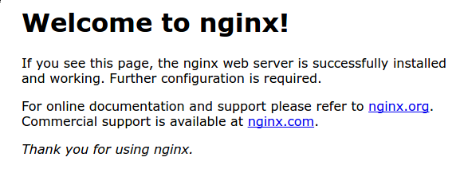

# installation guide

## Install and Configure Nginx on Ubuntu | Step-by-Step Guide

#### Introduction

[Nginx](https://www.nginx.com/) is one of the most popular web servers in the world and is responsible for hosting some of the largest and highest-traffic sites on the internet. It is a lightweight choice that can be used as either a web server or reverse proxy.

In this guide, we’ll discuss how to install Nginx on your Ubuntu server, adjust the firewall, manage the Nginx process, and set up server blocks for hosting more than one domain from a single server.

<details>

<summary>Prerequisites</summary>

Before you begin this guide, you should have a regular, non-root user with sudo privileges configured on your server. You can learn how to configure a regular user account by following our [Initial server setup guide for Ubuntu](https://www.digitalocean.com/community/tutorials/initial-server-setup-with-ubuntu-20-04).

You will also optionally want to have registered a domain name before completing the last steps of this tutorial. To learn more about setting up a domain name with DigitalOcean, please refer to our [Introduction to DigitalOcean DNS](https://docs.digitalocean.com/products/networking/dns/).

When you have an account available, log in as your non-root user to begin.

</details>



### Step 1 – Installing Nginx

Because Nginx is available in Ubuntu’s default repositories, it is possible to install it from these repositories using the `apt` packaging system.

Since this is our first interaction with the `apt` packaging system in this session, we will update our local package index so that we have access to the most recent package listings. Afterwards, we can install `nginx`:

```
sudo apt update
sudo apt install nginx
```

After accepting the procedure, `apt` will install Nginx and any required dependencies to your server.



### Step 2 – Adjusting the Firewall

Before testing Nginx, the firewall software needs to be adjusted to allow access to the service. Nginx registers itself as a service with `ufw` upon installation, making it straightforward to allow Nginx access.

List the application configurations that `ufw` knows how to work with by typing:

```
sudo ufw app list
```

You should get a listing of the application profiles:

```
OutputAvailable applications:
  Nginx Full
  Nginx HTTP
  Nginx HTTPS
  OpenSSH
```

As demonstrated by the output, there are three profiles available for Nginx:

* **Nginx Full**: This profile opens both port 80 (normal, unencrypted web traffic) and port 443 (TLS/SSL encrypted traffic)
* **Nginx HTTP**: This profile opens only port 80 (normal, unencrypted web traffic)
* **Nginx HTTPS**: This profile opens only port 443 (TLS/SSL encrypted traffic)

It is recommended that you enable the most restrictive profile that will still allow the traffic you’ve configured. Right now, we will only need to allow traffic on port 80.

You can enable this by typing:

```
sudo ufw allow 'Nginx HTTP'
```

You can verify the change by typing:

```
sudo ufw status
```

The output will indicated which HTTP traffic is allowed:

```
OutputStatus: active

To                         Action      From
--                         ------      ----
OpenSSH                    ALLOW       Anywhere                  
Nginx HTTP                 ALLOW       Anywhere                  
OpenSSH (v6)               ALLOW       Anywhere (v6)             
Nginx HTTP (v6)            ALLOW       Anywhere (v6)
```



### Step 3 – Checking your Web Server

At the end of the installation process, Ubuntu starts Nginx. The web server should already be up and running.

We can check with the `systemd` init system to make sure the service is running by typing:

```
systemctl status nginx
```

```
Output● nginx.service - A high performance web server and a reverse proxy server
   Loaded: loaded (/lib/systemd/system/nginx.service; enabled; vendor preset: enabled)
   Active: active (running) since Fri 2020-04-20 16:08:19 UTC; 3 days ago
     Docs: man:nginx(8)
 Main PID: 2369 (nginx)
    Tasks: 2 (limit: 1153)
   Memory: 3.5M
   CGroup: /system.slice/nginx.service
           ├─2369 nginx: master process /usr/sbin/nginx -g daemon on; master_process on;
           └─2380 nginx: worker process
```

As confirmed by this out, the service has started successfully. However, the best way to test this is to actually request a page from Nginx.

You can access the default Nginx landing page to confirm that the software is running properly by navigating to your server’s IP address. If you do not know your server’s IP address, you can find it by using the [icanhazip.com](http://icanhazip.com/) tool, which will give you your public IP address as received from another location on the internet:

```
curl -4 icanhazip.com
```

When you have your server’s IP address, enter it into your browser’s address bar:

```
http://your_server_ip
```

You should receive the default Nginx landing page:



If you are on this page, your server is running correctly and is ready to be managed.



### Step 4 – Managing the Nginx Process

Now that you have your web server up and running, let’s review some basic management commands.

To stop your web server, type:

```
sudo systemctl stop nginx
```

To start the web server when it is stopped, type:

```
sudo systemctl start nginx
```

To stop and then start the service again, type:

```
sudo systemctl restart nginx
```

If you are only making configuration changes, Nginx can often reload without dropping connections. To do this, type:

```
sudo systemctl reload nginx
```

By default, Nginx is configured to start automatically when the server boots. If this is not what you want, you can disable this behavior by typing:

```
sudo systemctl disable nginx
```

To re-enable the service to start up at boot, you can type:

```
sudo systemctl enable nginx
```

You have now learned basic management commands and should be ready to configure the site to host more than one domain.



### Step 5 – Setting Up Server Blocks (Recommended)

When using the Nginx web server, _server blocks_ (similar to virtual hosts in Apache) can be used to encapsulate configuration details and host more than one domain from a single server. We will set up a domain called **your\_domain**, but you should **replace this with your own domain name**.

Nginx on Ubuntu has one server block enabled by default that is configured to serve documents out of a directory at `/var/www/html`. While this works well for a single site, it can become unwieldy if you are hosting multiple sites. Instead of modifying `/var/www/html`, let’s create a directory structure within `/var/www` for our **your\_domain** site, leaving `/var/www/html` in place as the default directory to be served if a client request doesn’t match any other sites.

Create the directory for **your\_domain** as follows, using the `-p` flag to create any necessary parent directories:

```
sudo mkdir -p /var/www/your_domain/html
```

Next, assign ownership of the directory with the `$USER` environment variable:

```
sudo chown -R $USER:$USER /var/www/your_domain/html
```

The permissions of your web roots should be correct if you haven’t modified your `umask` value, which sets default file permissions. To ensure that your permissions are correct and allow the owner to read, write, and execute the files while granting only read and execute permissions to groups and others, you can input the following command:

```
sudo chmod -R 755 /var/www/your_domain
```

Next, create a sample `index.html` page using `nano` or your favorite editor:

```
sudo nano /var/www/your_domain/html/index.html
```

Inside, add the following sample HTML:

/var/www/your\_domain/html/index.html

```
<html>
    <head>
        <title>Welcome to your_domain!</title>
    </head>
    <body>
        <h1>Success!  The your_domain server block is working!</h1>
    </body>
</html>
```

Save and close the file by pressing `Ctrl+X` to exit, then when prompted to save, `Y` and then `Enter`.

In order for Nginx to serve this content, it’s necessary to create a server block with the correct directives. Instead of modifying the default configuration file directly, let’s make a new one at `/etc/nginx/sites-available/your_domain`:

```
sudo nano /etc/nginx/sites-available/your_domain
```

Paste in the following configuration block, which is similar to the default, but updated for our new directory and domain name:

/etc/nginx/sites-available/your\_domain

```
server {
        listen 80;
        listen [::]:80;

        root /var/www/your_domain/html;
        index index.html index.htm index.nginx-debian.html;

        server_name your_domain www.your_domain;

        location / {
                try_files $uri $uri/ =404;
        }
}
```

Notice that we’ve updated the `root` configuration to our new directory, and the `server_name` to our domain name.

Next, let’s enable the file by creating a link from it to the `sites-enabled` directory, which Nginx reads from during startup:

```
sudo ln -s /etc/nginx/sites-available/your_domain /etc/nginx/sites-enabled/
```

**Note:** Nginx uses a common practice called symbolic links, or symlinks, to track which of your server blocks are enabled. Creating a symlink is like creating a shortcut on disk, so that you could later delete the shortcut from the `sites-enabled` directory while keeping the server block in `sites-available` if you wanted to enable it.

Two server blocks are now enabled and configured to respond to requests based on their `listen` and `server_name` directives (you can read more about how Nginx processes these directives [here](https://www.digitalocean.com/community/tutorials/understanding-nginx-server-and-location-block-selection-algorithms)):

* `your_domain`: Will respond to requests for `your_domain` and `www.your_domain`.
* `default`: Will respond to any requests on port 80 that do not match the other two blocks.

To avoid a possible hash bucket memory problem that can arise from adding additional server names, it is necessary to adjust a single value in the `/etc/nginx/nginx.conf` file. Open the file:

```
sudo nano /etc/nginx/nginx.conf
```

Find the `server_names_hash_bucket_size` directive and remove the `#` symbol to uncomment the line. If you are using nano, you can quickly search for words in the file by pressing `CTRL` and `w`.

**Note:** Commenting out lines of code – usually by putting `#` at the start of a line – is another way of disabling them without needing to actually delete them. Many configuration files ship with multiple options commented out so that they can be enabled or disabled, by toggling them between active code and documentation.

/etc/nginx/nginx.conf

```
...
http {
    ...
    server_names_hash_bucket_size 64;
    ...
}
...
```

Save and close the file when you are finished.

Next, test to make sure that there are no syntax errors in any of your Nginx files:

```
sudo nginx -t
```

If there aren’t any problems, restart Nginx to enable your changes:

```
sudo systemctl restart nginx
```

Nginx should now be serving your domain name. You can test this by navigating to `http://your_domain`, where you should see something like this:





### Step 6 – Getting Familiar with Important Nginx Files and Directories

Now that you know how to manage the Nginx service itself, you should take a few minutes to familiarize yourself with a few important directories and files.

**Content**

* `/var/www/html`: The actual web content, which by default only consists of the default Nginx page you saw earlier, is served out of the `/var/www/html` directory. This can be changed by altering Nginx configuration files.

**Server Configuration**

* `/etc/nginx`: The Nginx configuration directory. All of the Nginx configuration files reside here.
* `/etc/nginx/nginx.conf`: The main Nginx configuration file. This can be modified to make changes to the Nginx global configuration.
* `/etc/nginx/sites-available/`: The directory where per-site server blocks can be stored. Nginx will not use the configuration files found in this directory unless they are linked to the `sites-enabled` directory. Typically, all server block configuration is done in this directory, and then enabled by linking to the other directory.
* `/etc/nginx/sites-enabled/`: The directory where enabled per-site server blocks are stored. Typically, these are created by linking to configuration files found in the `sites-available` directory.
* `/etc/nginx/snippets`: This directory contains configuration fragments that can be included elsewhere in the Nginx configuration. Potentially repeatable configuration segments are good candidates for refactoring into snippets.

**Server Logs**

* `/var/log/nginx/access.log`: Every request to your web server is recorded in this log file unless Nginx is configured to do otherwise.
* `/var/log/nginx/error.log`: Any Nginx errors will be recorded in this log.



<details>

<summary>Performance tuning for high-traffic servers</summary>

In this section, we will discuss some advanced techniques for optimizing the performance of your Nginx server, particularly for high-traffic websites. These techniques include load balancing, caching, and fine-tuning server configurations. By implementing these strategies, you can ensure that your server can handle a large number of concurrent requests efficiently and reliably.

**Load balancing:** Distributing incoming network traffic across a group of backend servers, ensuring no single server becomes overburdened. This can be achieved by setting up a load balancer like HAProxy or Nginx itself, and configuring it to distribute incoming traffic across multiple backend servers. Alternatively, you can use [DigitalOcean’s Load Balancer](https://www.digitalocean.com/products/load-balancer) for a managed load balancing solution.

**Caching:** Storing frequently accessed data in a cache, reducing the need to fetch it from the original source. This can be achieved by setting up a caching layer like Redis or Memcached, and configuring Nginx to use it for caching frequently accessed resources. For a managed caching solution, consider using [DigitalOcean’s Redis](https://www.digitalocean.com/products/managed-databases-redis) service.

**Fine-tuning server configurations:** Adjusting various settings to optimize server performance, such as increasing the number of worker processes or adjusting the buffer size. This can be achieved by modifying the Nginx configuration files to adjust settings like the number of worker processes, buffer sizes, and timeouts, based on the specific needs of the server and the traffic it handles.

</details>

<details>

<summary>Setting up Nginx as a reverse proxy for applications like Node.js, Python, or PHP</summary>

Nginx can be used as a [reverse proxy](https://www.digitalocean.com/community/tutorials/how-to-configure-nginx-as-a-reverse-proxy-on-ubuntu-22-04) to route requests to different applications or services. This is useful when you have multiple applications running on the same server and want to manage them as a single entity.

To set up Nginx as a reverse proxy, you need to create a server block in the `sites-available` directory and configure it to listen for requests on a specific port. You can then use the `proxy_pass` directive to forward requests to the appropriate backend application or service.

For example, if you have a Node.js application running on port 3000, you can set up a server block like this:

/etc/nginx/sites-available/nodejs

```
server {
    listen 80;
    server_name your_domain;
    location / {
        proxy_pass http://localhost:3000;
    }
}
```

</details>

<details>

<summary>Troubleshooting common Nginx errors</summary>

When working with Nginx, you may encounter errors that can be frustrating to resolve. In this section, we’ll cover some common Nginx errors, their causes, and how to troubleshoot them.

**1. “403 Forbidden” Error**

The “403 Forbidden” error occurs when Nginx denies access to a requested resource. This can happen due to incorrect permissions on the file or directory, or if the Nginx user does not have the necessary permissions to access the content.

Solution: Ensure that the Nginx user has the correct permissions to access the content. You can do this by running the command `chown -R www-data:www-data /var/www/html` to change the ownership of the `/var/www/html` directory to the Nginx user.

**2. “502 Bad Gateway” Error**

The “502 Bad Gateway” error occurs when Nginx acts as a reverse proxy and the backend server fails to respond. This can happen due to a misconfigured backend server or if the backend server is not running.

Solution: Check the backend server’s status and ensure it is running correctly. If the backend server is running, check the Nginx configuration files for any errors in the `proxy_pass` directive. For example, ensure that the port number in the `proxy_pass` directive matches the port the backend server is listening on.

**3. “504 Gateway Timeout” Error**

The “504 Gateway Timeout” error occurs when Nginx acts as a reverse proxy and the backend server takes too long to respond. This can happen due to a slow backend server or if the timeout values in the Nginx configuration are set too low.

Solution: Increase the timeout values in the Nginx configuration files. For example, you can add the following lines to your server block to increase the timeout values:

```
proxy_connect_timeout 300;
proxy_send_timeout 300;
proxy_read_timeout 300;
```

These lines increase the timeout values to 300 seconds.

By understanding the causes of these common Nginx errors and applying the solutions provided, you can quickly troubleshoot and resolve issues with your Nginx server.

</details>

<details>

<summary>FAQs</summary>


</details>

<details>

<summary>Conclusion</summary>

Now that you have your web server installed, you have many options for the type of content to serve and the technologies you want to use to create a richer experience.

If you’d like to build out a more complete application stack, check out the article [How To Install Linux, Nginx, MySQL, PHP (LEMP stack) on Ubuntu](https://www.digitalocean.com/community/tutorials/how-to-install-linux-nginx-mysql-php-lemp-stack-on-ubuntu-20-04).

In order to set up HTTPS for your domain name with a free SSL certificate using _Let’s Encrypt_, you should move on to [How To Secure Nginx with Let’s Encrypt on Ubuntu](https://www.digitalocean.com/community/tutorials/how-to-secure-nginx-with-let-s-encrypt-on-ubuntu-20-04).

For further exploration, consider the following tutorials to enhance your Nginx setup:

* [How To Run Nginx in a Docker Container on Ubuntu](https://www.digitalocean.com/community/tutorials/how-to-run-nginx-in-a-docker-container-on-ubuntu-22-04).
* [How To Use Docker Exec to Run Commands in a Docker Container](https://www.digitalocean.com/community/tutorials/how-to-use-docker-exec-to-run-commands-in-a-docker-container).
* [How To Troubleshoot Common Nginx Errors](https://www.digitalocean.com/community/tutorials/how-to-troubleshoot-common-nginx-errors).
* [How To Set Up Laravel, Nginx, and MySQL with Docker Compose on Ubuntu](https://www.digitalocean.com/community/tutorials/how-to-set-up-laravel-nginx-and-mysql-with-docker-compose-on-ubuntu-20-04).

</details>
